# Building an E-commerce Checkout System: Distributed Transactions, Saga Patterns, and Reliability

> How does Amazon process millions of orders daily with 99.99% reliability? When a customer clicks "Place Order," dozens of microservices must coordinate flawlessly. One failure could mean lost inventory, duplicate charges, or frustrated customers. Let's design a checkout system that handles it all.

---

## A Real-World Problem

**Aadvik (Interviewer):** "Sara, imagine you're building an e-commerce platform. A customer adds items to their cart, clicks 'Place Order,' and then... everything must happen perfectly. Inventory gets reserved, payment gets processed, shipping label gets created, warehouse gets notified, customer gets confirmation email. But here's the catch—each of these happens in a different microservice. What if payment succeeds but inventory reservation fails? What if the warehouse service is down? How do you ensure atomicity across services?"

**Sara (Candidate):** *[Thoughtful pause]* "This is the classic distributed transaction problem! In a monolithic system, we'd use database transactions with ACID guarantees. But across microservices, we can't use traditional two-phase commit—it's too slow and creates tight coupling. We need a different approach."

**Aadvik:** "Exactly. Traditional ACID transactions don't work across service boundaries. We need patterns that embrace eventual consistency while ensuring business reliability. Ready to design a checkout system that handles failures gracefully?"

**Sara:** "Absolutely. Let me start with some clarifying questions to understand the requirements better:
- What's the scale? How many orders per day?
- What services are involved in the checkout process?
- What are the SLAs for each step?
- Do we need to handle partial failures gracefully?
- What about idempotency? Can a customer click 'Place Order' multiple times?
- How do we handle payment retries?
- What's the inventory reservation strategy?"

**Aadvik:** "Great questions! Let's define the requirements:

**Functional Requirements:**
1. Cart management (add, remove, update quantities)
2. Checkout initiation with order creation
3. Inventory reservation (deduct stock)
4. Payment processing (charge customer)
5. Order fulfillment (notify warehouse)
6. Order status tracking
7. Order history for users

**Non-Functional Requirements:**
1. Scale: 100,000 orders/day (peak: 5x = 500K/day)
2. Availability: 99.9% (allows ~43 minutes downtime/month)
3. Consistency: Eventually consistent across services
4. Idempotency: Same request must be safe to retry
5. Failure handling: Partial failures must rollback gracefully
6. Latency: < 3 seconds for checkout initiation

**Core Challenges:**
1. **Distributed Transactions**: No ACID guarantees across services
2. **Partial Failures**: Payment succeeds but inventory fails—what now?
3. **Idempotency**: User clicks 'Place Order' twice—prevent duplicate orders
4. **Eventual Consistency**: Services see updates at different times
5. **Failure Recovery**: System crashed mid-checkout—how to resume?"

---

## Part 1: Requirements & Core Challenges

**Aadvik:** "Let's start by understanding why this is hard. In a monolithic system, checkout would be one transaction:

```sql
BEGIN TRANSACTION;
  UPDATE inventory SET quantity = quantity - 1 WHERE item_id = 'X';
  INSERT INTO orders ...;
  INSERT INTO payments ...;
COMMIT;
```

But with microservices, each service has its own database. How do you handle this?"

**Sara:** "The fundamental challenge is the **CAP Theorem**. We have to choose between:
- **Consistency**: All services see the same data at the same time (impossible in distributed systems)
- **Availability**: System remains responsive (we need this)
- **Partition Tolerance**: System works despite network failures (unavoidable)

We typically choose **Availability + Partition Tolerance**, which means we accept **Eventual Consistency**."

**Aadvik:** "Good. Now, what's the checkout flow? What services are involved?"

**Sara:** "Here's the checkout process:

1. **Cart Service**: Validates cart items
2. **Inventory Service**: Reserves items (decrements stock)
3. **Payment Service**: Charges the customer
4. **Order Service**: Creates order record
5. **Shipping Service**: Calculates shipping cost
6. **Notification Service**: Sends confirmation email
7. **Warehouse Service**: Creates pick list

The challenge: If step 3 (payment) succeeds but step 2 (inventory) fails, we've charged the customer but didn't reserve items. We need **compensating actions**."

---

## Part 2: High-Level Architecture

**Aadvik:** "Let's design the system. Start with a simple architecture and scale from there."

**Sara:** "Let me start with the core components:"

### Initial Architecture (Simple)

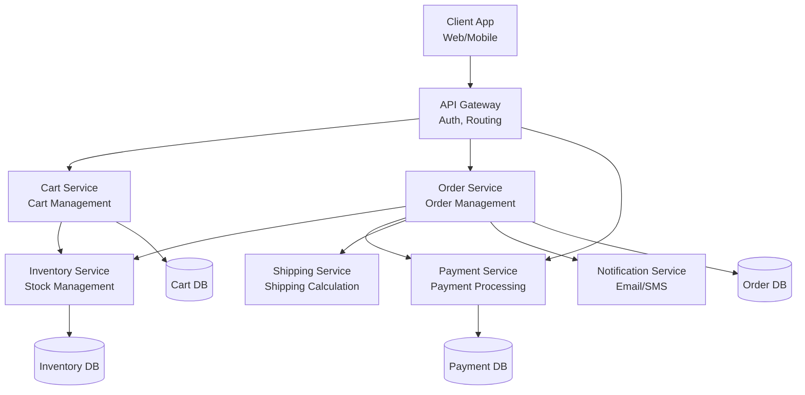

**Aadvik:** "But this creates tight coupling. Services call each other directly. What happens if Payment Service is down? The entire checkout fails. How do we make it resilient?"

**Sara:** "We need **event-driven architecture** with **Saga Pattern** for orchestration. Here's the improved design:"

### Event-Driven Architecture with Saga

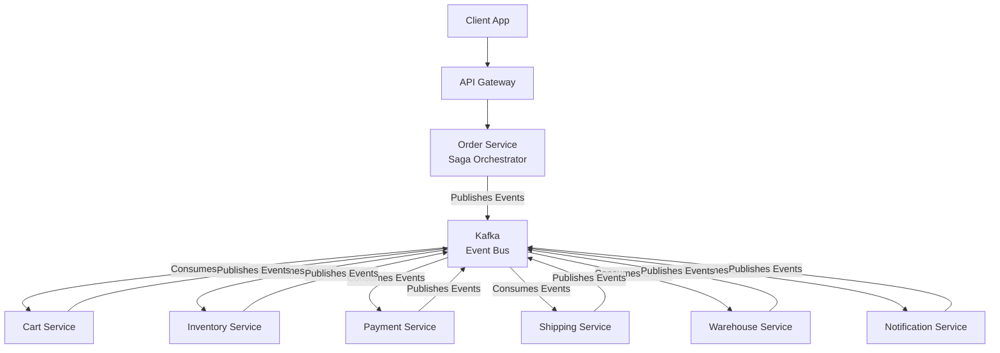

**Aadvik:** "Now we have services communicating through events. But who orchestrates the saga? Who decides what happens next when payment succeeds?"

**Sara:** "There are two patterns:

### Saga Pattern: Orchestration vs Choreography

**Aadvik:** "Explain both."

**Sara:** "**Orchestration**: Central orchestrator (Order Service) coordinates all steps.

**Choreography**: Each service knows what to do next based on events (no central coordinator).

Let me show both:"

---

## Part 3: Saga Pattern Deep Dive

### Pattern 1: Orchestration (Central Coordinator)

**Sara:** "In **Orchestration**, the Order Service acts as the orchestrator. It decides the flow and coordinates compensation if something fails."

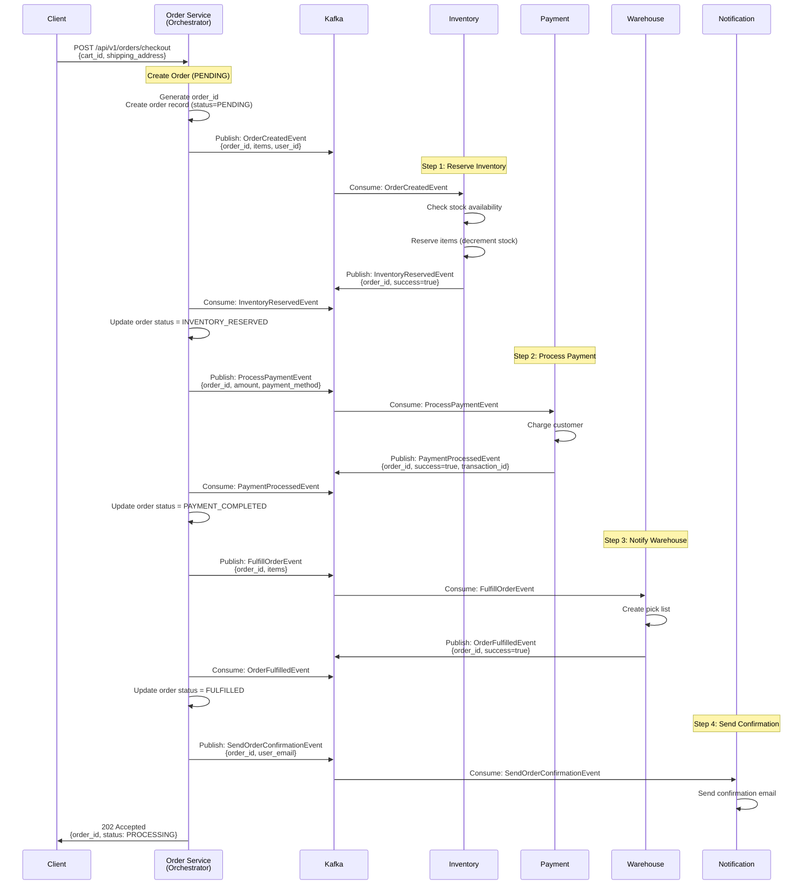

**Aadvik:** "What if inventory reservation fails?"

**Sara:** "Then we skip payment and send a failure notification. But what if payment fails after inventory is reserved? We need **compensation**:"

### Compensation Flow (Rollback)

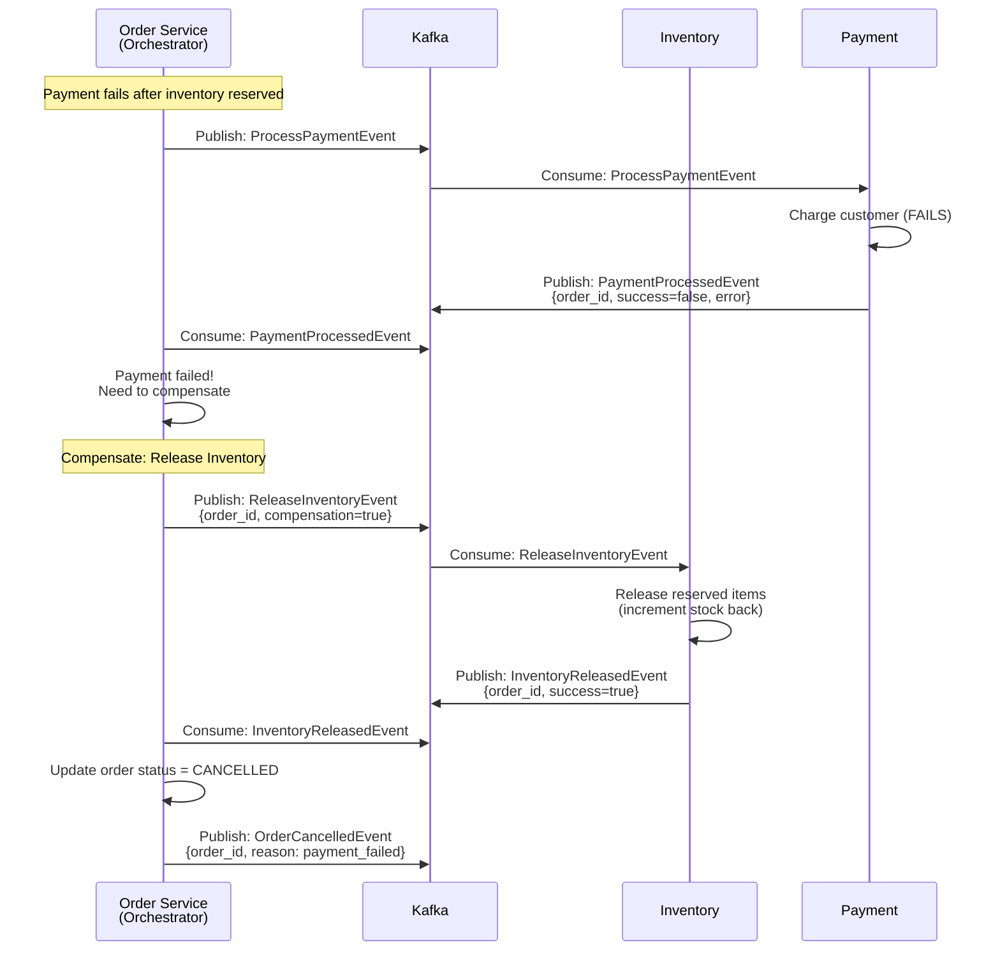

**Pros of Orchestration:**
- Centralized control—easy to understand flow
- Easy to add new steps
- Clear visibility of saga state
- Easier debugging

**Cons:**
- Orchestrator becomes a single point of failure
- Orchestrator must know all business logic
- Can become complex with many steps

### Pattern 2: Choreography (Distributed Coordination)

**Sara:** "In **Choreography**, there's no central orchestrator. Each service listens to events and knows what to do next."

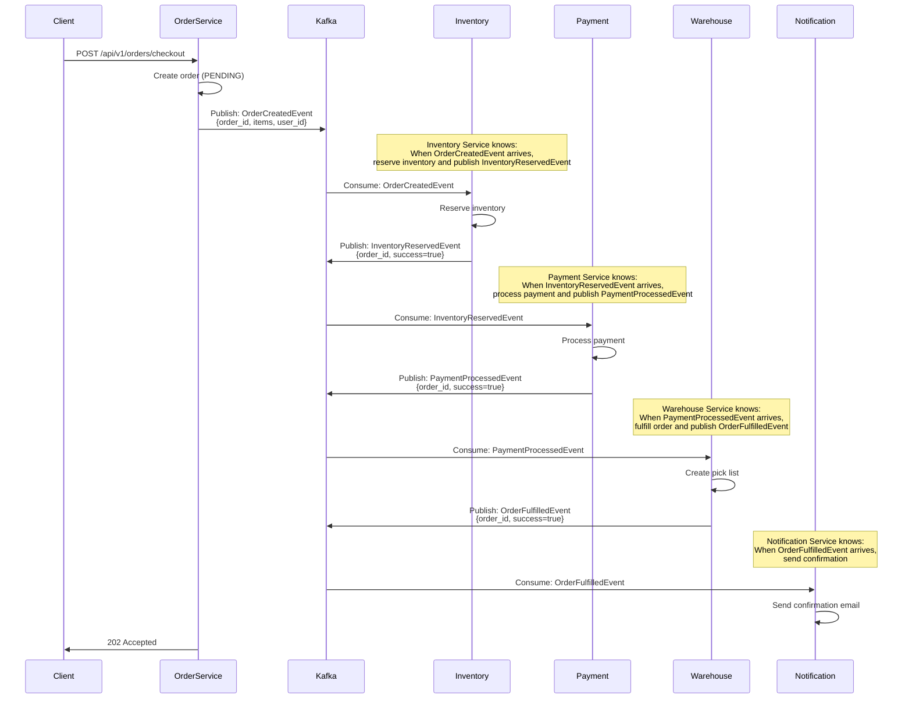

**Aadvik:** "How does compensation work in choreography?"

**Sara:** "Each service also listens for failure events and performs compensation:"

### Choreography Compensation

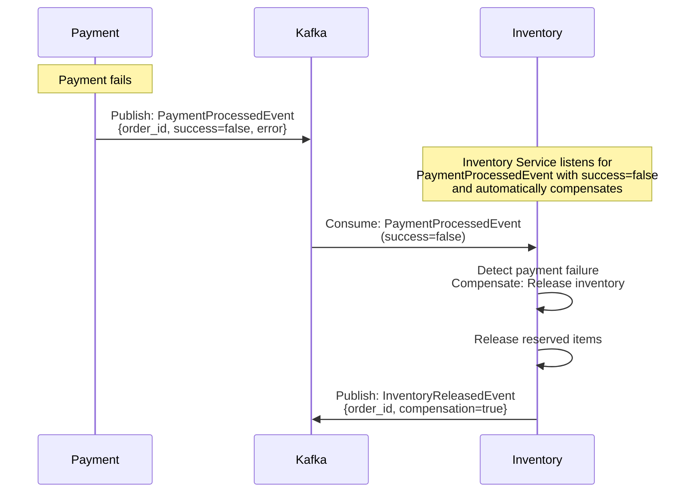

**Pros of Choreography:**
- No single point of failure
- Services are loosely coupled
- Each service is autonomous

**Cons:**
- Hard to understand overall flow (no central view)
- Difficult to debug (events scattered)
- Business logic distributed across services
- Hard to add new steps (need to update multiple services)

**Aadvik:** "Which one would you choose?"

**Sara:** "For checkout, I'd recommend **Orchestration** because:
1. Checkout is a critical business process—we want centralized visibility
2. Order Service is the natural owner of order lifecycle
3. Easier to add new steps (e.g., fraud detection)
4. Better for debugging and monitoring

But I'd use **Choreography** for simpler workflows like order status updates or notifications."

---

## Part 4: Idempotency Design

**Aadvik:** "Critical question: What if the user clicks 'Place Order' twice? Or the network retries the request? How do you prevent duplicate orders?"

**Sara:** "We need **idempotency**. An idempotent operation can be safely retried without side effects."

### Idempotency Strategies

**1. Idempotency Key (Request Deduplication)**

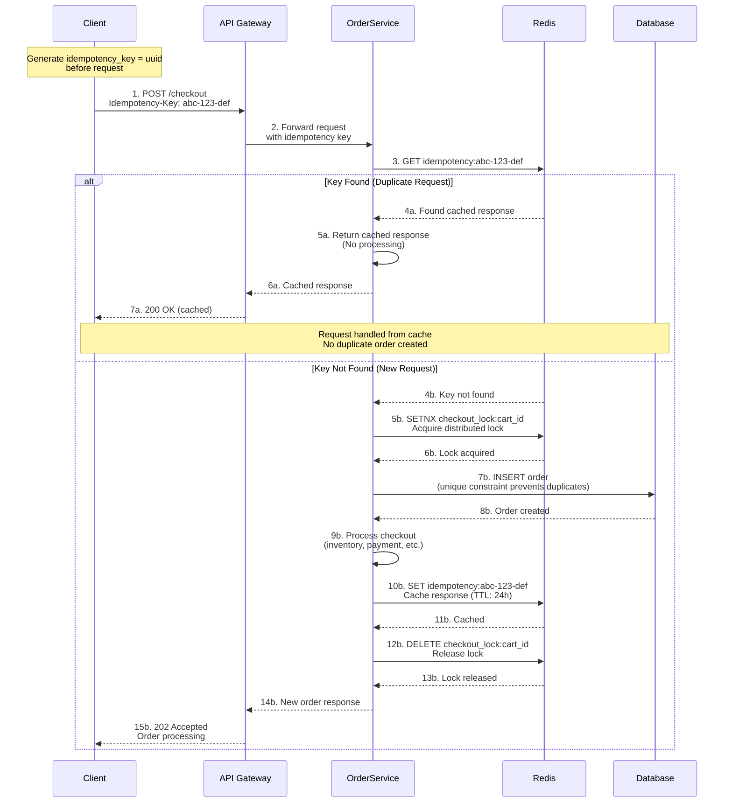

**Flow:**
1. Client generates `idempotency_key` (UUID) before first request
2. Client includes `Idempotency-Key: <uuid>` header in request
3. Order Service checks Redis: `GET idempotency:<uuid>`
4. If exists: Return cached response (no processing)
5. If not exists: Process request, store response in Redis with TTL (e.g., 24 hours)

**Java Implementation (Minimal Code):**

```java
@RestController
public class CheckoutController {
    
    @Autowired
    private RedisTemplate<String, String> redis;
    
    @PostMapping("/api/v1/orders/checkout")
    public ResponseEntity<?> checkout(
            @RequestBody CheckoutRequest request,
            @RequestHeader("Idempotency-Key") String idempotencyKey) {
        
        // Check Redis for idempotency key
        String cachedResponse = redis.opsForValue()
            .get("idempotency:" + idempotencyKey);
        
        if (cachedResponse != null) {
            // Return cached response
            return ResponseEntity.ok()
                .header("X-Idempotency-Key", idempotencyKey)
                .body(cachedResponse);
        }
        
        // Process checkout
        OrderResponse response = processCheckout(request);
        
        // Store response in Redis (TTL: 24 hours)
        redis.opsForValue().set(
            "idempotency:" + idempotencyKey,
            objectMapper.writeValueAsString(response),
            24, TimeUnit.HOURS
        );
        
        return ResponseEntity.accepted()
            .header("X-Idempotency-Key", idempotencyKey)
            .body(response);
    }
}
```

**2. Database-Level Idempotency (Unique Constraints)**

```sql
CREATE TABLE orders (
    order_id VARCHAR(50) PRIMARY KEY,
    user_id VARCHAR(50) NOT NULL,
    cart_id VARCHAR(50) NOT NULL,
    status VARCHAR(20) NOT NULL,
    created_at TIMESTAMP NOT NULL,
    
    -- Prevent duplicate orders for same cart
    UNIQUE KEY unique_cart_order (cart_id, status)
    -- Only one PENDING order per cart
);

-- When processing checkout:
INSERT INTO orders (order_id, user_id, cart_id, status, created_at)
VALUES ('order_123', 'user_456', 'cart_789', 'PENDING', NOW())
ON DUPLICATE KEY UPDATE 
    order_id = order_id;  -- No-op if duplicate
```

**3. Distributed Lock (Redis)**

```java
// Acquire lock before processing
String lockKey = "checkout_lock:" + cart_id;
Boolean acquired = redis.opsForValue()
    .setIfAbsent(lockKey, "locked", 30, TimeUnit.SECONDS);

if (!acquired) {
    // Another request is processing this cart
    throw new ConflictException("Checkout already in progress");
}

try {
    // Process checkout
    return processCheckout(request);
} finally {
    // Release lock
    redis.delete(lockKey);
}
```

**Aadvik:** "Which approach do you recommend?"

**Sara:** "I'd use a **combination**:
1. **Idempotency Key** for request-level deduplication (handles retries)
2. **Database unique constraint** on `(cart_id, status)` to prevent concurrent checkouts
3. **Distributed lock** as additional safety (optional, for high-concurrency scenarios)

This provides defense in depth."

---

## Part 5: Database Design

**Aadvik:** "Let's design the database schema. What tables do we need?"

**Sara:** "Core tables for the checkout system:"

### Database Schema

**1. Cart Table**
```sql
CREATE TABLE carts (
    cart_id VARCHAR(50) PRIMARY KEY,
    user_id VARCHAR(50) NOT NULL,
    created_at TIMESTAMP NOT NULL,
    updated_at TIMESTAMP NOT NULL,
    
    INDEX idx_user_id (user_id)
);
```
**Purpose:** Stores user shopping carts. Each user can have one active cart.

**2. Cart Items Table**
```sql
CREATE TABLE cart_items (
    cart_item_id BIGSERIAL PRIMARY KEY,
    cart_id VARCHAR(50) NOT NULL,
    product_id VARCHAR(50) NOT NULL,
    quantity INT NOT NULL,
    price DECIMAL(10,2) NOT NULL,
    added_at TIMESTAMP NOT NULL,
    
    FOREIGN KEY (cart_id) REFERENCES carts(cart_id),
    UNIQUE KEY unique_cart_product (cart_id, product_id),
    INDEX idx_cart_id (cart_id)
);
```
**Purpose:** Stores items in each cart with quantities and prices.

**3. Orders Table**
```sql
CREATE TABLE orders (
    order_id VARCHAR(50) PRIMARY KEY,
    user_id VARCHAR(50) NOT NULL,
    cart_id VARCHAR(50) NOT NULL,
    status VARCHAR(20) NOT NULL,  -- PENDING, PROCESSING, COMPLETED, CANCELLED, FAILED
    total_amount DECIMAL(10,2) NOT NULL,
    address_id VARCHAR(50) NOT NULL,
    created_at TIMESTAMP NOT NULL,
    updated_at TIMESTAMP NOT NULL,
    
    INDEX idx_user_id (user_id),
    INDEX idx_status (status),
    INDEX idx_cart_id (cart_id),
    UNIQUE KEY unique_cart_pending (cart_id, status)
    -- Prevents multiple PENDING orders for same cart
);
```
**Purpose:** Main order records tracking order lifecycle and preventing duplicate checkouts.

**4. Order Items Table**
```sql
CREATE TABLE order_items (
    order_item_id BIGSERIAL PRIMARY KEY,
    order_id VARCHAR(50) NOT NULL,
    product_id VARCHAR(50) NOT NULL,
    quantity INT NOT NULL,
    price DECIMAL(10,2) NOT NULL,
    
    FOREIGN KEY (order_id) REFERENCES orders(order_id),
    INDEX idx_order_id (order_id)
);
```
**Purpose:** Stores items for each order (snapshot at checkout time).

**5. Inventory Table**
```sql
CREATE TABLE inventory (
    product_id VARCHAR(50) PRIMARY KEY,
    available_quantity INT NOT NULL,
    reserved_quantity INT NOT NULL DEFAULT 0,
    total_quantity INT NOT NULL,
    updated_at TIMESTAMP NOT NULL,
    
    INDEX idx_available (available_quantity)
);
```
**Purpose:** Tracks product stock levels, including reserved quantities during checkout.

**6. Order Saga State Table**
```sql
CREATE TABLE order_saga_state (
    saga_id VARCHAR(50) PRIMARY KEY,
    order_id VARCHAR(50) NOT NULL,
    current_step VARCHAR(50) NOT NULL,
    status VARCHAR(20) NOT NULL,  -- IN_PROGRESS, COMPLETED, COMPENSATING, FAILED
    step_data JSONB,
    compensation_data JSONB,
    created_at TIMESTAMP NOT NULL,
    updated_at TIMESTAMP NOT NULL,
    
    INDEX idx_order_id (order_id),
    INDEX idx_status (status)
);
```
**Purpose:** Tracks saga execution state for each order, enabling recovery from failures.

**7. Payments Table**
```sql
CREATE TABLE payments (
    payment_id VARCHAR(50) PRIMARY KEY,
    order_id VARCHAR(50) NOT NULL,
    amount DECIMAL(10,2) NOT NULL,
    payment_method VARCHAR(20) NOT NULL,
    transaction_id VARCHAR(100),
    status VARCHAR(20) NOT NULL,  -- PENDIN
    created_at TIMESTAMP NOT NULL,
    updated_at TIMESTAMP NOT NULL,
    
    INDEX idx_order_id (order_id),
    INDEX idx_transaction_id (transaction_id)
);
```
**Purpose:** Records payment transactions with idempotency support.

---

## Part 6: API Design & Contracts

**Aadvik:** "Let's define all the APIs needed for the checkout system."

**Sara:** "Here are the key endpoints:"

### 1. Cart Management APIs

#### Add Item to Cart
**Endpoint:** `POST /api/v1/carts/{cart_id}/items`

**Request:**
```json
{
  "product_id": "prod_123",
  "quantity": 2
}
```

**Response (201 Created):**
```json
{
  "cart_item_id": "item_456",
  "cart_id": "cart_789",
  "product_id": "prod_123",
  "quantity": 2,
  "price": 29.99,
  "added_at": "2024-01-15T10:30:00Z"
}
```

#### Update Cart Item Quantity
**Endpoint:** `PUT /api/v1/carts/{cart_id}/items/{item_id}`

**Request:**
```json
{
  "quantity": 3
}
```

**Response (200 OK):**
```json
{
  "cart_item_id": "item_456",
  "quantity": 3,
  "updated_at": "2024-01-15T10:35:00Z"
}
```

#### Remove Item from Cart
**Endpoint:** `DELETE /api/v1/carts/{cart_id}/items/{item_id}`

**Response (204 No Content)**

#### Get Cart
**Endpoint:** `GET /api/v1/carts/{cart_id}`

**Response (200 OK):**
```json
{
  "cart_id": "cart_789",
  "user_id": "user_123",
  "items": [
    {
      "cart_item_id": "item_456",
      "product_id": "prod_123",
      "quantity": 2,
      "price": 29.99,
      "name": "Product Name"
    }
  ],
  "total_amount": 59.98,
  "item_count": 2,
  "updated_at": "2024-01-15T10:30:00Z"
}
```

### 2. Checkout APIs

#### Initiate Checkout
**Endpoint:** `POST /api/v1/orders/checkout`

**Headers:**
- `Idempotency-Key: <uuid>` (Required)

**Request:**
```json
{
  "cart_id": "cart_789",
  "shipping_address": {
    "street": "123 Main St",
    "city": "San Francisco",
    "state": "CA",
    "zip": "94102",
    "country": "USA"
  },
  "payment_method": {
    "type": "credit_card",
    "card_token": "card_token_abc123"
  }
}
```

**Response (202 Accepted):**
```json
{
  "order_id": "order_123456",
  "status": "PROCESSING",
  "estimated_completion": "2024-01-15T10:33:00Z",
  "idempotency_key": "abc-def-123",
  "created_at": "2024-01-15T10:30:00Z"
}
```

**Note:** Returns immediately with 202 Accepted. Order is processed asynchronously.

### 3. Order Status APIs

#### Get Order Status
**Endpoint:** `GET /api/v1/orders/{order_id}`

**Response (200 OK):**
```json
{
  "order_id": "order_123456",
  "user_id": "user_123",
  "status": "COMPLETED",
  "total_amount": 59.98,
  "items": [
    {
      "product_id": "prod_123",
      "quantity": 2,
      "price": 29.99
    }
  ],
  "shipping_address": {...},
  "payment": {
    "payment_id": "pay_789",
    "status": "COMPLETED",
    "transaction_id": "txn_abc123"
  },
  "saga_steps": [
    {
      "step": "INVENTORY_RESERVED",
      "status": "COMPLETED",
      "completed_at": "2024-01-15T10:30:15Z"
    },
    {
      "step": "PAYMENT_PROCESSED",
      "status": "COMPLETED",
      "completed_at": "2024-01-15T10:30:18Z"
    },
    {
      "step": "ORDER_FULFILLED",
      "status": "COMPLETED",
      "completed_at": "2024-01-15T10:30:25Z"
    }
  ],
  "created_at": "2024-01-15T10:30:00Z",
  "updated_at": "2024-01-15T10:30:25Z"
}
```

### 4. Order History APIs

#### Get User Orders
**Endpoint:** `GET /api/v1/orders?user_id={user_id}&status={status}&page={page}&limit={limit}`

**Query Parameters:**
- `user_id` (required)
- `status` (optional): Filter by status
- `page` (default: 1)
- `limit` (default: 20, max: 100)

**Response (200 OK):**
```json
{
  "orders": [
    {
      "order_id": "order_123456",
      "status": "COMPLETED",
      "total_amount": 59.98,
      "item_count": 2,
      "created_at": "2024-01-15T10:30:00Z"
    }
  ],
  "pagination": {
    "page": 1,
    "limit": 20,
    "total": 150,
    "total_pages": 8
  }
}
```

### 5. Payment APIs (Internal)

#### Process Payment
**Endpoint:** `POST /api/v1/payments/process` (Internal)

**Request:**
```json
{
  "order_id": "order_123456",
  "amount": 59.98,
  "payment_method": {
    "type": "credit_card",
    "card_token": "card_token_abc123"
  },
  "idempotency_key": "payment_abc123"
}
```

**Response (200 OK):**
```json
{
  "payment_id": "pay_789",
  "order_id": "order_123456",
  "transaction_id": "txn_abc123",
  "status": "COMPLETED",
  "amount": 59.98,
  "processed_at": "2024-01-15T10:30:18Z"
}
```

---

## Part 7: Kafka Event Contracts

**Aadvik:** "Now let's define the Kafka events for saga orchestration."

**Sara:** "Here are the key events and their schemas:"

### Event Topics

**1. Order Events**

#### Topic: `order-events`

**Event: OrderCreatedEvent**
```json
{
  "event_id": "evt_123",
  "event_type": "OrderCreatedEvent",
  "order_id": "order_123456",
  "user_id": "user_123",
  "cart_id": "cart_789",
  "items": [
    {
      "product_id": "prod_123",
      "quantity": 2,
      "price": 29.99
    }
  ],
  "total_amount": 59.98,
  "shipping_address": {...},
  "timestamp": "2024-01-15T10:30:00Z"
}
```

**Event: OrderStatusUpdatedEvent**
```json
{
  "event_id": "evt_124",
  "event_type": "OrderStatusUpdatedEvent",
  "order_id": "order_123456",
  "previous_status": "PENDING",
  "new_status": "INVENTORY_RESERVED",
  "timestamp": "2024-01-15T10:30:15Z"
}
```

**Event: OrderCancelledEvent**
```json
{
  "event_id": "evt_125",
  "event_type": "OrderCancelledEvent",
  "order_id": "order_123456",
  "reason": "payment_failed",
  "compensation_required": true,
  "timestamp": "2024-01-15T10:30:20Z"
}
```

**2. Inventory Events**

#### Topic: `inventory-events`

**Event: InventoryReservedEvent**
```json
{
  "event_id": "evt_126",
  "event_type": "InventoryReservedEvent",
  "order_id": "order_123456",
  "reservations": [
    {
      "product_id": "prod_123",
      "quantity": 2,
      "reserved": true
    }
  ],
  "success": true,
  "timestamp": "2024-01-15T10:30:15Z"
}
```

**Event: InventoryReservationFailedEvent**
```json
{
  "event_id": "evt_127",
  "event_type": "InventoryReservationFailedEvent",
  "order_id": "order_123456",
  "reason": "insufficient_stock",
  "failed_items": [
    {
      "product_id": "prod_123",
      "requested": 2,
      "available": 0
    }
  ],
  "timestamp": "2024-01-15T10:30:15Z"
}
```

**Event: InventoryReleasedEvent**
```json
{
  "event_id": "evt_128",
  "event_type": "InventoryReleasedEvent",
  "order_id": "order_123456",
  "compensation": true,
  "released_items": [
    {
      "product_id": "prod_123",
      "quantity": 2
    }
  ],
  "timestamp": "2024-01-15T10:30:20Z"
}
```

**3. Payment Events**

#### Topic: `payment-events`

**Event: PaymentProcessedEvent**
```json
{
  "event_id": "evt_129",
  "event_type": "PaymentProcessedEvent",
  "order_id": "order_123456",
  "payment_id": "pay_789",
  "transaction_id": "txn_abc123",
  "amount": 59.98,
  "success": true,
  "timestamp": "2024-01-15T10:30:18Z"
}
```

**Event: PaymentFailedEvent**
```json
{
  "event_id": "evt_130",
  "event_type": "PaymentFailedEvent",
  "order_id": "order_123456",
  "payment_id": "pay_789",
  "error_code": "INSUFFICIENT_FUNDS",
  "error_message": "Payment failed: insufficient funds",
  "timestamp": "2024-01-15T10:30:18Z"
}
```

**4. Fulfillment Events**

#### Topic: `fulfillment-events`

**Event: OrderFulfilledEvent**
```json
{
  "event_id": "evt_131",
  "event_type": "OrderFulfilledEvent",
  "order_id": "order_123456",
  "warehouse_id": "warehouse_001",
  "pick_list_id": "pick_456",
  "success": true,
  "timestamp": "2024-01-15T10:30:25Z"
}
```

---

## Part 8: Complete Saga Flow with Compensation

**Aadvik:** "Let's see the complete flow with all failure scenarios handled."

**Sara:** "Here's the full saga orchestration with compensation logic:"

### Successful Checkout Flow

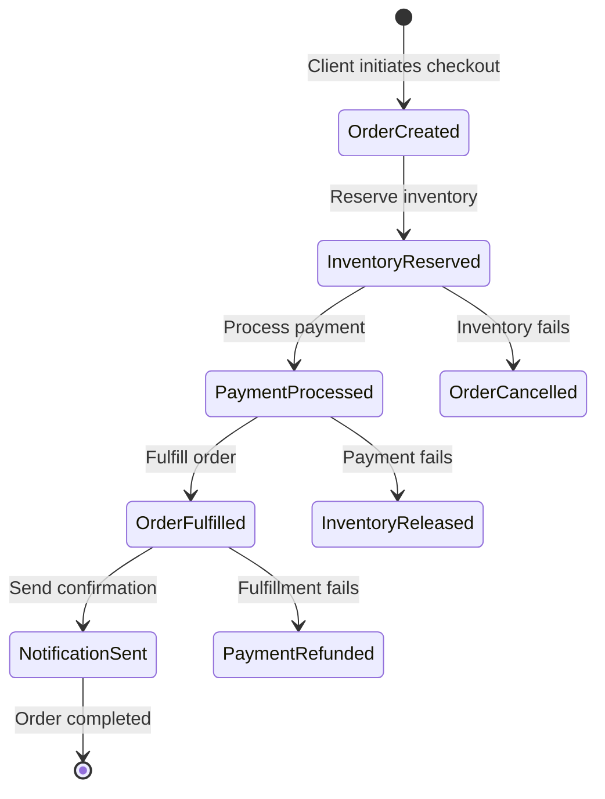

### Detailed Saga State Machine

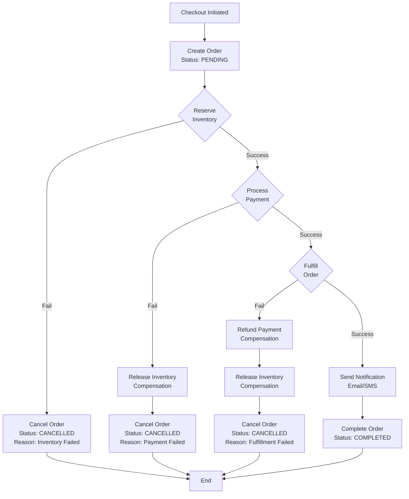

---

## Part 9: Failure Handling & Recovery

**Aadvik:** "What happens if Order Service crashes mid-saga? How do you recover?"

**Sara:** "We use **saga state persistence** and **event sourcing** for recovery:"

### Saga Recovery Mechanism

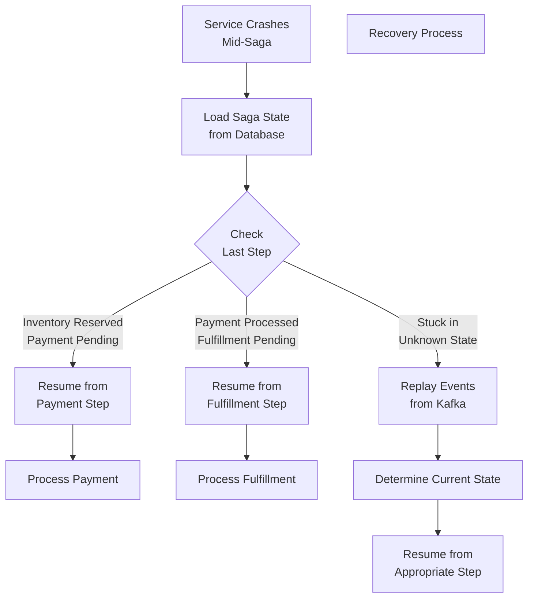

### Implementation Strategy

**1. Saga State Persistence**
```sql
-- Store saga state after each step
UPDATE order_saga_state SET
    current_step = 'PAYMENT_PROCESSING',
    status = 'IN_PROGRESS',
    step_data = '{"payment_id": "pay_789"}',
    updated_at = NOW()
WHERE saga_id = 'saga_123';
```

**2. Event Replay**
```java
// On recovery, replay events to rebuild state
public void recoverSaga(String sagaId) {
    OrderSagaState saga = loadSagaState(sagaId);
    
    // Query Kafka for events related to this order
    List<OrderEvent> events = kafkaConsumer.getEvents(saga.getOrderId());
    
    // Rebuild state by replaying events
    OrderState currentState = replayEvents(events);
    
    // Resume from current state
    resumeFromStep(currentState);
}
```

**3. Timeout Handling**
```java
// Background job checks for stuck sagas
@Scheduled(fixedRate = 60000) // Every minute
public void checkStuckSagas() {
    List<OrderSagaState> stuckSagas = findStuckSagas(
        status = 'IN_PROGRESS',
        updated_at < NOW() - 5 minutes
    );
    
    for (OrderSagaState saga : stuckSagas) {
        // Determine next action or compensate
        handleStuckSaga(saga);
    }
}
```

---

## Part 10: Scaling & Optimization

**Aadvik:** "How do you scale this to handle 500K orders/day?"

**Sara:** "Scaling strategies:"

### Scaling Architecture

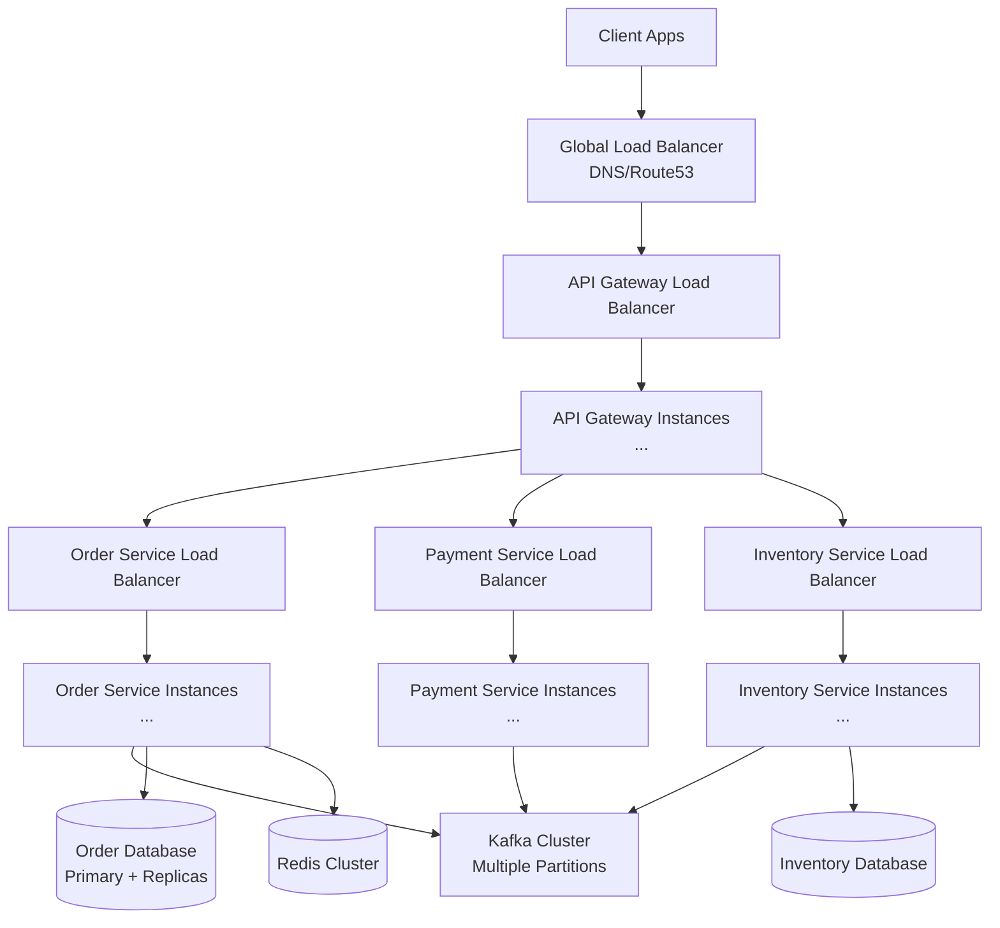

**Architecture Notes:**
- Each service type has its own load balancer for independent scaling
- Load balancers distribute traffic across multiple instances (shown as "...")
- Can scale horizontally by adding instances behind each load balancer
- Services communicate with Kafka and databases independently
- Database layer includes primary + read replicas for scaling reads

### Scaling Strategies

**1. Database Sharding**

**Aadvik:** "How do you shard the database? Are there different approaches?"

**Sara:** "There are multiple sharding strategies. Let me explain the options:"

**Approach 1: Database-Provided Sharding (Managed Sharding)**

Many database providers offer built-in sharding capabilities:

**PostgreSQL with Citus:**
```sql
-- Citus provides automatic sharding
CREATE EXTENSION citus;

-- Create distributed table
SELECT create_distributed_table('orders', 'user_id');

-- Sharding happens automatically based on user_id
-- Citus handles shard placement, query routing, and joins
```

**MySQL with Vitess:**
```sql
-- Vitess provides sharding at the proxy layer
-- Automatic shard key routing
-- Handles cross-shard queries
```

**MongoDB Sharding:**
```javascript
// MongoDB has built-in sharding
sh.enableSharding("ecommerce")
sh.shardCollection("ecommerce.orders", { "user_id": 1 })

// Automatic balancing and shard key routing
```

**Benefits of Database-Provided Sharding:**
- Automatic shard management and balancing
- Query routing handled by database
- Easier operations (backup, monitoring, scaling)
- Handles cross-shard queries and joins

**Approach 2: Application-Level Sharding**

Sharding logic implemented in application code:

```java
// Shard by user_id using consistent hashing
public String getShardKey(String userId) {
    int hash = userId.hashCode();
    int shardIndex = Math.abs(hash) % NUM_SHARDS;
    return "orders_shard_" + shardIndex;
}

// Route queries to correct shard
public Order getOrder(String orderId, String userId) {
    String shardKey = getShardKey(userId);
    DataSource shard = getShardDataSource(shardKey);
    return shard.query("SELECT * FROM orders WHERE order_id = ?", orderId);
}
```

**Pros:**
- Full control over sharding strategy
- Can optimize for specific access patterns
- Works with any database

**Cons:**
- More complex to implement and maintain
- Application must handle routing
- Cross-shard queries become difficult

**Approach 3: NoSQL Database Options**

For high-scale scenarios, consider NoSQL databases with built-in sharding:

**Cassandra (Partition-Based Sharding):**
```sql
-- Cassandra automatically shards by partition key
CREATE TABLE orders (
    order_id UUID,
    user_id UUID,
    status TEXT,
    total_amount DECIMAL,
    PRIMARY KEY ((user_id), order_id)  -- user_id is partition key
);

-- Automatic sharding and replication
-- Excellent for write-heavy workloads
```

**DynamoDB (AWS Managed NoSQL):**
```python
# DynamoDB automatically handles sharding
# Partition key: user_id (automatic sharding)
# Sort key: order_id (within partition)

table = dynamodb.Table('orders')
response = table.put_item(
    Item={
        'user_id': 'user_123',
        'order_id': 'order_456',
        'status': 'COMPLETED'
    }
)
# DynamoDB automatically distributes across partitions
```

**Benefits of NoSQL for Sharding:**
- Built-in horizontal scaling
- Automatic partition management
- Better for high-throughput scenarios
- Good for event sourcing and write-heavy workloads

**Sharding Strategy for E-commerce:**

```sql
-- Recommended: Hybrid approach
-- Use PostgreSQL with Citus for relational data (orders, payments)
-- Use Cassandra/DynamoDB for high-volume data (events, logs)

-- Orders table (sharded by user_id)
SELECT create_distributed_table('orders', 'user_id');

-- Events table (use NoSQL for high volume)
-- Store in Cassandra/DynamoDB for better write performance
```

**Sharding Considerations:**

1. **Shard Key Selection:**
   - Choose keys with good distribution (user_id, order_id)
   - Avoid hot shards (all data in one shard)
   - Consider access patterns (queries should hit single shard when possible)

2. **Cross-Shard Queries:**
   - Minimize cross-shard operations (expensive)
   - Use read replicas for analytics queries
   - Consider materialized views for aggregated data

3. **Resharding:**
   - Plan for shard rebalancing as data grows
   - Some databases handle this automatically (Citus, MongoDB)
   - Application-level sharding requires manual resharding

**2. Kafka Partitioning**
```java
// Partition orders by order_id for ordering guarantees
kafkaTemplate.send("order-events", orderId, event);
// Same partition = ordered processing
```

**3. Caching**
```java
// Cache frequently accessed data
- Cart data: Redis (TTL: 1 hour)
- Order status: Redis (TTL: 5 minutes)
- Product inventory: Redis (TTL: 1 minute)
```

**4. Read Replicas**
```sql
-- Use read replicas for order history queries
SELECT * FROM orders_replica 
WHERE user_id = 'user_123' 
ORDER BY created_at DESC;
```

---

## Part 11: Trade-offs & Final Thoughts

**Aadvik:** "What are the key trade-offs in this design?"

**Sara:** "Important trade-offs:

**1. Consistency vs Availability**
- **Chosen**: Eventual consistency (AP from CAP)
- **Trade-off**: Temporary inconsistency between services
- **Mitigation**: Compensation logic handles inconsistencies

**2. Synchronous vs Asynchronous**
- **Chosen**: Asynchronous processing (Kafka events)
- **Trade-off**: No immediate confirmation (returns 202 Accepted)
- **Mitigation**: Client polls order status or uses webhooks

**3. Orchestration vs Choreography**
- **Chosen**: Orchestration for checkout
- **Trade-off**: Central coordinator can be bottleneck
- **Mitigation**: Scale Order Service horizontally

**4. Idempotency Overhead**
- **Chosen**: Store idempotency keys in Redis
- **Trade-off**: Additional storage and lookup
- **Mitigation**: TTL on keys (auto-cleanup)

**5. Saga Complexity**
- **Chosen**: Saga pattern for distributed transactions
- **Trade-off**: Complex compensation logic
- **Mitigation**: Well-defined state machine and testing"

**Aadvik:** "What would you improve if you had more time?"

**Sara:** "Additional improvements:

1. **Outbox Pattern**: Ensure event publishing is atomic with DB writes
2. **Saga Timeouts**: Automatic compensation after timeout
3. **Circuit Breakers**: Prevent cascading failures
4. **Observability**: Distributed tracing (OpenTelemetry)
5. **Testing**: Saga testing framework for compensation scenarios
6. **Payment Retry**: Exponential backoff for payment failures
7. **Inventory Reservation TTL**: Auto-release if checkout doesn't complete"

---

## Summary

**Key Takeaways:**

1. **Distributed transactions require different patterns** - Traditional ACID doesn't work across services
2. **Saga pattern provides eventual consistency** - With compensation for failures
3. **Idempotency is critical** - Prevent duplicate orders and charges
4. **Event-driven architecture** - Loose coupling between services
5. **Orchestration vs Choreography** - Choose based on complexity and control needs

**System handles:**
- 100K-500K orders/day
- Partial failures with compensation
- Idempotent operations
- Eventual consistency
- Horizontal scaling

**This architecture powers reliable e-commerce checkouts at scale!**

