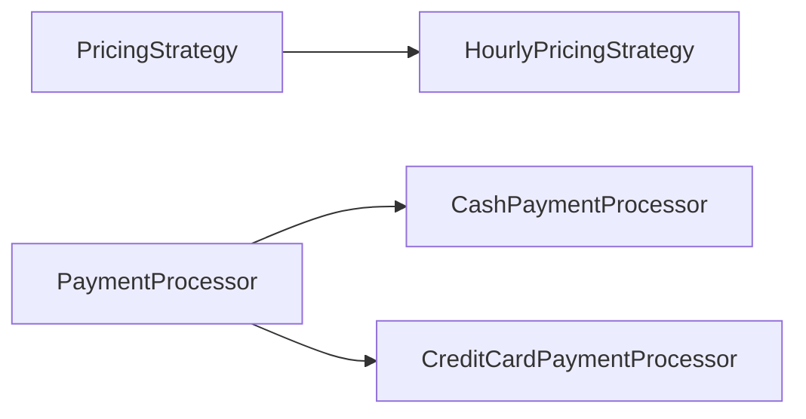
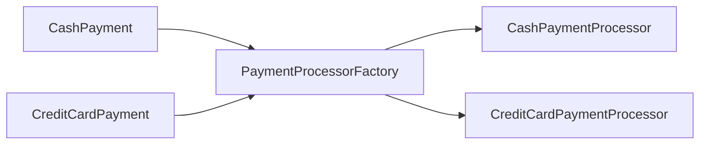
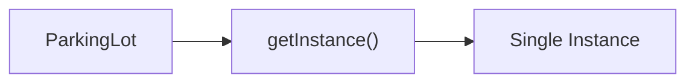
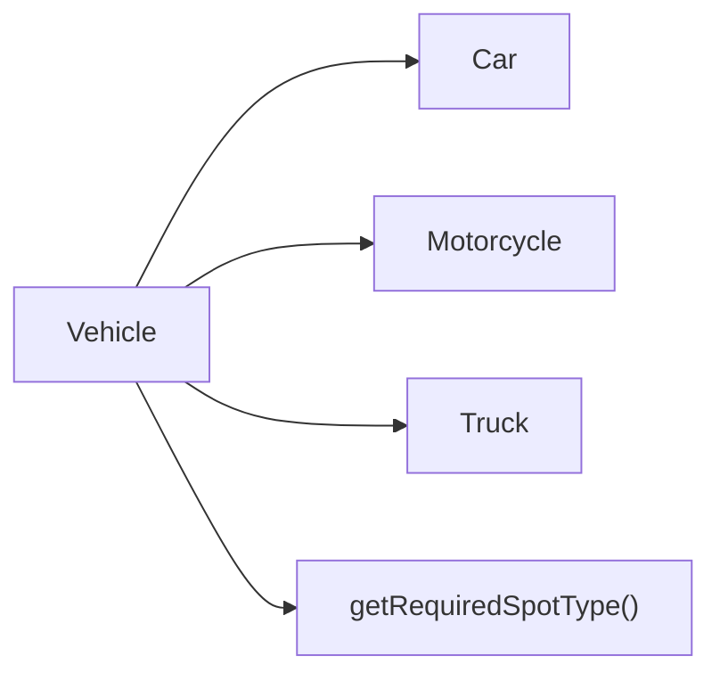
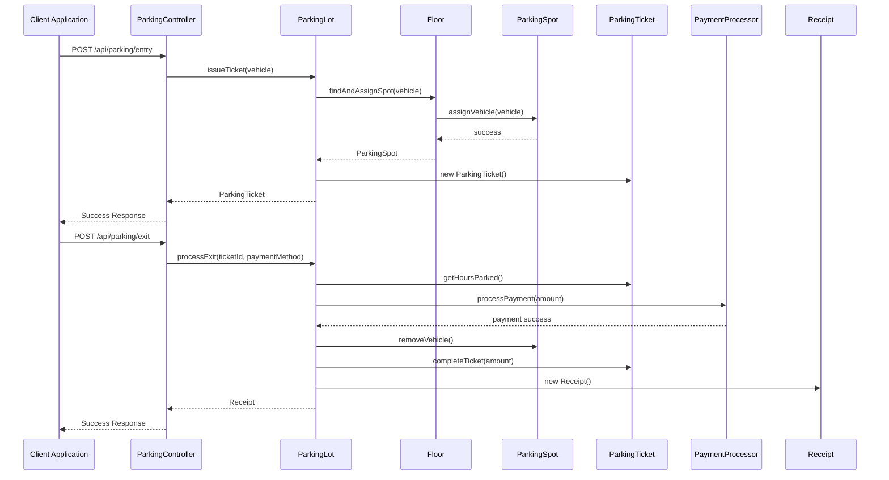
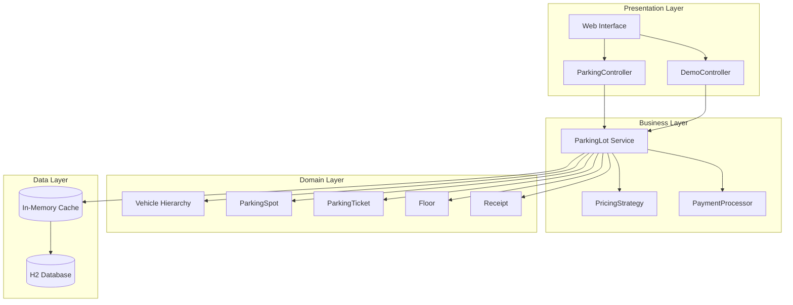

# 🏗️ Parking Lot Management System - Class Diagram

This document provides a comprehensive class diagram showing all the classes, interfaces, and their relationships in the parking lot management system.

## 📊 Complete System Architecture

```mermaid
classDiagram
    %% Core Domain Models
    class SpotType {
        <<enumeration>>
        COMPACT
        REGULAR
        LARGE
        HANDICAPPED
    }
    
    class VehicleType {
        <<enumeration>>
        MOTORCYCLE
        CAR
        TRUCK
    }
    
    class Vehicle {
        <<abstract>>
        -String licensePlate
        -VehicleType type
        +getRequiredSpotType()* SpotType
        +getLicensePlate() String
        +getType() VehicleType
        +toString() String
    }
    
    class Car {
        +Car(String licensePlate)
        +getRequiredSpotType() SpotType
    }
    
    class Motorcycle {
        +Motorcycle(String licensePlate)
        +getRequiredSpotType() SpotType
    }
    
    class Truck {
        +Truck(String licensePlate)
        +getRequiredSpotType() SpotType
    }
    
    class ParkingSpot {
        -String spotId
        -SpotType type
        -boolean isOccupied
        -Vehicle parkedVehicle
        -LocalDateTime occupiedAt
        -int floorNumber
        +assignVehicle(Vehicle) boolean
        +removeVehicle() void
        +canAccommodate(SpotType) boolean
        +getSpotId() String
        +getType() SpotType
        +isOccupied() boolean
        +getParkedVehicle() Vehicle
        +getOccupiedAt() LocalDateTime
        +getFloorNumber() int
    }
    
    class ParkingTicket {
        -String ticketId
        -Vehicle vehicle
        -ParkingSpot assignedSpot
        -LocalDateTime entryTime
        -LocalDateTime exitTime
        -double amountPaid
        -TicketStatus status
        +getHoursParked() long
        +completeTicket(double) void
        +getTicketId() String
        +getVehicle() Vehicle
        +getAssignedSpot() ParkingSpot
        +getEntryTime() LocalDateTime
        +getExitTime() LocalDateTime
        +getAmountPaid() double
        +getStatus() TicketStatus
    }
    
    class TicketStatus {
        <<enumeration>>
        ACTIVE
        COMPLETED
    }
    
    class Floor {
        -int floorNumber
        -Map~SpotType,List~ParkingSpot~~ spotsByType
        -Map~SpotType,ReadWriteLock~ spotTypeLocks
        +addSpot(ParkingSpot) void
        +findAndAssignSpot(Vehicle) ParkingSpot
        +getAvailableSpotCount(SpotType) int
        +getTotalSpotCount(SpotType) int
        +getAllSpots() List~ParkingSpot~
        +getFloorNumber() int
        +getSpotsByType() Map
    }
    
    class Receipt {
        -ParkingTicket ticket
        -double amountPaid
        -String message
        +Receipt(ParkingTicket, double)
        +Receipt(ParkingTicket, double, String)
        +toString() String
        +getTicket() ParkingTicket
        +getAmountPaid() double
        +getMessage() String
    }
    
    %% Pricing Strategy
    class PricingStrategy {
        <<interface>>
        +calculatePrice(VehicleType, long) double
    }
    
    class HourlyPricingStrategy {
        -Map~VehicleType,Double~ hourlyRates
        +HourlyPricingStrategy()
        +calculatePrice(VehicleType, long) double
    }
    
    %% Payment System
    class PaymentMethod {
        <<interface>>
        +getMethodName() String
    }
    
    class CashPayment {
        -double amountGiven
        +CashPayment(double)
        +getMethodName() String
        +getAmountGiven() double
    }
    
    class CreditCardPayment {
        -String cardNumber
        -String cvv
        -String expiryDate
        +CreditCardPayment(String, String, String)
        +getMethodName() String
        +getCardNumber() String
        +getCvv() String
        +getExpiryDate() String
    }
    
    class PaymentProcessor {
        <<interface>>
        +processPayment(PaymentMethod, double) boolean
    }
    
    class CashPaymentProcessor {
        +processPayment(PaymentMethod, double) boolean
    }
    
    class CreditCardPaymentProcessor {
        +processPayment(PaymentMethod, double) boolean
    }
    
    class PaymentProcessorFactory {
        <<utility>>
        +getProcessor(PaymentMethod) PaymentProcessor
    }
    
    %% Core Service
    class ParkingLot {
        -static ParkingLot instance
        -List~Floor~ floors
        -Map~String,ParkingTicket~ activeTickets
        -PricingStrategy pricingStrategy
        -ParkingLot()
        +getInstance() ParkingLot
        -initializeParkingLot() void
        -addSpotsToFloor(Floor, SpotType, int) void
        +issueTicket(Vehicle) ParkingTicket
        +processExit(String, PaymentMethod) Receipt
        -findAndAssignSpot(Vehicle) ParkingSpot
        -isFull(SpotType) boolean
        -generateTicketId() String
        +getAvailabilitySummary() Map~SpotType,Integer~
        +getActiveTickets() List~ParkingTicket~
        +getFloors() List~Floor~
        +getPricingStrategy() PricingStrategy
    }
    
    %% REST Controllers
    class ParkingController {
        -ParkingLot parkingLot
        +vehicleEntry(VehicleEntryRequest) Map~String,Object~
        +vehicleExit(VehicleExitRequest) Map~String,Object~
        +getAvailability() Map~String,Object~
        +getParkingLotStatus() Map~String,Object~
        -createVehicle(String, String) Vehicle
        -createPaymentMethod(String, Map) PaymentMethod
    }
    
    class DemoController {
        -ParkingLot parkingLot
        +scenario1_CarEntryAndExit() Map~String,Object~
        +scenario2_MultipleVehicles() Map~String,Object~
        +scenario3_ConcurrentEntries() Map~String,Object~
        +resetParkingLot() Map~String,Object~
    }
    
    class VehicleEntryRequest {
        -String vehicleType
        -String licensePlate
        +getVehicleType() String
        +setVehicleType(String) void
        +getLicensePlate() String
        +setLicensePlate(String) void
    }
    
    class VehicleExitRequest {
        -String ticketId
        -String paymentMethod
        -Map~String,String~ paymentDetails
        +getTicketId() String
        +setTicketId(String) void
        +getPaymentMethod() String
        +setPaymentMethod(String) void
        +getPaymentDetails() Map
        +setPaymentDetails(Map) void
    }
    
    %% Main Application
    class ParkingLotDesignApplication {
        <<SpringBootApplication>>
        +main(String[]) void
    }
    
    %% Relationships
    Vehicle <|-- Car : extends
    Vehicle <|-- Motorcycle : extends
    Vehicle <|-- Truck : extends
    
    Vehicle --> VehicleType : uses
    Vehicle --> SpotType : returns
    
    ParkingSpot --> SpotType : uses
    ParkingSpot --> Vehicle : contains
    
    ParkingTicket --> Vehicle : contains
    ParkingTicket --> ParkingSpot : references
    ParkingTicket --> TicketStatus : uses
    
    Floor --> ParkingSpot : contains
    Floor --> SpotType : organizes by
    
    Receipt --> ParkingTicket : contains
    
    PricingStrategy <|.. HourlyPricingStrategy : implements
    
    PaymentMethod <|.. CashPayment : implements
    PaymentMethod <|.. CreditCardPayment : implements
    
    PaymentProcessor <|.. CashPaymentProcessor : implements
    PaymentProcessor <|.. CreditCardPaymentProcessor : implements
    
    PaymentProcessorFactory --> PaymentProcessor : creates
    PaymentProcessorFactory --> PaymentMethod : uses
    
    ParkingLot --> Floor : manages
    ParkingLot --> ParkingTicket : manages
    ParkingLot --> PricingStrategy : uses
    ParkingLot --> PaymentProcessorFactory : uses
    
    ParkingController --> ParkingLot : uses
    ParkingController --> VehicleEntryRequest : uses
    ParkingController --> VehicleExitRequest : uses
    
    DemoController --> ParkingLot : uses
    
    ParkingLotDesignApplication --> ParkingController : manages
    ParkingLotDesignApplication --> DemoController : manages
```

## 🔗 Key Relationships Explained

### 1. **Inheritance Hierarchy**
- `Vehicle` (abstract) ← `Car`, `Motorcycle`, `Truck`
- `PricingStrategy` (interface) ← `HourlyPricingStrategy`
- `PaymentMethod` (interface) ← `CashPayment`, `CreditCardPayment`
- `PaymentProcessor` (interface) ← `CashPaymentProcessor`, `CreditCardPaymentProcessor`

### 2. **Composition Relationships**
- `ParkingLot` **contains** multiple `Floor` objects
- `Floor` **contains** multiple `ParkingSpot` objects
- `ParkingTicket` **references** a `Vehicle` and `ParkingSpot`
- `Receipt` **contains** a `ParkingTicket`

### 3. **Dependency Relationships**
- `ParkingLot` **uses** `PricingStrategy` for fee calculation
- `ParkingLot` **uses** `PaymentProcessorFactory` for payment processing
- `ParkingController` **uses** `ParkingLot` for business operations
- `DemoController` **uses** `ParkingLot` for demo scenarios

### 4. **Factory Pattern**
- `PaymentProcessorFactory` **creates** appropriate `PaymentProcessor` based on `PaymentMethod`

### 5. **Singleton Pattern**
- `ParkingLot` implements singleton pattern with `getInstance()` method

## 🎯 Design Patterns Illustrated

### **Strategy Pattern**

### **Factory Pattern**

### **Singleton Pattern**

### **Template Method Pattern**

## 📊 Data Flow Diagram

## 🏗️ Layered Architecture

## 🔧 Component Interactions

### **Entry Flow**
1. `ParkingController` receives entry request
2. Creates `Vehicle` object based on type
3. Calls `ParkingLot.issueTicket()`
4. `ParkingLot` finds available spot via `Floor.findAndAssignSpot()`
5. `ParkingSpot.assignVehicle()` assigns the vehicle
6. `ParkingTicket` is created and stored
7. Response returned to client

### **Exit Flow**
1. `ParkingController` receives exit request
2. Creates `PaymentMethod` object
3. Calls `ParkingLot.processExit()`
4. `PricingStrategy` calculates fee
5. `PaymentProcessor` processes payment
6. `ParkingSpot.removeVehicle()` frees the spot
7. `Receipt` is generated and returned

### **Concurrency Handling**
- `Floor` uses `ReadWriteLock` per spot type
- `ParkingSpot` uses `synchronized` methods
- `ParkingLot` uses `ConcurrentHashMap` for active tickets
- Atomic find-and-assign operations prevent race conditions

This class diagram provides a complete overview of the parking lot management system architecture, showing all relationships, design patterns, and data flow patterns used in the implementation.

