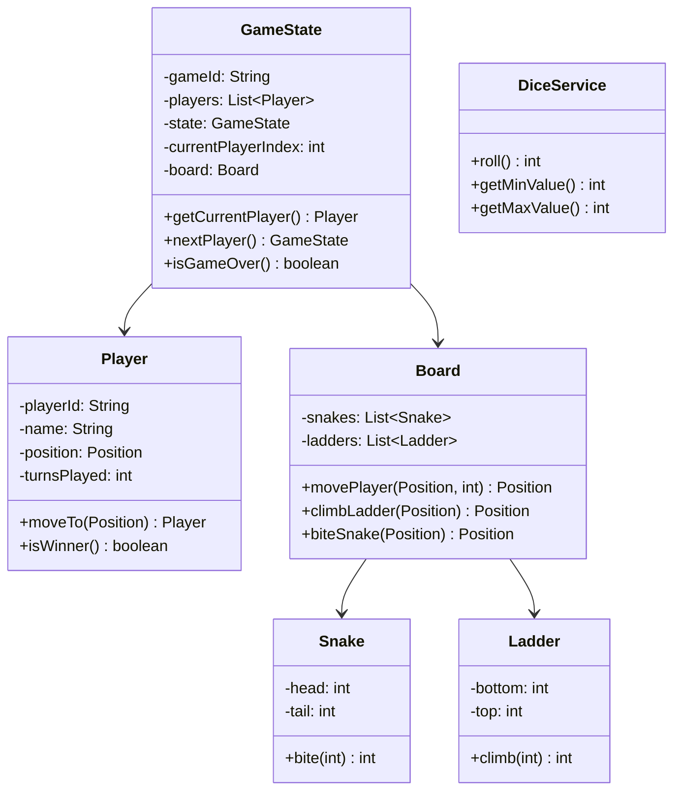
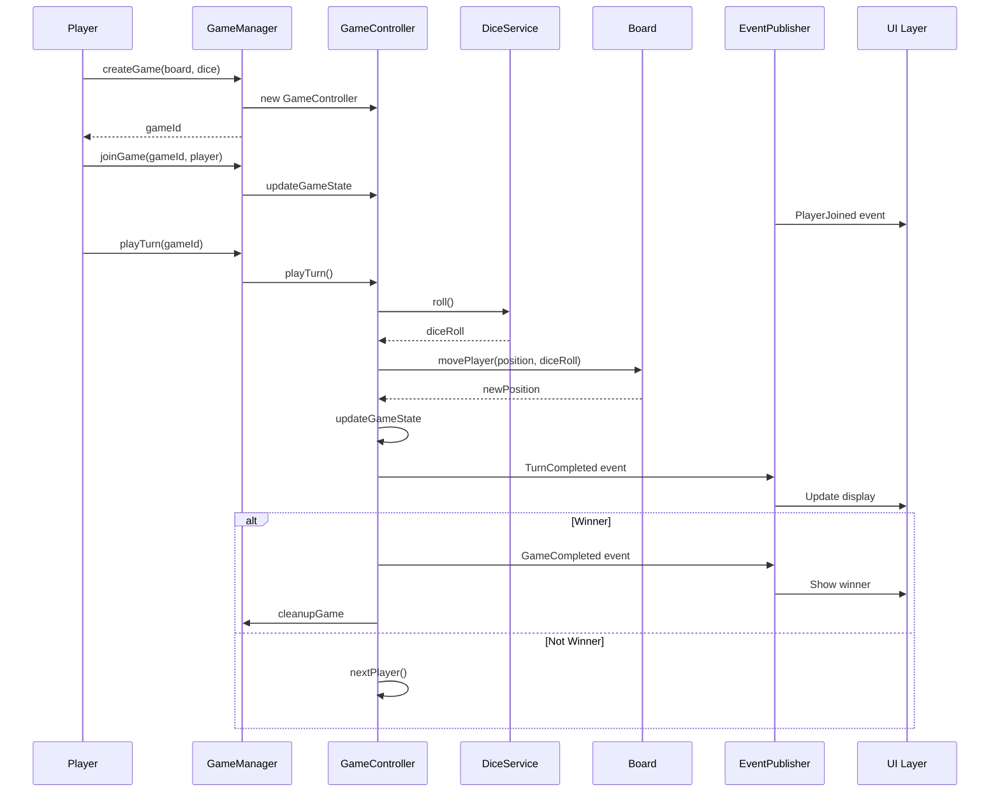
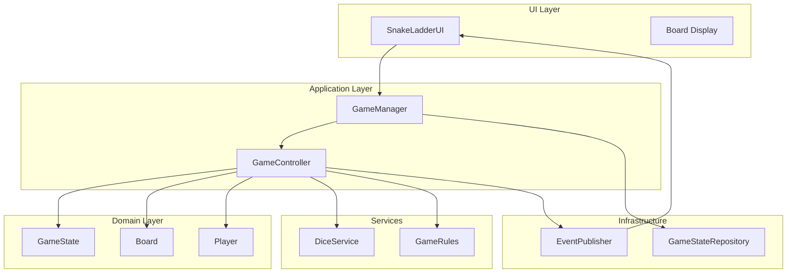

# How to Design a Snake and Ladder Game - Interview Deep Dive
##### *Complete Guide: Game State Management, Multi-Player Coordination, Board Representation, and UI Separation*

"So, Alex, imagine building the classic Snake and Ladder game... but this time, you're not playing it in a cardboard box. You're architecting it for millions of users, handling real-time multiplayer, custom boards, and the possibility of extending it to other board games."

You've probably played Snake and Ladder as a kid, rolling dice and climbing ladders while dodging snakes. But when an interviewer asks you to design one from scratch, suddenly you're thinking about game loops, state management, random number generation, and making it work for 10 players simultaneously.

The truth is, even simple games like Snake and Ladder have sophisticated systems underneath. They need to handle game state transitions, player turns, board physics, and UI separation—all while keeping the code extensible for future features.

Meet Alex, a software engineer about to tackle this challenge. Over the next 45 minutes, you'll see how a seemingly simple game unfolds into a sophisticated system design covering state machines, turn management, board representation, and separation of concerns.

**What you'll discover:**
- How to model game state and player turns
- Designing efficient board representation with snakes and ladders
- Handling multiple players with fair turn rotation
- Separating game logic from UI for testability
- Making the design extensible for custom boards and other games
- Managing game lifecycle and win conditions

Ready to see how it's done? Let's dive in.

---

## Opening - Understanding the Problem

**Raj:** "Alright Alex, let's build something everyone knows. Design a Snake and Ladder game for me."

**Alex:** *(picks up the marker, pauses)* "Okay, before I jump in... when you say Snake and Ladder, are we talking about a simple console game, or a full multiplayer system with custom boards and online play?"

**Raj:** "Good question. Let's say we want a system that can handle multiple players, custom board configurations, and real-time gameplay."

**Alex:** "Got it. And should I focus on the game logic, or the presentation layer too?"

**Raj:** *(smiles)* "Both. We want a clean separation so the game logic is independent of the UI."

**Alex:** "Perfect. So I'm designing the system that handles things like... board state, player movement, dice rolling, turn management, and win conditions?"

**Raj:** "Exactly. What else might you need to consider?"

**Alex:** *(starts drawing on the whiteboard)* "Well, multiple players need turn coordination. Dice rolling with randomization. Board position tracking. Game state management - when a player wins, when the game ends. And... uh, probably handling custom board configurations, right? Different snake and ladder positions?"

**Raj:** "All valid. Before you start designing, let's do some quick math. What kind of scale are we expecting?"

**Alex:** *(nods)* "Right, envelope estimation. Let me think..."

*(draws a small table on the whiteboard)*

```
Game Specs:
- Board Size: 100 squares (standard)
- Players: 2-6 (typical), up to 10 (maximum)
- Dice: 6-sided standard
- Snakes: 10-15 snakes
- Ladders: 10-15 ladders

Game Flow:
- Average game length: 20-50 turns per player
- Turn duration: 3-5 seconds
- Maximum game duration: ~5 minutes
- Concurrent games: 1000+ simultaneous games
```

**Alex:** "So each game has its own state that needs to be maintained separately. Players take turns sequentially, so we need robust state management."

**Raj:** "Good. What about response time expectations?"

**Alex:** "Dice roll and position update should be instant - under 50ms. Board state changes should be synchronized across all players - under 100ms. Can't have players seeing different board states."

**Raj:** "And extensibility considerations?"

**Alex:** "The design should support custom boards, different game rules, and potentially other board games. We want a solid foundation for a gaming platform."

**Raj:** "Excellent. Now that we understand the scale, let's start designing."

---

**📝 Section Summary:**
- **Scope**: 100-square board, 2-10 players, custom snake/ladder configurations
- **Focus**: Game logic with clean UI separation
- **Key Requirements**: Turn management, dice rolling, position tracking, game state management
- **Scale**: 1000+ concurrent games
- **Response Time**: <50ms for dice rolls, <100ms for state synchronization
- **Extensibility**: Support for custom boards and multiple game types

---

## Core Entities Discussion

**Raj:** "What objects do you need to model this system?"

**Alex:** *(draws boxes on the whiteboard)* "Let me think out loud here. Obviously, I need a `Game` class for the overall game state. `Player` for individual players. `Board` to represent the game board. `Square` for each position on the board. And maybe a `GameController` to manage gameplay?"

**Raj:** "Reasonable start. But tell me - what are the components of the game board?"

**Alex:** "The board has squares numbered 1-100. Some squares have snakes that send you back. Some have ladders that move you forward. And there's a start and end position."

**Raj:** "How would you model the snakes and ladders?"

**Alex:** *(pauses, thinking)* "I could model them as special squares with connections, or as separate entities that know their start and end positions. Let me try the latter approach for cleaner separation."

```java
// Core game entities
record Position(int square) {
    public boolean isValid() {
        return square >= 1 && square <= 100;
    }
    
    public Position move(int steps) {
        return new Position(Math.min(100, square + steps));
    }
}

record Snake(int head, int tail) {
    public boolean isValid() {
        return head > tail && head <= 100 && tail >= 1;
    }
    
    public int bite(int position) {
        return position == head ? tail : position;
    }
}

record Ladder(int bottom, int top) {
    public boolean isValid() {
        return bottom < top && top <= 100 && bottom >= 1;
    }
    
    public int climb(int position) {
        return position == bottom ? top : position;
    }
}

record Player(String playerId, String name, Position position, int turnsPlayed) {
    public Player moveTo(Position newPosition) {
        return new Player(playerId, name, newPosition, turnsPlayed + 1);
    }
    
    public boolean isWinner() {
        return position.square() == 100;
    }
    
    public Player playTurn() {
        return new Player(playerId, name, position, turnsPlayed + 1);
    }
}

enum GameState { WAITING_FOR_PLAYERS, IN_PROGRESS, PAUSED, COMPLETED, ABANDONED }

record GameState(String gameId, List<Player> players, GameState state, 
                int currentPlayerIndex, Board board) {
    
    public boolean canStart() {
        return players.size() >= 2 && state == GameState.WAITING_FOR_PLAYERS;
    }
    
    public Player getCurrentPlayer() {
        if (players.isEmpty() || currentPlayerIndex < 0 || currentPlayerIndex >= players.size()) {
            return null;
        }
        return players.get(currentPlayerIndex);
    }
    
    public GameState nextPlayer() {
        int nextIndex = (currentPlayerIndex + 1) % players.size();
        return new GameState(gameId, players, state, nextIndex, board);
    }
    
    public boolean isGameOver() {
        return players.stream().anyMatch(Player::isWinner);
    }
}
```

**Raj:** "I see you used records for immutability. Why?"

**Alex:** "Because game state is critical and we want to avoid accidental mutations. Records give us immutability by default, which makes the game logic much safer."

**Raj:** "Now, how are you representing the board?"

**Alex:** "The board needs to track snakes, ladders, and provide navigation logic."

```java
record Board(List<Snake> snakes, List<Ladder> ladders) {
    
    public Position movePlayer(Position currentPosition, int diceRoll) {
        Position newPosition = currentPosition.move(diceRoll);
        
        // Check if player landed on a ladder
        newPosition = climbLadder(newPosition);
        
        // Check if player landed on a snake
        newPosition = biteSnake(newPosition);
        
        return newPosition;
    }
    
    private Position climbLadder(Position position) {
        for (Ladder ladder : ladders) {
            int updatedPosition = ladder.climb(position.square());
            if (updatedPosition != position.square()) {
                return new Position(updatedPosition);
            }
        }
        return position;
    }
    
    private Position biteSnake(Position position) {
        for (Snake snake : snakes) {
            int updatedPosition = snake.bite(position.square());
            if (updatedPosition != position.square()) {
                return new Position(updatedPosition);
            }
        }
        return position;
    }
    
    public boolean isValidPosition(Position position) {
        return position.isValid();
    }
    
    public Position getFinalPosition(Position startPosition, int diceRoll) {
        return movePlayer(startPosition, diceRoll);
    }
}
```

**Raj:** "I notice you have dice rolling logic implicit. Where does that fit?"

**Alex:** "I need a Dice service for randomization and rolling."

```java
interface DiceService {
    int roll();
    int getMinValue();
    int getMaxValue();
}

class SixSidedDice implements DiceService {
    private final Random random = new Random();
    
    @Override
    public int roll() {
        return random.nextInt(6) + 1; // 1-6
    }
    
    @Override
    public int getMinValue() {
        return 1;
    }
    
    @Override
    public int getMaxValue() {
        return 6;
    }
}

class LoadedDice implements DiceService {
    private final Random random = new Random();
    private final int preferredValue;
    private final double probability;
    
    public LoadedDice(int preferredValue, double probability) {
        this.preferredValue = preferredValue;
        this.probability = probability;
    }
    
    @Override
    public int roll() {
        if (random.nextDouble() < probability) {
            return preferredValue;
        }
        return random.nextInt(6) + 1;
    }
    
    @Override
    public int getMinValue() {
        return 1;
    }
    
    @Override
    public int getMaxValue() {
        return 6;
    }
}
```

**Alex:** *(adds to the diagram)*



**Raj:** "Nice. This gives us a good foundation. Your core entities are clear."

---

**📝 Section Summary:**
- **Core Entities**: GameState, Player, Board, Snake, Ladder, Position, DiceService
- **Design Choices**:
  - Records for immutable data structures
  - Value objects (Position) for type safety
  - Service interface (DiceService) for extensibility
  - Clear separation between game logic and board representation
- **Key Logic**: 
  - Board handles snake/ladder navigation
  - GameState manages turn progression and game lifecycle
  - Players track position and turns
- **Extensibility**: Interface-based design allows different dice implementations

---

## Game Controller and Turn Management

**Raj:** "Now let's talk about the game controller. How do you coordinate everything?"

**Alex:** *(draws a flowchart on the whiteboard)* "I need a `GameController` that orchestrates the entire game flow. It should handle player turns, dice rolling, position updates, and win detection."

```java
class GameController {
    private GameState gameState;
    private DiceService diceService;
    private GameEventPublisher eventPublisher;
    
    public GameController(GameState gameState, DiceService diceService, GameEventPublisher eventPublisher) {
        this.gameState = gameState;
        this.diceService = diceService;
        this.eventPublisher = eventPublisher;
    }
    
    public TurnResult playTurn() {
        if (gameState.state() != GameState.IN_PROGRESS) {
            throw new IllegalStateException("Game is not in progress");
        }
        
        Player currentPlayer = gameState.getCurrentPlayer();
        if (currentPlayer == null) {
            throw new IllegalStateException("No current player");
        }
        
        // Roll dice
        int diceRoll = diceService.roll();
        
        // Calculate new position
        Position currentPosition = currentPlayer.position();
        Position newPosition = gameState.board().movePlayer(currentPosition, diceRoll);
        
        // Update player position
        Player updatedPlayer = currentPlayer.moveTo(newPosition);
        
        // Update game state with new player position
        List<Player> updatedPlayers = new ArrayList<>(gameState.players());
        int playerIndex = findPlayerIndex(currentPlayer.playerId(), updatedPlayers);
        updatedPlayers.set(playerIndex, updatedPlayer);
        
        GameState newGameState = gameState;
        
        // Check for win condition
        if (updatedPlayer.isWinner()) {
            newGameState = new GameState(
                gameState.gameId(),
                updatedPlayers,
                GameState.COMPLETED,
                playerIndex,
                gameState.board()
            );
            
            eventPublisher.publish(new GameCompletedEvent(gameState.gameId(), updatedPlayer.playerId()));
        } else {
            // Move to next player
            int nextPlayerIndex = (gameState.currentPlayerIndex() + 1) % updatedPlayers.size();
            newGameState = new GameState(
                gameState.gameId(),
                updatedPlayers,
                GameState.IN_PROGRESS,
                nextPlayerIndex,
                gameState.board()
            );
        }
        
        this.gameState = newGameState;
        
        // Publish event
        eventPublisher.publish(new TurnCompletedEvent(
            gameState.gameId(),
            currentPlayer.playerId(),
            diceRoll,
            currentPosition.square(),
            newPosition.square(),
            newGameState.state()
        ));
        
        return new TurnResult(currentPlayer, diceRoll, currentPosition, newPosition, newGameState.isGameOver());
    }
    
    public void startGame() {
        if (!gameState.canStart()) {
            throw new IllegalStateException("Cannot start game");
        }
        
        gameState = new GameState(
            gameState.gameId(),
            gameState.players(),
            GameState.IN_PROGRESS,
            0,
            gameState.board()
        );
        
        eventPublisher.publish(new GameStartedEvent(gameState.gameId(), gameState.players()));
    }
    
    public void pauseGame() {
        if (gameState.state() == GameState.IN_PROGRESS) {
            gameState = new GameState(
                gameState.gameId(),
                gameState.players(),
                GameState.PAUSED,
                gameState.currentPlayerIndex(),
                gameState.board()
            );
            
            eventPublisher.publish(new GamePausedEvent(gameState.gameId()));
        }
    }
    
    public void resumeGame() {
        if (gameState.state() == GameState.PAUSED) {
            gameState = new GameState(
                gameState.gameId(),
                gameState.players(),
                GameState.IN_PROGRESS,
                gameState.currentPlayerIndex(),
                gameState.board()
            );
            
            eventPublisher.publish(new GameResumedEvent(gameState.gameId()));
        }
    }
    
    public GameState getGameState() {
        return gameState;
    }
    
    private int findPlayerIndex(String playerId, List<Player> players) {
        for (int i = 0; i < players.size(); i++) {
            if (players.get(i).playerId().equals(playerId)) {
                return i;
            }
        }
        return -1;
    }
}

record TurnResult(Player player, int diceRoll, Position previousPosition, 
                  Position newPosition, boolean gameOver) {
}

// Events for UI notification
interface GameEvent {
    String gameId();
}

record GameStartedEvent(String gameId, List<Player> players) implements GameEvent {}
record TurnCompletedEvent(String gameId, String playerId, int diceRoll, 
                          int fromSquare, int toSquare, GameState state) implements GameEvent {}
record GameCompletedEvent(String gameId, String winnerPlayerId) implements GameEvent {}
record GamePausedEvent(String gameId) implements GameEvent {}
record GameResumedEvent(String gameId) implements GameEvent {}
```

**Raj:** "Why the event publishing system?"

**Alex:** "So the UI can react to game state changes without the controller knowing about the UI. This keeps the game logic completely independent of rendering."

**Raj:** "Smart. What about the game loop? How does it run?"

**Alex:** "I'd use an event-driven approach rather than a traditional game loop."

```java
class GameManager {
    private final Map<String, GameController> activeGames;
    private final GameEventPublisher eventPublisher;
    private final GameStateRepository gameStateRepository;
    
    public GameManager(GameEventPublisher eventPublisher, GameStateRepository gameStateRepository) {
        this.activeGames = new ConcurrentHashMap<>();
        this.eventPublisher = eventPublisher;
        this.gameStateRepository = gameStateRepository;
    }
    
    public String createGame(Board board, DiceService diceService) {
        String gameId = UUID.randomUUID().toString();
        
        GameState initialState = new GameState(
            gameId,
            new ArrayList<>(),
            GameState.WAITING_FOR_PLAYERS,
            0,
            board
        );
        
        GameController controller = new GameController(initialState, diceService, eventPublisher);
        activeGames.put(gameId, controller);
        gameStateRepository.save(gameId, initialState);
        
        return gameId;
    }
    
    public void joinGame(String gameId, Player player) {
        GameController controller = activeGames.get(gameId);
        if (controller == null) {
            throw new IllegalStateException("Game not found");
        }
        
        GameState state = controller.getGameState();
        List<Player> players = new ArrayList<>(state.players());
        players.add(player);
        
        GameState updatedState = new GameState(
            state.gameId(),
            players,
            state.state(),
            state.currentPlayerIndex(),
            state.board()
        );
        
        controller = new GameController(updatedState, controller.getDiceService(), eventPublisher);
        activeGames.put(gameId, controller);
        gameStateRepository.save(gameId, updatedState);
    }
    
    public TurnResult playTurn(String gameId) {
        GameController controller = activeGames.get(gameId);
        if (controller == null) {
            throw new IllegalStateException("Game not found");
        }
        
        TurnResult result = controller.playTurn();
        gameStateRepository.save(gameId, controller.getGameState());
        
        if (result.gameOver()) {
            cleanupGame(gameId);
        }
        
        return result;
    }
    
    public void pauseGame(String gameId) {
        GameController controller = activeGames.get(gameId);
        if (controller != null) {
            controller.pauseGame();
            gameStateRepository.save(gameId, controller.getGameState());
        }
    }
    
    public void resumeGame(String gameId) {
        GameController controller = activeGames.get(gameId);
        if (controller != null) {
            controller.resumeGame();
            gameStateRepository.save(gameId, controller.getGameState());
        }
    }
    
    private void cleanupGame(String gameId) {
        activeGames.remove(gameId);
        // Optionally keep game history
    }
    
    public GameState getGameState(String gameId) {
        return gameStateRepository.load(gameId);
    }
}
```

**Raj:** "I see you're persisting game state. Why?"

**Alex:** "So games can be resumed, analyzed, or replayed. Also useful for debugging and analytics."

**Raj:** "Excellent."

**Alex:** *(adds the game flow diagram)*



---

**📝 Section Summary:**
- **Game Controller**: Orchestrates game flow and turn management
- **Turn Management**: Sequential player turns with proper state transitions
- **Event-Driven Architecture**: Game events for UI notification
- **Game Manager**: Manages multiple concurrent games
- **State Persistence**: Save/load game state for resume and replay
- **Lifecycle Management**: Create, start, pause, resume, cleanup
- **Win Detection**: Automatic win condition checking

---

## Board Configuration and Validation

**Raj:** "Let's talk about board configuration. How do you handle different board setups?"

**Alex:** "I need a builder or factory pattern to create boards with different snake and ladder configurations. I should also validate that configurations are legal."

**Raj:** "What makes a configuration legal?"

**Alex:** *(thinks)* "Snakes must have head > tail. Ladders must have bottom < top. No overlapping snakes or ladders. No infinite loops (snake head to ladder bottom creating a cycle)."

```java
class BoardBuilder {
    private List<Snake> snakes = new ArrayList<>();
    private List<Ladder> ladders = new ArrayList<>();
    
    public BoardBuilder addSnake(int head, int tail) {
        Snake snake = new Snake(head, tail);
        if (!snake.isValid()) {
            throw new IllegalArgumentException("Invalid snake: head=" + head + ", tail=" + tail);
        }
        snakes.add(snake);
        return this;
    }
    
    public BoardBuilder addLadder(int bottom, int top) {
        Ladder ladder = new Ladder(bottom, top);
        if (!ladder.isValid()) {
            throw new IllegalArgumentException("Invalid ladder: bottom=" + bottom + ", top=" + top);
        }
        ladders.add(ladder);
        return this;
    }
    
    public Board build() {
        validateConfiguration();
        return new Board(snakes, ladders);
    }
    
    private void validateConfiguration() {
        // Check for overlapping squares
        Set<Integer> snakeSquares = new HashSet<>();
        for (Snake snake : snakes) {
            if (snakeSquares.contains(snake.head()) || snakeSquares.contains(snake.tail())) {
                throw new IllegalArgumentException("Overlapping snakes detected");
            }
            snakeSquares.add(snake.head());
            snakeSquares.add(snake.tail());
        }
        
        Set<Integer> ladderSquares = new HashSet<>();
        for (Ladder ladder : ladders) {
            if (ladderSquares.contains(ladder.bottom()) || ladderSquares.contains(ladder.top())) {
                throw new IllegalArgumentException("Overlapping ladders detected");
            }
            ladderSquares.add(ladder.bottom());
            ladderSquares.add(ladder.top());
        }
        
        // Check for snake-ladder intersections at same square
        for (Snake snake : snakes) {
            if (ladderSquares.contains(snake.head()) || ladderSquares.contains(snake.tail())) {
                throw new IllegalArgumentException("Snake and ladder cannot share the same square");
            }
        }
        
        // Check for infinite loops
        checkForInfiniteLoops();
    }
    
    private void checkForInfiniteLoops() {
        // Detect if a player can get stuck in a cycle
        for (Snake snake : snakes) {
            Position pos = new Position(snake.head());
            Set<Integer> visited = new HashSet<>();
            
            int steps = 0;
            while (steps < 100) { // Max cycle check
                int square = pos.square();
                if (visited.contains(square)) {
                    throw new IllegalArgumentException("Infinite loop detected at square " + square);
                }
                visited.add(square);
                
                // Check ladder
                boolean hasLadder = false;
                for (Ladder ladder : ladders) {
                    if (ladder.bottom() == square) {
                        pos = new Position(ladder.top());
                        hasLadder = true;
                        break;
                    }
                }
                
                // Check snake
                if (!hasLadder) {
                    for (Snake s : snakes) {
                        if (s.head() == square) {
                            pos = new Position(s.tail());
                            break;
                        }
                    }
                }
                
                steps++;
            }
        }
    }
}

class BoardFactory {
    
    public static Board createStandardBoard() {
        return new BoardBuilder()
            .addSnake(98, 60)
            .addSnake(95, 56)
            .addSnake(87, 24)
            .addSnake(62, 19)
            .addSnake(51, 7)
            .addSnake(47, 26)
            .addSnake(36, 6)
            .addLadder(2, 23)
            .addLadder(8, 34)
            .addLadder(28, 77)
            .addLadder(21, 42)
            .addLadder(50, 93)
            .addLadder(71, 92)
            .addLadder(80, 100)
            .build();
    }
    
    public static Board createCustomBoard(List<Snake> snakes, List<Ladder> ladders) {
        BoardBuilder builder = new BoardBuilder();
        for (Snake snake : snakes) {
            builder.addSnake(snake.head(), snake.tail());
        }
        for (Ladder ladder : ladders) {
            builder.addLadder(ladder.bottom(), ladder.top());
        }
        return builder.build();
    }
    
    public static Board createRandomBoard(int numSnakes, int numLadders) {
        BoardBuilder builder = new BoardBuilder();
        Random random = new Random();
        Set<Integer> usedSquares = new HashSet<>();
        usedSquares.add(1); // Start
        usedSquares.add(100); // End
        
        // Add snakes
        for (int i = 0; i < numSnakes; i++) {
            int head, tail;
            do {
                head = random.nextInt(99) + 2; // 2-100
                tail = random.nextInt(head - 1) + 1; // 1 to head-1
            } while (usedSquares.contains(head) || usedSquares.contains(tail));
            
            builder.addSnake(head, tail);
            usedSquares.add(head);
            usedSquares.add(tail);
        }
        
        // Add ladders
        for (int i = 0; i < numLadders; i++) {
            int bottom, top;
            do {
                bottom = random.nextInt(99) + 1; // 1-99
                top = random.nextInt(100 - bottom) + bottom + 1; // bottom+1 to 100
            } while (usedSquares.contains(bottom) || usedSquares.contains(tail) || top > 100);
            
            builder.addLadder(bottom, top);
            usedSquares.add(bottom);
            usedSquares.add(top);
        }
        
        return builder.build();
    }
}
```

**Raj:** "Good validation. Now, what about custom rules? Like 'roll a 6 to start'?"

**Alex:** "I'd make the game rules configurable through a GameRules interface."

```java
interface GameRules {
    boolean canPlayerMove(Player player, int diceRoll);
    boolean isValidDiceRoll(int roll);
    Position calculateNewPosition(Board board, Position currentPosition, int diceRoll);
}

class StandardGameRules implements GameRules {
    @Override
    public boolean canPlayerMove(Player player, int diceRoll) {
        // Any valid dice roll allows movement
        return isValidDiceRoll(diceRoll);
    }
    
    @Override
    public boolean isValidDiceRoll(int roll) {
        return roll >= 1 && roll <= 6;
    }
    
    @Override
    public Position calculateNewPosition(Board board, Position currentPosition, int diceRoll) {
        return board.movePlayer(currentPosition, diceRoll);
    }
}

class SixToStartRules implements GameRules {
    private final Map<String, Integer> playerConsecutiveRolls = new HashMap<>();
    
    @Override
    public boolean canPlayerMove(Player player, int diceRoll) {
        // Must roll a 6 to start
        if (player.position().square() == 1 && diceRoll != 6) {
            return false;
        }
        return isValidDiceRoll(diceRoll);
    }
    
    @Override
    public boolean isValidDiceRoll(int roll) {
        return roll >= 1 && roll <= 6;
    }
    
    @Override
    public Position calculateNewPosition(Board board, Position currentPosition, int diceRoll) {
        return board.movePlayer(currentPosition, diceRoll);
    }
}

class ThreeRollsToWinRules implements GameRules {
    private final Map<String, Integer> playerConsecutiveSixes = new HashMap<>();
    
    @Override
    public boolean canPlayerMove(Player player, int diceRoll) {
        if (player.position().square() >= 94) {
            // Check if player has rolled three 6s consecutively
            int consecutiveSixes = playerConsecutiveSixes.getOrDefault(player.playerId(), 0);
            if (diceRoll == 6) {
                consecutiveSixes++;
                playerConsecutiveSixes.put(player.playerId(), consecutiveSixes);
                return consecutiveSixes == 3;
            } else {
                playerConsecutiveSixes.put(player.playerId(), 0);
            }
        }
        return isValidDiceRoll(diceRoll);
    }
    
    @Override
    public boolean isValidDiceRoll(int roll) {
        return roll >= 1 && roll <= 6;
    }
    
    @Override
    public Position calculateNewPosition(Board board, Position currentPosition, int diceRoll) {
        return board.movePlayer(currentPosition, diceRoll);
    }
}
```

**Raj:** "Excellent. This makes the system very flexible."

---

**📝 Section Summary:**
- **Board Building**: Builder pattern for creating boards
- **Configuration Validation**: Check for overlaps, infinite loops, invalid configurations
- **Board Factory**: Predefined board configurations
- **Game Rules**: Interface for custom game rules
- **Rule Examples**: Standard rules, "roll 6 to start", "three 6s to win"
- **Flexibility**: Support for different game variants and custom boards

---

## UI Separation and Event Handling

**Raj:** "Earlier you mentioned separating game logic from UI. Let's dive deeper."

**Alex:** "Right. The game controller should have zero knowledge about UI. The UI subscribes to game events and renders accordingly."

```java
interface GameEventSubscriber {
    void onGameStarted(GameStartedEvent event);
    void onTurnCompleted(TurnCompletedEvent event);
    void onGameCompleted(GameCompletedEvent event);
    void onGamePaused(GamePausedEvent event);
    void onGameResumed(GameResumedEvent event);
}

class GameEventPublisher {
    private final List<GameEventSubscriber> subscribers = new CopyOnWriteArrayList<>();
    
    public void subscribe(GameEventSubscriber subscriber) {
        subscribers.add(subscriber);
    }
    
    public void unsubscribe(GameEventSubscriber subscriber) {
        subscribers.remove(subscriber);
    }
    
    public void publish(GameEvent event) {
        for (GameEventSubscriber subscriber : subscribers) {
            try {
                if (event instanceof GameStartedEvent) {
                    subscriber.onGameStarted((GameStartedEvent) event);
                } else if (event instanceof TurnCompletedEvent) {
                    subscriber.onTurnCompleted((TurnCompletedEvent) event);
                } else if (event instanceof GameCompletedEvent) {
                    subscriber.onGameCompleted((GameCompletedEvent) event);
                } else if (event instanceof GamePausedEvent) {
                    subscriber.onGamePaused((GamePausedEvent) event);
                } else if (event instanceof GameResumedEvent) {
                    subscriber.onGameResumed((GameResumedEvent) event);
                }
            } catch (Exception e) {
                System.err.println("Error notifying subscriber: " + e.getMessage());
            }
        }
    }
}

// UI Layer (Completely separate from game logic)
class SnakeLadderUI implements GameEventSubscriber {
    private GameManager gameManager;
    private String currentGameId;
    
    public SnakeLadderUI(GameManager gameManager) {
        this.gameManager = gameManager;
        gameManager.getEventPublisher().subscribe(this);
    }
    
    @Override
    public void onGameStarted(GameStartedEvent event) {
        System.out.println("Game " + event.gameId() + " has started!");
        displayBoard();
        displayPlayers(event.players());
    }
    
    @Override
    public void onTurnCompleted(TurnCompletedEvent event) {
        System.out.println("Player " + event.playerId() + " rolled " + event.diceRoll() + 
                          " and moved from " + event.fromSquare() + " to " + event.toSquare());
        displayBoard();
        displayPlayerPositions();
        
        if (event.state() == GameState.COMPLETED) {
            System.out.println("Game Over!");
        }
    }
    
    @Override
    public void onGameCompleted(GameCompletedEvent event) {
        System.out.println("Player " + event.winnerPlayerId() + " wins!");
        displayFinalBoard();
    }
    
    @Override
    public void onGamePaused(GamePausedEvent event) {
        System.out.println("Game paused");
    }
    
    @Override
    public void onGameResumed(GameResumedEvent event) {
        System.out.println("Game resumed");
    }
    
    private void displayBoard() {
        // Render the board with snakes and ladders
        // This is UI-specific logic
    }
    
    private void displayPlayers(List<Player> players) {
        for (Player player : players) {
            System.out.println("Player: " + player.name() + " at position " + player.position().square());
        }
    }
    
    private void displayPlayerPositions() {
        // Display current positions
    }
    
    private void displayFinalBoard() {
        // Display final state
    }
    
    public void startNewGame() {
        Board board = BoardFactory.createStandardBoard();
        DiceService dice = new SixSidedDice();
        currentGameId = gameManager.createGame(board, dice);
        
        // Add players
        for (int i = 0; i < 4; i++) {
            Player player = new Player("player" + i, "Player " + (i + 1), new Position(1), 0);
            gameManager.joinGame(currentGameId, player);
        }
        
        gameManager.startGame(currentGameId);
    }
    
    public void playNextTurn() {
        if (currentGameId != null) {
            gameManager.playTurn(currentGameId);
        }
    }
}
```

**Raj:** "Perfect. The UI is completely decoupled. What about state persistence for reload?"

**Alex:** "I need a repository pattern to save and load game state."

```java
interface GameStateRepository {
    void save(String gameId, GameState gameState);
    GameState load(String gameId);
    void delete(String gameId);
    List<GameState> getAllActiveGames();
}

class InMemoryGameStateRepository implements GameStateRepository {
    private final Map<String, GameState> storage = new ConcurrentHashMap<>();
    
    @Override
    public void save(String gameId, GameState gameState) {
        storage.put(gameId, gameState);
    }
    
    @Override
    public GameState load(String gameId) {
        return storage.get(gameId);
    }
    
    @Override
    public void delete(String gameId) {
        storage.remove(gameId);
    }
    
    @Override
    public List<GameState> getAllActiveGames() {
        return new ArrayList<>(storage.values());
    }
}

// For production, you'd use a database
class DatabaseGameStateRepository implements GameStateRepository {
    private final JdbcTemplate jdbcTemplate;
    
    @Override
    public void save(String gameId, GameState gameState) {
        // Serialize gameState to JSON
        String json = serialize(gameState);
        
        // Save to database
        jdbcTemplate.update(
            "INSERT INTO game_states (game_id, state_json, updated_at) VALUES (?, ?, ?)",
            gameId, json, LocalDateTime.now()
        );
    }
    
    @Override
    public GameState load(String gameId) {
        String json = jdbcTemplate.queryForObject(
            "SELECT state_json FROM game_states WHERE game_id = ?",
            new Object[]{gameId},
            String.class
        );
        
        return deserialize(json);
    }
    
    private String serialize(GameState gameState) {
        // Use Jackson or similar
        return ""; // Simplified
    }
    
    private GameState deserialize(String json) {
        // Parse JSON
        return null; // Simplified
    }
}
```

**Alex:** *(adds the architecture diagram)*



---

**📝 Section Summary:**
- **UI Separation**: Complete decoupling through event publishing
- **Event-Driven**: GameController publishes events, UI subscribes
- **Observer Pattern**: Event subscriber interface
- **State Persistence**: Repository pattern for save/load
- **Architecture**: Clear separation between UI, application, domain, and infrastructure layers
- **Benefits**: Testability, flexibility, maintainability

---

## Advanced Features: Multiplayer Support and Replay

**Raj:** "Now let's talk about multiplayer. What if players are remote?"

**Alex:** "I'd add network support using a client-server architecture. The game controller stays server-side, and clients communicate via API."

```java
@RestController
@RequestMapping("/api/game")
public class GameRestController {
    private final GameManager gameManager;
    
    @PostMapping("/create")
    public ResponseEntity<CreateGameResponse> createGame(@RequestBody CreateGameRequest request) {
        String gameId = gameManager.createGame(request.board(), request.diceService());
        return ResponseEntity.ok(new CreateGameResponse(gameId));
    }
    
    @PostMapping("/{gameId}/join")
    public ResponseEntity<Void> joinGame(@PathVariable String gameId, 
                                         @RequestBody JoinGameRequest request) {
        Player player = new Player(request.playerId(), request.playerName(), new Position(1), 0);
        gameManager.joinGame(gameId, player);
        return ResponseEntity.ok().build();
    }
    
    @PostMapping("/{gameId}/play-turn")
    @PreAuthorize("hasPermission(#gameId, 'PLAY_TURN')")
    public ResponseEntity<TurnResultResponse> playTurn(@PathVariable String gameId) {
        TurnResult result = gameManager.playTurn(gameId);
        return ResponseEntity.ok(mapToResponse(result));
    }
    
    @GetMapping("/{gameId}/state")
    public ResponseEntity<GameStateResponse> getGameState(@PathVariable String gameId) {
        GameState state = gameManager.getGameState(gameId);
        return ResponseEntity.ok(mapToResponse(state));
    }
}

// WebSocket for real-time updates
@Component
public class GameWebSocketHandler extends TextWebSocketHandler {
    private final GameManager gameManager;
    private final Map<String, WebSocketSession> sessions = new ConcurrentHashMap<>();
    
    @Override
    public void afterConnectionEstablished(WebSocketSession session) {
        String gameId = extractGameId(session);
        sessions.put(session.getId(), session);
        
        // Subscribe to game events
        gameManager.getEventPublisher().subscribe(new GameEventSubscriber() {
            @Override
            public void onTurnCompleted(TurnCompletedEvent event) {
                if (event.gameId().equals(gameId)) {
                    sendToClient(session, event);
                }
            }
            
            // ... other event handlers
        });
    }
    
    private void sendToClient(WebSocketSession session, GameEvent event) {
        try {
            String json = serialize(event);
            session.sendMessage(new TextMessage(json));
        } catch (Exception e) {
            // Handle error
        }
    }
}
```

**Raj:** "Good. Now what about replay functionality?"

**Alex:** "I'd record all game actions and allow replay."

```java
class GameHistory {
    private final String gameId;
    private final List<GameAction> actions;
    private final GameState initialState;
    
    public GameHistory(String gameId, GameState initialState) {
        this.gameId = gameId;
        this.actions = new ArrayList<>();
        this.initialState = initialState;
    }
    
    public void recordAction(GameAction action) {
        actions.add(action);
    }
    
    public Replay playback() {
        return new Replay(gameId, initialState, actions);
    }
    
    public List<GameAction> getHistory() {
        return new ArrayList<>(actions);
    }
}

record GameAction(String actionType, String playerId, int diceRoll, 
                 Position fromPosition, Position toPosition, LocalDateTime timestamp) {
}

class Replay {
    private final String gameId;
    private final GameState initialState;
    private final List<GameAction> actions;
    private int currentActionIndex = 0;
    
    public Replay(String gameId, GameState initialState, List<GameAction> actions) {
        this.gameId = gameId;
        this.initialState = initialState;
        this.actions = new ArrayList<>(actions);
    }
    
    public GameState getCurrentState() {
        // Reconstruct state up to current action
        GameState state = initialState;
        for (int i = 0; i < currentActionIndex; i++) {
            state = applyAction(state, actions.get(i));
        }
        return state;
    }
    
    public void next() {
        if (currentActionIndex < actions.size()) {
            currentActionIndex++;
        }
    }
    
    public void previous() {
        if (currentActionIndex > 0) {
            currentActionIndex--;
        }
    }
    
    private GameState applyAction(GameState state, GameAction action) {
        // Reconstruct state from action
        return state; // Simplified
    }
}

class GameRecorder {
    private final Map<String, GameHistory> recordedGames = new ConcurrentHashMap<>();
    
    public void startRecording(String gameId, GameState initialState) {
        recordedGames.put(gameId, new GameHistory(gameId, initialState));
    }
    
    public void recordAction(String gameId, GameAction action) {
        GameHistory history = recordedGames.get(gameId);
        if (history != null) {
            history.recordAction(action);
        }
    }
    
    public Replay getReplay(String gameId) {
        GameHistory history = recordedGames.get(gameId);
        return history != null ? history.playback() : null;
    }
}
```

---

**📝 Section Summary:**
- **Multiplayer API**: REST endpoints for game operations
- **Real-time Updates**: WebSocket for live game state
- **Replay System**: Record all actions for playback
- **Game History**: Track complete game sequence
- **Security**: Authorization checks for game actions

---

## Extensibility: Supporting Other Board Games

**Raj:** "One more thing - how extensible is this for other board games?"

**Alex:** *(draws on whiteboard)* "The architecture should support multiple game types through interfaces and polymorphism."

```java
// Generic game interface
interface BoardGame {
    String getGameId();
    GameState getGameState();
    void startGame();
    void playTurn();
    boolean isGameOver();
    Player getWinner();
}

// Snake and Ladder implementation
class SnakeAndLadderGame implements BoardGame {
    private final GameController controller;
    
    @Override
    public String getGameId() {
        return controller.getGameState().gameId();
    }
    
    @Override
    public GameState getGameState() {
        return controller.getGameState();
    }
    
    // ... implementation
}

// Generic game manager
class BoardGameManager {
    private final Map<String, BoardGame> games = new ConcurrentHashMap<>();
    private final GameFactory gameFactory;
    
    public BoardGameManager(GameFactory gameFactory) {
        this.gameFactory = gameFactory;
    }
    
    public String createGame(GameType gameType, GameConfig config) {
        BoardGame game = gameFactory.createGame(gameType, config);
        games.put(game.getGameId(), game);
        return game.getGameId();
    }
    
    public <T extends BoardGame> T getGame(String gameId, Class<T> gameClass) {
        return gameClass.cast(games.get(gameId));
    }
}

enum GameType { SNAKE_AND_LADDER, MONOPOLY, CHESS, TIC_TAC_TOE }

interface GameFactory {
    BoardGame createGame(GameType type, GameConfig config);
}

class GameFactoryImpl implements GameFactory {
    
    @Override
    public BoardGame createGame(GameType type, GameConfig config) {
        return switch (type) {
            case SNAKE_AND_LADDER -> createSnakeAndLadderGame(config);
            case MONOPOLY -> createMonopolyGame(config);
            case CHESS -> createChessGame(config);
            case TIC_TAC_TOE -> createTicTacToeGame(config);
        };
    }
    
    private BoardGame createSnakeAndLadderGame(GameConfig config) {
        // Create Snake and Ladder game
        return null; // Simplified
    }
    
    private BoardGame createMonopolyGame(GameConfig config) {
        // Create Monopoly game
        return null; // Simplified
    }
}
```

**Raj:** "Perfect. You've created an extensible platform."

---

**📝 Section Summary:**
- **Generic Game Interface**: BoardGame interface for multiple game types
- **Factory Pattern**: GameFactory for creating different games
- **Polymorphism**: Games implement common interface
- **Extensibility**: Easy to add new game types
- **Platform Approach**: Single system for multiple games

---

## Key Takeaways

### Design Patterns Used:
- **Factory Pattern**: GameFactory for creating different game types
- **Builder Pattern**: BoardBuilder for constructing boards
- **Strategy Pattern**: GameRules for different game rules
- **Observer Pattern**: GameEventPublisher for UI notification
- **Repository Pattern**: GameStateRepository for persistence
- **Command Pattern**: GameAction for game history
- **Singleton**: GameManager for single instance
- **Template Method**: BoardGame interface

### Modern Java Features Used:
- **Records**: Immutable data structures (GameState, Player, Position)
- **Switch Expressions**: Pattern matching in switch statements
- **Sealed Classes**: Type-safe game state hierarchies
- **Text Blocks**: Multi-line string literals
- **var**: Local variable type inference
- **Optional**: Null-safe operations

### Concurrency Techniques:
- ConcurrentHashMap for thread-safe game storage
- CopyOnWriteArrayList for event subscribers
- Synchronized blocks for critical sections
- WebSocket for real-time multiplayer updates

### Scalability Insights:
- Event-driven architecture for loose coupling
- Repository pattern for state persistence
- Service layer separation for testability
- API design for remote multiplayer

### Key Algorithms:
- **Turn Management**: Sequential player rotation
- **Snake/Ladder Navigation**: Deterministic board traversal
- **Win Detection**: Position-based win condition
- **Validation**: Configuration and rule checking
- **Replay**: Action-based game reconstruction

### Safety & Reliability:
- **State Validation**: Ensure valid game states
- **Configuration Validation**: Prevent invalid boards
- **Turn Validation**: Ensure proper player turns
- **Access Control**: Permissions for game actions
- **Audit Logging**: Complete game history

### Production Considerations:
- **Real-Time Processing**: <50ms for dice rolls, <100ms for state updates
- **State Persistence**: Save/load for resume and replay
- **Event-Driven**: Loose coupling for UI separation
- **Multiplayer Support**: Network communication
- **Security**: Authorization and validation
- **Scalability**: Support for 1000+ concurrent games

### Extensibility:
- **Game Rules**: Pluggable rule system
- **Board Configuration**: Custom board support
- **Dice Variations**: Different dice implementations
- **UI Separation**: Complete decoupling
- **Platform Approach**: Support multiple game types

---

## Conclusion

This design provides a comprehensive Snake and Ladder game that handles:
- ✅ Multi-player turn management with fair rotation
- ✅ Board representation with snakes and ladders
- ✅ Dice rolling and position calculation
- ✅ Clean separation of game logic and UI
- ✅ Custom board configurations and game rules
- ✅ State persistence for replay
- ✅ Extensibility for other board games
- ✅ Real-time multiplayer support
- ✅ Event-driven architecture

This Snake and Ladder game design is **#4 of 32 LLD problems** I'm breaking down in this format. Each one is a complete interview story—no shortcuts, no hand-waving, just real conversations about real systems.

**Next up:**  
- Rate Limiter with Redis  
- Chat Application  
- Notification System  
- URL Shortener  
... and many more

**If this resonated with you:**  
👏 Clap to let me know  
💾 Save for your interview prep  
🔔 Follow so you don't miss the next one  

Drop a comment if there's a specific design problem you want me to tackle next.

**Remember:** Every senior engineer started exactly where you are now—staring at a whiteboard, wondering where to begin.

The difference? They kept designing. They kept learning. They kept asking questions.

Now it's your turn.

See you in the next interview room.

*Found this helpful? Share it with someone prepping for interviews. We all need that one resource that makes things click.*

