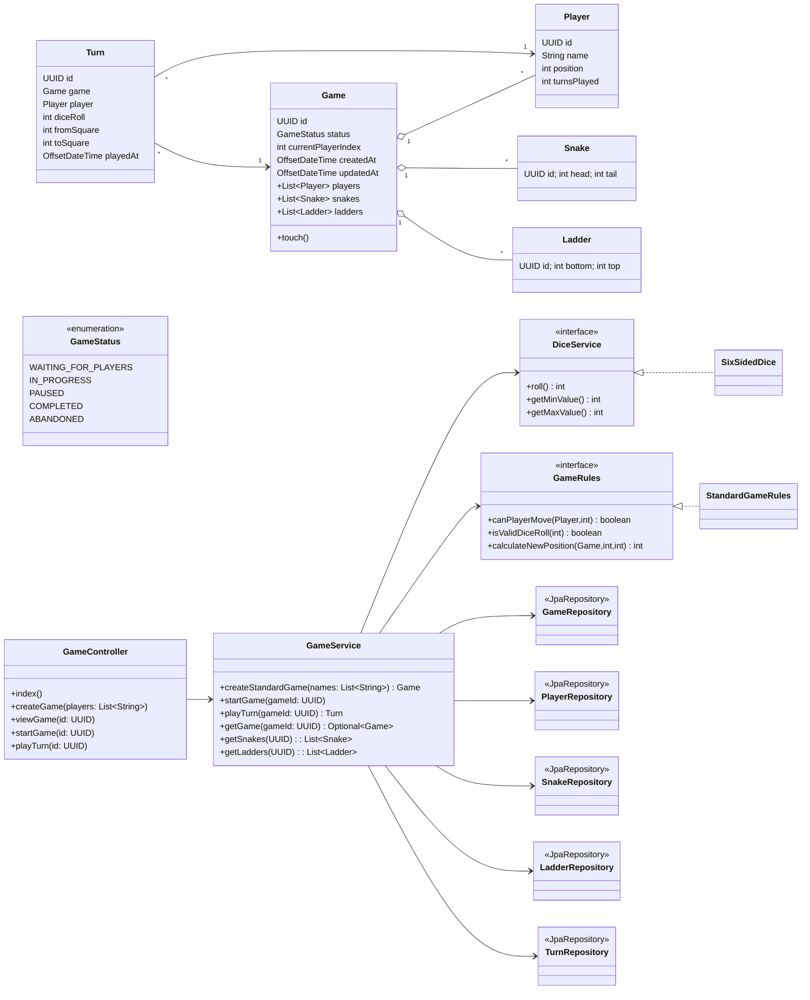

# Class Diagram

Short overview
- The domain is persisted with JPA entities (`Game`, `Player`, `Snake`, `Ladder`, `Turn`).
- Application logic lives in `GameService` using `DiceService` and `GameRules` strategies.
- `GameController` orchestrates web flow and prepares lightweight view records.
- Repositories encapsulate persistence; H2 is configured via Spring Boot.

