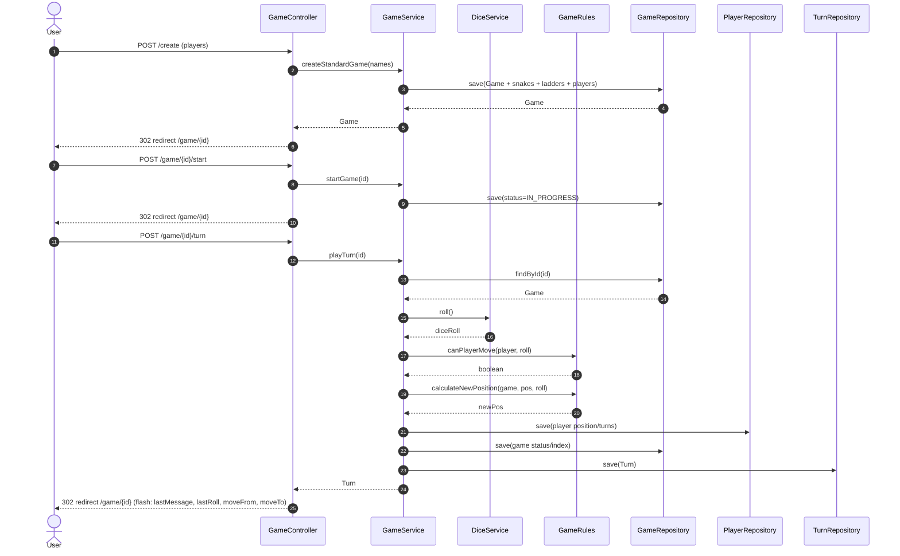

# Sequence Diagram

Short overview
- A user creates a game from the UI; controller delegates to service.
- On play turn: service rolls the dice, applies rules, updates entities, persists a Turn, and computes winner.
- Controller redirects back with flash attributes for UI messaging/animations.

