# Building a Real-Time Messaging System: Design Deep Dive

> How do you deliver messages to 2 billion users in real-time? Let's design a messaging system that handles millions of concurrent connections, ensures message delivery, syncs across devices, and maintains privacy with end-to-end encryption.

---

## A Real-World Problem

**Aadvik (Interviewer):** "Sara, imagine you're building WhatsApp. Your users expect messages to arrive instantly, even when they switch devices. They expect end-to-end encryption for privacy. They never want to lose a message, even if they're offline for days. Where do you start?"

**Sara (Candidate):** *[Thinking]* "This is fundamentally about real-time communication at massive scale. We need to handle connection management, message routing, persistence, encryption, and multi-device synchronization. The scale challenge is huge - millions of concurrent WebSocket connections, billions of messages per day."

**Aadvik:** "Exactly. And here's the complexity - different users are on different networks, different devices, some online, some offline. Messages need to be delivered reliably, quickly, and securely. Ready to design this?"

**Sara:** "Yes! Let me start by understanding the requirements. Here are my clarifying questions:
- What types of messages? Text, media, group chats?
- What delivery guarantees? At-least-once or exactly-once?
- How do we handle offline users?
- Do we need read receipts, typing indicators?
- What's the expected scale? Concurrent users, messages per second?
- Security requirements? End-to-end encryption needed?
- Multi-device support? Same user on phone and laptop simultaneously?"

**Aadvik:** "Great questions, Sara. Let's define the requirements:

**Functional Requirements:**
1. User registration and authentication
2. Send messages (text, images, videos) between users
3. Real-time delivery when recipient is online
4. Store messages for offline users
5. Support 1-on-1 and group chats (up to 256 members)
6. Message status: sent, delivered, read
7. Typing indicators and user presence
8. End-to-end encryption
9. Multi-device synchronization
10. Media transfer and storage

**Non-Functional Requirements:**
1. Scale: 500 million daily active users, 100 billion messages/day
2. Latency: <100ms for online delivery
3. Availability: 99.99% uptime
4. Message persistence: Store for 1 year
5. Handle offline users: Deliver all missed messages on reconnect
6. Encryption: End-to-end encryption for privacy

**Scale Estimation:**
- Daily active users: 500 million
- Concurrent connections: 100 million (20% of DAU)
- Messages per day: 100 billion
- Average message size: 1 KB (text) to 500 KB (media)
- Peak message rate: 1 million messages/second
- Storage: ~500 TB/day (with media), 182 PB/year"

---

## Part 1: Requirements & Core Challenges

**Aadvik:** "Before we dive into architecture, let's identify the core challenges."

**Sara:** "The main challenges are:
1. **Connection Management** - How to maintain millions of WebSocket connections efficiently
2. **Message Routing** - How to route messages to the right server where user is connected
3. **Delivery Guarantees** - How to ensure messages aren't lost during delivery
4. **Offline Handling** - How to deliver messages when user comes back online
5. **Multi-device Sync** - How to sync messages across user's devices (phone, laptop, tablet)
6. **Encryption** - How to implement end-to-end encryption without breaking the system
7. **Storage** - How to store billions of messages efficiently with fast retrieval"

**Aadvik:** "Excellent breakdown. One more question - what about ordering? If User A sends three messages quickly, how do we ensure User B receives them in order?"

**Sara:** "Good point! Message ordering is critical, especially in group chats. We need to handle:
- Out-of-order delivery due to network issues
- Messages arriving from different servers
- Retries causing duplicates"

**Aadvik:** "Perfect. Now let's start with the simplest case - User A sends a message to User B who is online. Walk me through what happens step by step."

---

## Part 2: Core Architecture - 1-on-1 Messaging

**Aadvik:** "User A sends 'Hello' to User B. User B is online. What happens?"

**Sara:** "Let me think step by step. First, User A's device needs to send the message to our server. How should we handle the connection?"

**Aadvik:** "What are the options?"

**Sara:** "We have several options:
1. **WebSocket** - Persistent connection, bidirectional, low latency
2. **Long Polling** - HTTP-based, simpler, works through firewalls
3. **Server-Sent Events (SSE)** - One-way push, simpler than WebSocket

For real-time messaging, WebSocket is the best choice. It maintains a persistent connection, allows bidirectional communication, and has minimal overhead."

**Aadvik:** "Good. Now, User A sends 'Hello' via WebSocket. What happens next?"

### Basic Message Flow

**Sara:** "Here's what should happen:

1. **User A's device** → Sends message via WebSocket to Server
2. **Server** → Receives message, needs to find where User B is connected
3. **Server** → Looks up User B's connection (which server/connection ID)
4. **Server** → Delivers message to User B via their WebSocket
5. **User B's device** → Receives message, sends ACK back

But here's the problem - if we have multiple servers, User A might be connected to Server 1, but User B might be connected to Server 2. How do we route?"

**Aadvik:** "Exactly the challenge. How do you solve this?"

**Sara:** "We need a **Connection Registry** - a shared storage that tracks which server each user is connected to. When User B connects, we register: `User B → Server 2, Connection ID: xyz`. When routing a message, we look up this registry."

### Connection Registry Pattern

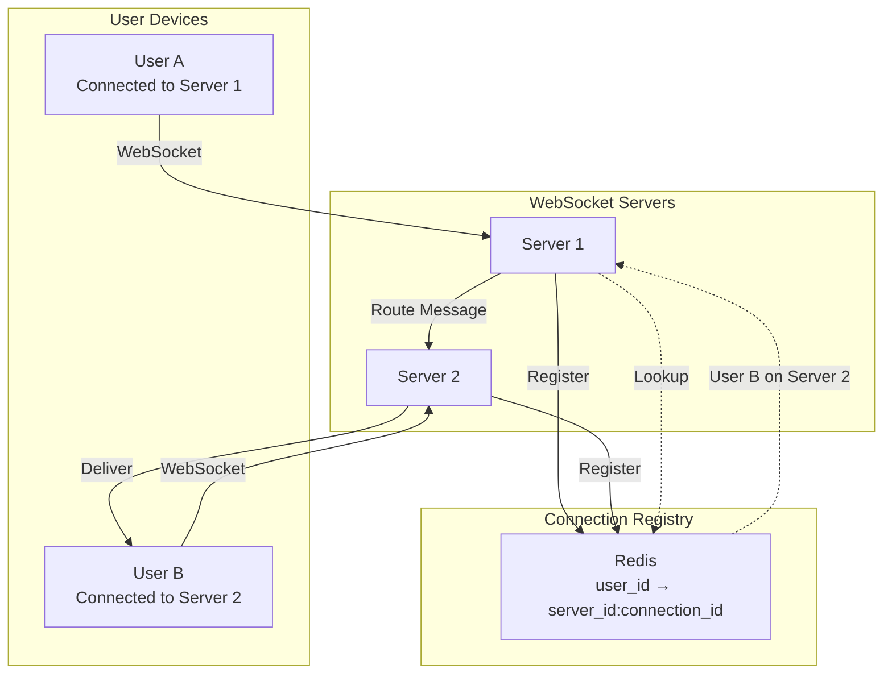
```mermaid
graph TB
    subgraph "User Devices"
        A[User A<br/>Connected to Server 1]
        B[User B<br/>Connected to Server 2]
    end
    
    subgraph "WebSocket Servers"
        S1[Server 1]
        S2[Server 2]
    end
    
    subgraph "Connection Registry"
        R[Redis<br/>user_id → server_id:connection_id]
    end
    
    A -->|WebSocket| S1
    B -->|WebSocket| S2
    
    S1 -->|Register| R
    S2 -->|Register| R
    
    S1 -.Lookup.-> R
    R -.User B on Server 2.-> S1
    S1 -->|Route Message| S2
    S2 -->|Deliver| B
```

**Aadvik:** "Good. But wait - if User A and User B are on the same server, do you still need to route?"

**Sara:** "No! That's an optimization. If both users are on the same server, we can deliver directly without going through the registry lookup. The registry is only needed for cross-server routing."

**Aadvik:** "What about storing the message? Should we store before or after delivery?"

**Sara:** "We should store **before** attempting delivery. This ensures we don't lose messages if delivery fails. The flow should be:

1. Store message in database
2. Attempt delivery
3. Update delivery status (delivered/not delivered)
4. If offline, mark for later delivery"

**Aadvik:** "Perfect. Now show me the complete sequence diagram."

### Complete Message Delivery Sequence (Both Users Online)

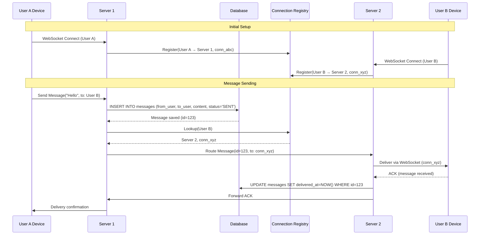
```mermaid
sequenceDiagram
    participant UA as User A Device
    participant S1 as Server 1
    participant DB as Database
    participant Reg as Connection Registry
    participant S2 as Server 2
    participant UB as User B Device
    
    Note over UA,UB: Initial Setup
    UA->>S1: WebSocket Connect (User A)
    S1->>Reg: Register(User A → Server 1, conn_abc)
    
    UB->>S2: WebSocket Connect (User B)
    S2->>Reg: Register(User B → Server 2, conn_xyz)
    
    Note over UA,UB: Message Sending
    UA->>S1: Send Message("Hello", to: User B)
    
    S1->>DB: INSERT INTO messages (from_user, to_user, content, status='SENT')
    DB-->>S1: Message saved (id=123)
    
    S1->>Reg: Lookup(User B)
    Reg-->>S1: Server 2, conn_xyz
    
    S1->>S2: Route Message(id=123, to: conn_xyz)
    S2->>UB: Deliver via WebSocket (conn_xyz)
    
    UB-->>S2: ACK (message received)
    S2->>DB: UPDATE messages SET delivered_at=NOW() WHERE id=123
    S2->>S1: Forward ACK
    
    S1->>UA: Delivery confirmation
```

**Aadvik:** "What if both users are on the same server?"

**Sara:** "Great optimization! If the lookup shows User B is on the same server, we skip cross-server routing. The server can directly find User B's connection from its local connection map."

### Same-Server Delivery (Optimized)

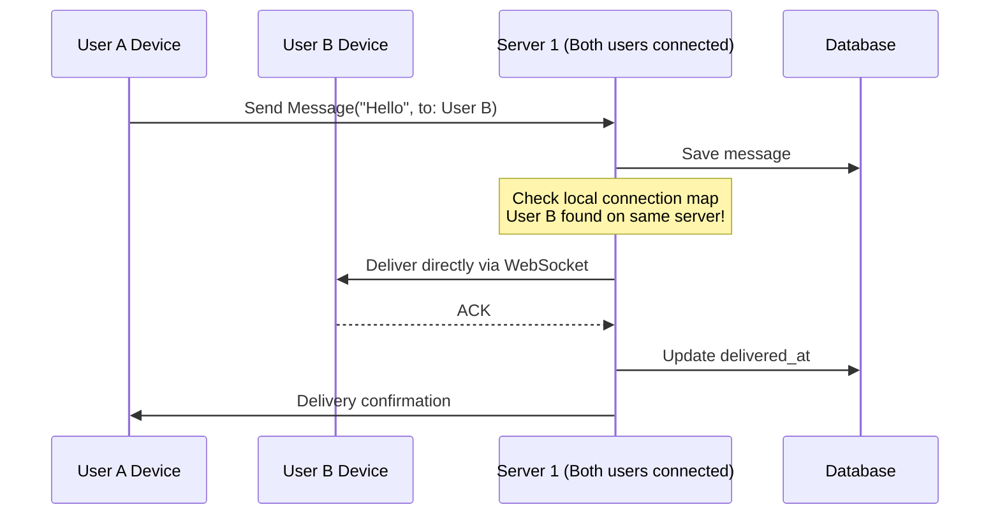
```mermaid
sequenceDiagram
    participant UA as User A Device
    participant UB as User B Device
    participant S1 as Server 1 (Both users connected)
    participant DB as Database
    
    UA->>S1: Send Message("Hello", to: User B)
    
    S1->>DB: Save message
    
    Note over S1: Check local connection map<br/>User B found on same server!
    
    S1->>UB: Deliver directly via WebSocket
    UB-->>S1: ACK
    S1->>DB: Update delivered_at
    
    S1->>UA: Delivery confirmation
```

**Aadvik:** "Now, what information do we need to store in the database for messages?"

**Sara:** "Let me think about the message schema..."

### Message Database Schema

```sql
CREATE TABLE messages (
    message_id BIGINT PRIMARY KEY,
    from_user_id VARCHAR(50) NOT NULL,
    to_user_id VARCHAR(50) NOT NULL,
    content TEXT,
    message_type ENUM('TEXT', 'IMAGE', 'VIDEO', 'AUDIO', 'FILE'),
    created_at TIMESTAMP NOT NULL,
    delivered_at TIMESTAMP NULL,
    read_at TIMESTAMP NULL,
    message_status ENUM('SENT', 'DELIVERED', 'READ') DEFAULT 'SENT',
    
    -- For ordering
    sequence_number BIGINT,
    
    -- Indexes
    INDEX idx_to_user (to_user_id, created_at DESC),
    INDEX idx_from_user (from_user_id, created_at DESC),
    INDEX idx_status (message_status)
);
```

**Aadvik:** "Why the sequence_number? And why indexes on both to_user and from_user?"

**Sara:** "Sequence numbers help with ordering, especially when messages might arrive out of order. We can use it to sort messages chronologically for display.

The indexes on both `to_user` and `from_user` are needed because:
- `to_user` index: When User B fetches their messages (inbox view)
- `from_user` index: When User A fetches sent messages (sent items view)

Both queries are common."

**Aadvik:** "What about the connection registry schema? How do you store that?"

**Sara:** "The connection registry should be fast and ephemeral - users connect/disconnect frequently. Redis is perfect:

**Redis Structure:**
- Key: `connection:user_id`
- Value: `server_id:connection_id`
- TTL: Set to expire after inactivity (e.g., 5 minutes of no heartbeat)"

**Aadvik:** "Good thinking. Now, one critical question - what if User B receives the message, but before they send ACK, the connection drops?"

**Sara:** "That's a tricky scenario. The message might be delivered but not acknowledged. We need a mechanism to handle this..."

[This leads to Part 5 - Message Delivery Guarantees, but for now we continue with offline handling]

---

## Part 2.5: WebSocket Server Architecture Deep Dive

**Aadvik:** "Let's dig deeper into WebSocket servers. You mentioned multiple servers, but how do they actually work together? How do servers register themselves? How do clients connect to the right server?"

**Sara:** "Great question. This is the foundation of our distributed messaging system. Let me break it down step by step."

### Server Startup and Registration

**Aadvik:** "When a WebSocket server starts up, what happens?"

**Sara:** "When a WebSocket server starts:

1. **Server initializes** - Starts listening on a port (e.g., 8080)
2. **Generates unique server ID** - Each server gets a unique identifier (e.g., `server-001`, `server-002`)
3. **Registers with Service Registry** - Announces its availability
4. **Registers with Load Balancer** - Tells the load balancer it's ready to accept connections
5. **Connects to shared Redis** - Establishes connection to Redis (connection registry)
6. **Starts health check heartbeat** - Begins sending periodic health checks"

**Aadvik:** "What's the difference between Service Registry and Load Balancer?"

**Sara:** "Good distinction:

- **Service Registry** (e.g., Consul, etcd, Zookeeper) - Tracks which services are running, their health, and metadata. Used by services to discover each other.

- **Load Balancer** (e.g., HAProxy, Nginx, AWS ELB) - Routes client requests to available servers. Clients don't know which server they're hitting.

For WebSocket servers, we need both:
- Service Registry: For server-to-server communication
- Load Balancer: For client-to-server connections"

### Server Registration Flow

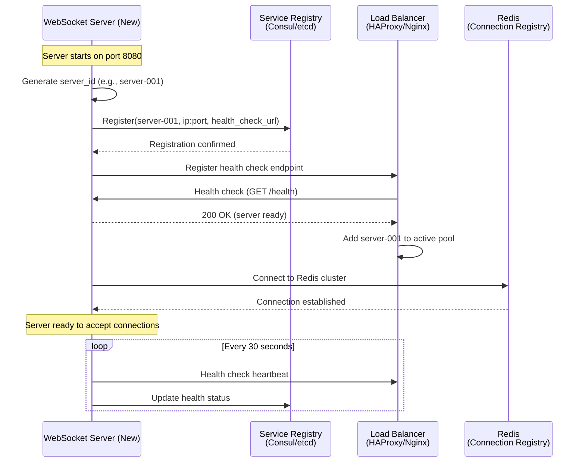
```mermaid
sequenceDiagram
    participant WS as WebSocket Server (New)
    participant Registry as Service Registry<br/>(Consul/etcd)
    participant LB as Load Balancer<br/>(HAProxy/Nginx)
    participant Redis as Redis<br/>(Connection Registry)
    
    Note over WS: Server starts on port 8080
    
    WS->>WS: Generate server_id (e.g., server-001)
    WS->>Registry: Register(server-001, ip:port, health_check_url)
    Registry-->>WS: Registration confirmed
    
    WS->>LB: Register health check endpoint
    LB->>WS: Health check (GET /health)
    WS-->>LB: 200 OK (server ready)
    LB->>LB: Add server-001 to active pool
    
    WS->>Redis: Connect to Redis cluster
    Redis-->>WS: Connection established
    
    Note over WS: Server ready to accept connections
    
    loop Every 30 seconds
        WS->>LB: Health check heartbeat
        WS->>Registry: Update health status
    end
```

**Aadvik:** "What information does the server store in the Service Registry?"

**Sara:** "The Service Registry stores:

```json
{
  "server_id": "server-001",
  "host": "10.0.1.5",
  "port": 8080,
  "region": "us-east-1",
  "health_check_url": "http://10.0.1.5:8080/health",
  "max_connections": 50000,
  "current_connections": 0,
  "status": "healthy",
  "registered_at": "2024-01-15T10:00:00Z"
}
```

Other servers can query the registry to discover available WebSocket servers."

**Aadvik:** "Now, how does a client connect? Walk me through the client connection flow."

**Sara:** "Here's the complete client connection flow:"

### Client Connection Flow

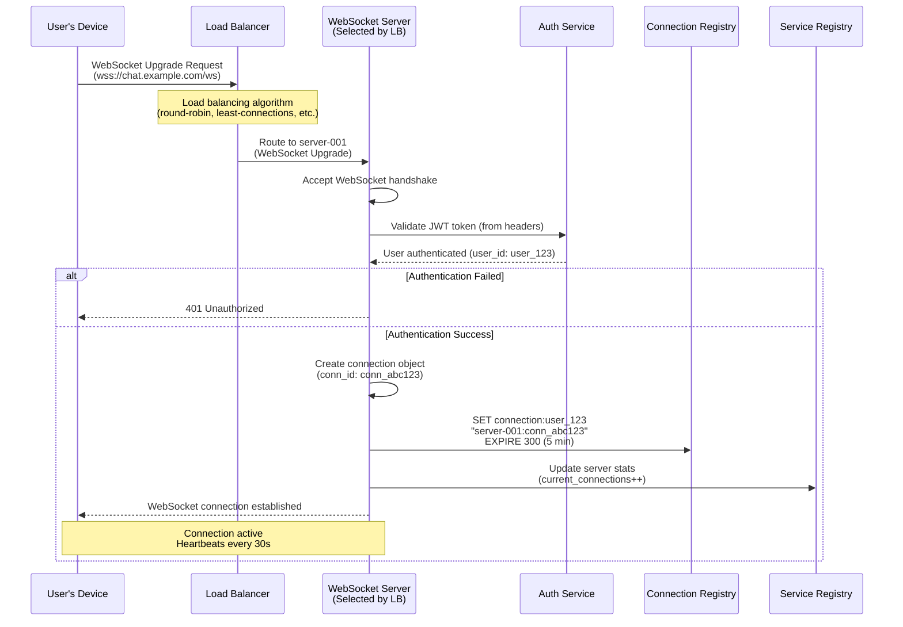
```mermaid
sequenceDiagram
    participant Client as User's Device
    participant LB as Load Balancer
    participant WS as WebSocket Server<br/>(Selected by LB)
    participant Auth as Auth Service
    participant Redis as Connection Registry
    participant Registry as Service Registry
    
    Client->>LB: WebSocket Upgrade Request<br/>(wss://chat.example.com/ws)
    Note over LB: Load balancing algorithm<br/>(round-robin, least-connections, etc.)
    LB->>WS: Route to server-001<br/>(WebSocket Upgrade)
    
    WS->>WS: Accept WebSocket handshake
    WS->>Auth: Validate JWT token (from headers)
    Auth-->>WS: User authenticated (user_id: user_123)
    
    alt Authentication Failed
        WS-->>Client: 401 Unauthorized
    else Authentication Success
        WS->>WS: Create connection object<br/>(conn_id: conn_abc123)
        WS->>Redis: SET connection:user_123<br/>"server-001:conn_abc123"<br/>EXPIRE 300 (5 min)
        
        WS->>Registry: Update server stats<br/>(current_connections++)
        
        WS-->>Client: WebSocket connection established
        
        Note over Client,WS: Connection active<br/>Heartbeats every 30s
    end
```

**Aadvik:** "How does the Load Balancer choose which server to route to?"

**Sara:** "Load balancer uses different algorithms:

**1. Round Robin** - Rotate through servers sequentially
**2. Least Connections** - Route to server with fewest active connections (best for WebSocket)
**3. IP Hash** - Route based on client IP (sticky sessions)
**4. Weighted** - Based on server capacity/load

For WebSocket, **Least Connections** is ideal because:
- WebSocket connections are long-lived
- We want to balance connection count, not request count
- Prevents overloading specific servers"

**Aadvik:** "What's stored in Redis for the connection registry?"

**Sara:** "In Redis, we store connection mappings:

**Key Structure:**
```
Key: connection:user_id
Example: connection:user_123
Value: server_id:connection_id
Example: server-001:conn_abc123
TTL: 300 seconds (5 minutes)
```

**Additional Keys for Multi-Device:**
```
Key: connection:user_id:device_id
Example: connection:user_123:device_phone_1
Value: server_id:connection_id
```

**Why TTL?**
- If server crashes, stale entries auto-expire
- If connection drops silently, entry expires after heartbeat timeout
- Prevents registry bloat"

**Aadvik:** "What happens when the server needs to look up a user's connection?"

**Sara:** "Here's the lookup process:"

### Connection Lookup Flow

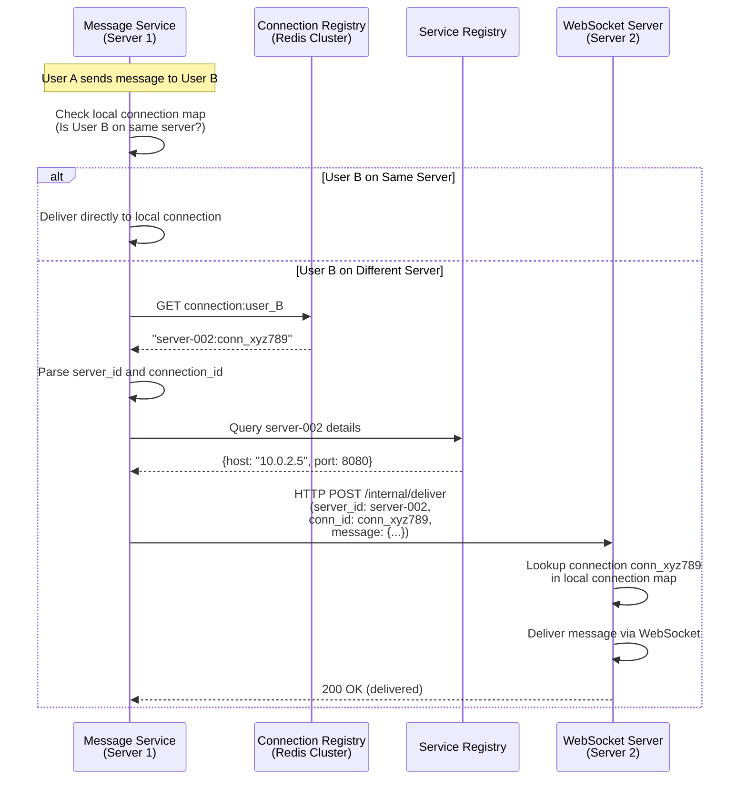
```mermaid
sequenceDiagram
    participant MSG as Message Service<br/>(Server 1)
    participant Redis as Connection Registry<br/>(Redis Cluster)
    participant Registry as Service Registry
    participant WS as WebSocket Server<br/>(Server 2)
    
    Note over MSG: User A sends message to User B
    
    MSG->>MSG: Check local connection map<br/>(Is User B on same server?)
    
    alt User B on Same Server
        MSG->>MSG: Deliver directly to local connection
    else User B on Different Server
        MSG->>Redis: GET connection:user_B
        Redis-->>MSG: "server-002:conn_xyz789"
        
        MSG->>MSG: Parse server_id and connection_id
        
        MSG->>Registry: Query server-002 details
        Registry-->>MSG: {host: "10.0.2.5", port: 8080}
        
        MSG->>WS: HTTP POST /internal/deliver<br/>(server_id: server-002,<br/>conn_id: conn_xyz789,<br/>message: {...})
        
        WS->>WS: Lookup connection conn_xyz789<br/>in local connection map
        
        WS->>WS: Deliver message via WebSocket
        WS-->>MSG: 200 OK (delivered)
    end
```

**Aadvik:** "How does Server 1 communicate with Server 2? Do they have direct connections?"

**Sara:** "Good question. There are two approaches:

**Option 1: Direct HTTP/gRPC Communication**
- Each server exposes an internal API endpoint
- Server 1 makes HTTP/gRPC call to Server 2
- Pros: Simple, direct
- Cons: Tight coupling, need to know server network addresses

**Option 2: Message Queue (Kafka)**
- All servers subscribe to message routing topics
- Server 1 publishes message to Kafka topic
- Server 2 consumes and delivers
- Pros: Decoupled, scalable, handles failures better
- Cons: Slightly more latency

I'd recommend **Option 2 (Kafka)** for better scalability and fault tolerance."

### Server-to-Server Communication via Kafka

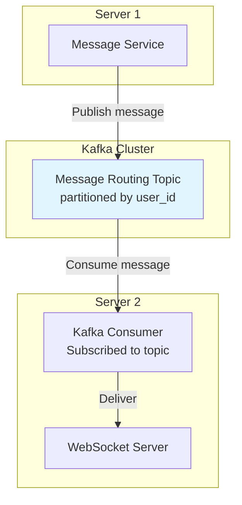
```mermaid
graph TB
    subgraph "Server 1"
        MSG1[Message Service]
    end
    
    subgraph "Kafka Cluster"
        TOPIC[Message Routing Topic<br/>partitioned by user_id]
    end
    
    subgraph "Server 2"
        CONSUMER[Kafka Consumer<br/>Subscribed to topic]
        WS2[WebSocket Server]
    end
    
    MSG1 -->|Publish message| TOPIC
    TOPIC -->|Consume message| CONSUMER
    CONSUMER -->|Deliver| WS2
    
    style TOPIC fill:#e1f5ff
```

**Aadvik:** "What if Server 2 is down when the message arrives?"

**Sara:** "Kafka handles this gracefully:

1. **Message persists** in Kafka (durable)
2. **Consumer group** - If Server 2 is down, another server in the consumer group can pick up the message
3. **Offset management** - Server 2 resumes from last committed offset when it comes back
4. **Retry logic** - Failed deliveries can be retried via dead-letter queue

This is much more resilient than direct HTTP calls."

**Aadvik:** "How does heartbeat work? What if a connection dies silently?"

**Sara:** "Heartbeats are critical for detecting dead connections:

**Client → Server Heartbeat:**
- Client sends ping frame every 30 seconds
- Server responds with pong frame
- If no ping for 90 seconds → Server closes connection

**Server → Registry Heartbeat:**
- Server updates Redis TTL every 30 seconds
- If server crashes → TTL expires, entry removed from registry
- Other servers know user is offline"

### Heartbeat Mechanism

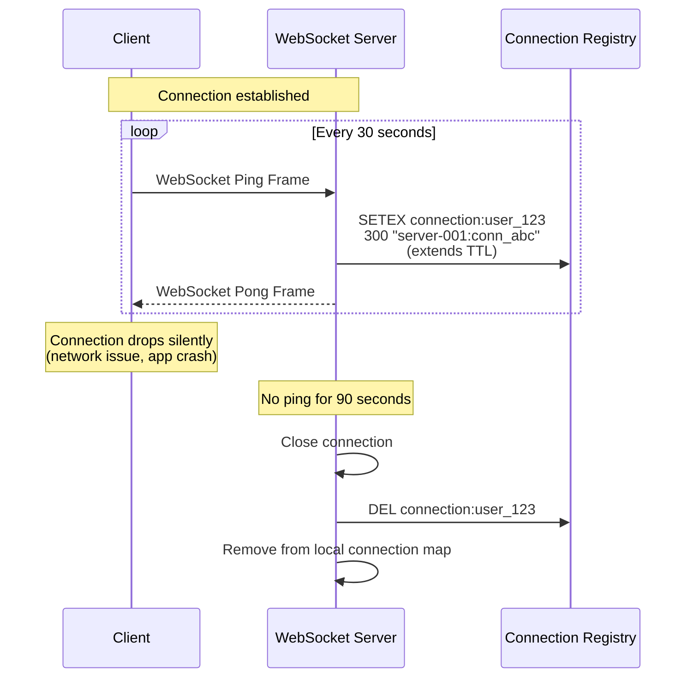
```mermaid
sequenceDiagram
    participant Client
    participant WS as WebSocket Server
    participant Redis as Connection Registry
    
    Note over Client,WS: Connection established
    
    loop Every 30 seconds
        Client->>WS: WebSocket Ping Frame
        WS->>Redis: SETEX connection:user_123<br/>300 "server-001:conn_abc"<br/>(extends TTL)
        WS-->>Client: WebSocket Pong Frame
    end
    
    Note over Client: Connection drops silently<br/>(network issue, app crash)
    
    Note over WS: No ping for 90 seconds
    
    WS->>WS: Close connection
    WS->>Redis: DEL connection:user_123
    WS->>WS: Remove from local connection map
```

**Aadvik:** "What happens when a WebSocket server crashes? How do we handle existing connections?"

**Sara:** "Server crash is a critical scenario. Here's the recovery process:"

### Server Crash Recovery

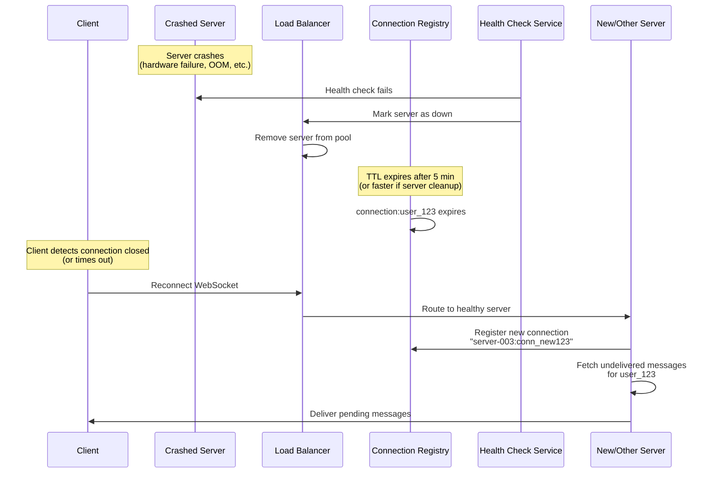
```mermaid
sequenceDiagram
    participant Client
    participant WS as Crashed Server
    participant LB as Load Balancer
    participant Redis as Connection Registry
    participant Health as Health Check Service
    participant NewWS as New/Other Server
    
    Note over WS: Server crashes<br/>(hardware failure, OOM, etc.)
    
    Health->>WS: Health check fails
    Health->>LB: Mark server as down
    LB->>LB: Remove server from pool
    
    Note over Redis: TTL expires after 5 min<br/>(or faster if server cleanup)
    
    Redis->>Redis: connection:user_123 expires
    
    Note over Client: Client detects connection closed<br/>(or times out)
    
    Client->>LB: Reconnect WebSocket
    LB->>NewWS: Route to healthy server
    NewWS->>Redis: Register new connection<br/>"server-003:conn_new123"
    
    NewWS->>NewWS: Fetch undelivered messages<br/>for user_123
    
    NewWS->>Client: Deliver pending messages
```

**Aadvik:** "How does the client know to reconnect?"

**Sara:** "Client implements reconnection logic:

1. **Connection closed event** - WebSocket API fires `onclose` event
2. **Exponential backoff** - Retry with increasing delays (1s, 2s, 4s, 8s, max 30s)
3. **Resume on reconnect** - Client sends `last_message_id` to sync missed messages
4. **Handle duplicate messages** - Use idempotency on client side"

**Aadvik:** "What about server startup? When a new server joins, how does it integrate?"

**Sara:** "When a new server starts:

1. **Registers with Service Registry** - Announces availability
2. **Load Balancer discovers it** - Via health check or registry watch
3. **Joins Kafka consumer group** - Starts consuming message routing topics
4. **Begins accepting connections** - Load balancer routes new connections to it
5. **No migration needed** - Existing connections stay on their servers

This is **horizontal scaling** - we can add servers dynamically without disrupting existing connections."

### Dynamic Server Scaling

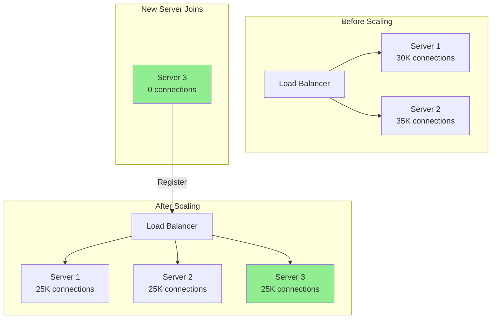
```mermaid
graph TB
    subgraph "Before Scaling"
        LB1[Load Balancer]
        WS1[Server 1<br/>30K connections]
        WS2[Server 2<br/>35K connections]
    end
    
    subgraph "New Server Joins"
        WS3[Server 3<br/>0 connections]
    end
    
    subgraph "After Scaling"
        LB2[Load Balancer]
        WS4[Server 1<br/>25K connections]
        WS5[Server 2<br/>25K connections]
        WS6[Server 3<br/>25K connections]
    end
    
    LB1 --> WS1
    LB1 --> WS2
    
    WS3 -->|Register| LB2
    LB2 --> WS4
    LB2 --> WS5
    LB2 --> WS6
    
    style WS3 fill:#90EE90
    style WS6 fill:#90EE90
```

**Aadvik:** "Excellent! One last question - how many connections can a single server handle?"

**Sara:** "Connection capacity depends on several factors:

**Per Server Capacity:**
- **Memory**: ~10-20KB per connection (connection state, buffers)
  - 50K connections ≈ 1GB RAM
  - 100K connections ≈ 2GB RAM
- **CPU**: WebSocket is event-driven, relatively lightweight
- **Network**: Depends on bandwidth and message frequency
- **OS Limits**: File descriptor limits (usually 65K per process)

**Typical Configuration:**
- **Small server**: 10K-20K connections
- **Medium server**: 50K-100K connections  
- **Large server**: 100K-200K connections

**For 100M concurrent users:**
- 100M ÷ 50K per server = **2,000 servers**
- With redundancy (50% overhead) = **3,000 servers**

We distribute these across multiple regions."

**Aadvik:** "Perfect! This gives a complete picture of how WebSocket servers work in a distributed system."

---

## Part 3: Database Choice - RDBMS vs NoSQL

**Aadvik:** "What database would you use for storing messages?"

**Sara:** "That's a critical decision. Let me think about the access patterns first:

**Primary Access Patterns:**
1. **Write**: Insert new message (high frequency - millions per second)
2. **Read**: Fetch messages for a user (sorted by timestamp, paginated)
3. **Read**: Fetch recent messages (last N messages)
4. **Update**: Mark as delivered/read (frequent updates)
5. **Range queries**: Messages between timestamps
6. **Ordering**: Chronological ordering is critical"

**Aadvik:** "Given these patterns, what are your options?"

**Sara:** "We have two main approaches:

### Option 1: RDBMS (MySQL/PostgreSQL)

**Pros:**
- ACID guarantees - Perfect for message delivery status updates
- Transaction support - Can ensure message saved and delivered atomically
- Mature tooling and team familiarity
- Strong consistency - Message ordering guaranteed
- Complex queries - Easy to query 'messages from User A to User B between dates'

**Cons:**
- Horizontal scaling is hard - Need sharding for billions of messages
- Write bottlenecks - Single master limits write throughput
- Storage costs - Structured data with indexes take more space
- Complex sharding logic needed at scale"

**Aadvik:** "What about NoSQL?"

**Sara:** "NoSQL options:

### Option 2: NoSQL - Cassandra

**Pros:**
- **Horizontal scaling** - Designed for write-heavy, distributed workloads
- **High write throughput** - Can handle millions of writes per second
- **Partitioning** - Natural partitioning by user_id
- **No single point of failure** - Multi-master replication
- **TTL support** - Can auto-expire old messages

**Cons:**
- **Eventual consistency** - Message ordering might be tricky across partitions
- **Limited transactions** - Harder to ensure atomic updates
- **Query limitations** - Can't easily query 'all messages between two users' across partitions
- **Learning curve** - Team needs to understand Cassandra data modeling"

**Aadvik:** "What about MongoDB?"

**Sara:** "MongoDB is another option:

### Option 3: NoSQL - MongoDB

**Pros:**
- Flexible schema - Easy to evolve message structure
- Horizontal scaling with sharding
- Good for JSON/document structure
- Secondary indexes support

**Cons:**
- Similar to Cassandra - eventual consistency challenges
- Storage overhead - Document storage can be inefficient
- Sharding complexity - Need careful shard key selection"

**Aadvik:** "Given our requirements - 100 billion messages per day, need for ordering, and delivery status tracking - which would you choose?"

**Sara:** "I'd choose **Cassandra** for message storage, and here's why:

**Why Cassandra:**
1. **Write-heavy workload** - 100B messages/day is primarily writes
2. **Natural partitioning** - Can partition by `to_user_id`, which aligns with primary read pattern
3. **Time-series nature** - Messages are time-ordered, Cassandra handles time-series well
4. **Scale requirement** - Need horizontal scaling, RDBMS sharding is complex

**But we need to handle:**
- Message ordering: Use `message_id` or `timestamp` as clustering key
- Cross-user queries: Denormalize or use separate service
- Delivery status: Store separately or use wide rows

**Hybrid Approach:**
- **Cassandra**: Primary message store (partitioned by recipient user_id)
- **MySQL/PostgreSQL**: User metadata, delivery status, analytics queries
- **Redis**: Hot messages cache (last 24 hours)"

**Aadvik:** "Good reasoning. Show me the Cassandra schema design."

**Sara:** "Cassandra schema needs careful design around the partition key."

### Cassandra Schema Design

```cql
-- Primary table: Partition by recipient (to_user_id)
CREATE TABLE messages_by_recipient (
    to_user_id VARCHAR,
    message_id BIGINT,  -- Clustering key for ordering
    from_user_id VARCHAR,
    content TEXT,
    message_type VARCHAR,
    created_at TIMESTAMP,
    delivered_at TIMESTAMP,
    read_at TIMESTAMP,
    message_status VARCHAR,
    
    PRIMARY KEY (to_user_id, message_id)
) WITH CLUSTERING ORDER BY (message_id DESC);

-- Secondary table: For 'sent messages' view
CREATE TABLE messages_by_sender (
    from_user_id VARCHAR,
    message_id BIGINT,
    to_user_id VARCHAR,
    content TEXT,
    created_at TIMESTAMP,
    
    PRIMARY KEY (from_user_id, message_id)
) WITH CLUSTERING ORDER BY (message_id DESC);
```

**Aadvik:** "Why two tables? That's duplication."

**Sara:** "Yes, but Cassandra doesn't support efficient queries across partitions. If User A wants to see their sent messages, we can't query `messages_by_recipient` efficiently. So we denormalize:

- **Write cost**: Write to both tables (2x writes, but acceptable)
- **Read benefit**: Fast queries for both inbox and sent messages
- **Consistency**: Eventual consistency between tables (acceptable for this use case)"

**Aadvik:** "What about message ordering? How do you ensure messages are in order?"

**Sara:** "We use `message_id` as the clustering key, and generate it using a technique that ensures ordering:

1. **Snowflake ID** - Timestamp-based, naturally ordered
2. **TimeUUID** - Cassandra's built-in time-ordered UUID
3. **Composite**: `timestamp + sequence` - If multiple messages in same millisecond

The clustering key automatically sorts within a partition, so messages for User B will be ordered by `message_id`."

**Aadvik:** "One more question - what about group messages? Same schema?"

**Sara:** "Group messages need a different approach. For a group with 256 members, we can't store one message in 256 partitions. Instead:

**Option 1**: Store once, fan-out on read
- Store in `messages_by_group` table
- When user queries, fetch from group messages

**Option 2**: Fan-out on write (store per member)
- When message sent to group, write to each member's `messages_by_recipient` partition
- More writes, but faster reads

I'd choose Option 2 for better read performance, which is more common than writes."

---

## Part 4: Offline Message Delivery

**Aadvik:** "What if User B is offline when User A sends the message?"

**Sara:** "The message is already stored in the database from Part 2. When we tried to deliver, the connection registry lookup would have shown User B as offline. So we mark the message as 'not delivered' and it remains in the database."

**Aadvik:** "Good. Now User B comes back online. How do they get their messages?"

**Sara:** "When User B reconnects, we need to:
1. Fetch all undelivered messages
2. Deliver them in order
3. Update delivery status

But there's a problem - if User B has been offline for a week, fetching all messages could be expensive."

**Aadvik:** "How would you handle that?"

**Sara:** "We need efficient message sync. Instead of fetching everything, we use a **sync timestamp** approach:

1. When User B connects, send their `last_sync_timestamp` (last time they were online)
2. Server fetches messages where `created_at > last_sync_timestamp`
3. Deliver messages in batches
4. Update `last_sync_timestamp` after successful delivery"

### Offline Message Sync Flow

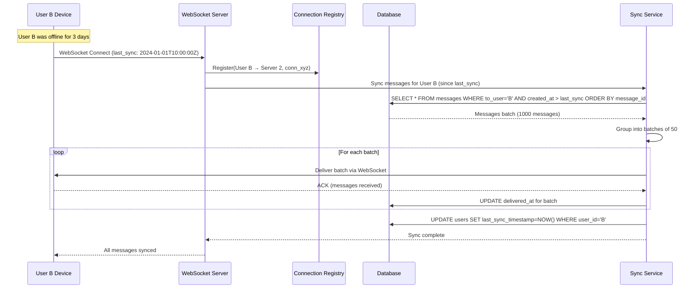
```mermaid
sequenceDiagram
    participant UB as User B Device
    participant WS as WebSocket Server
    participant Reg as Connection Registry
    participant DB as Database
    participant Sync as Sync Service
    
    Note over UB: User B was offline for 3 days
    
    UB->>WS: WebSocket Connect (last_sync: 2024-01-01T10:00:00Z)
    WS->>Reg: Register(User B → Server 2, conn_xyz)
    
    WS->>Sync: Sync messages for User B (since last_sync)
    
    Sync->>DB: SELECT * FROM messages WHERE to_user='B' AND created_at > last_sync ORDER BY message_id
    DB-->>Sync: Messages batch (1000 messages)
    
    Sync->>Sync: Group into batches of 50
    
    loop For each batch
        Sync->>UB: Deliver batch via WebSocket
        UB-->>Sync: ACK (messages received)
        Sync->>DB: UPDATE delivered_at for batch
    end
    
    Sync->>DB: UPDATE users SET last_sync_timestamp=NOW() WHERE user_id='B'
    Sync-->>WS: Sync complete
    WS-->>UB: All messages synced
```

**Aadvik:** "What if there are 10,000 messages? Delivering all at once would be slow."

**Sara:** "Exactly! We need pagination. Instead of one large query, we:

1. Fetch first batch (e.g., 50 messages)
2. Deliver and wait for ACK
3. Fetch next batch
4. Continue until all messages delivered

This prevents overwhelming the connection and allows the UI to render messages progressively."

### Cursor-Based Pagination for Sync

**Sara:** "We can use cursor-based pagination:

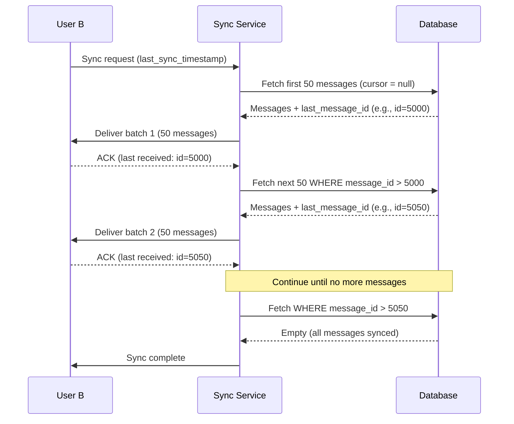
```mermaid
sequenceDiagram
    participant UB as User B
    participant Sync as Sync Service
    participant DB as Database
    
    UB->>Sync: Sync request (last_sync_timestamp)
    
    Sync->>DB: Fetch first 50 messages (cursor = null)
    DB-->>Sync: Messages + last_message_id (e.g., id=5000)
    
    Sync->>UB: Deliver batch 1 (50 messages)
    UB-->>Sync: ACK (last received: id=5000)
    
    Sync->>DB: Fetch next 50 WHERE message_id > 5000
    DB-->>Sync: Messages + last_message_id (e.g., id=5050)
    
    Sync->>UB: Deliver batch 2 (50 messages)
    UB-->>Sync: ACK (last received: id=5050)
    
    Note over Sync,DB: Continue until no more messages
    
    Sync->>DB: Fetch WHERE message_id > 5050
    DB-->>Sync: Empty (all messages synced)
    Sync->>UB: Sync complete
```

**Aadvik:** "Good. But what if User B receives new messages while syncing old ones?"

**Sara:** "That's a race condition! While User B is syncing old messages, User A might send a new message. We need to handle this:

**Solution**: New messages go through the same sync mechanism. When a new message arrives during sync:
- Add to sync queue
- After current batch completes, include new messages in next batch
- Or, deliver new messages immediately via WebSocket (they're already connected)

I'd prefer the second approach - deliver new messages immediately, continue background sync for old messages."

### Concurrent Sync and New Messages

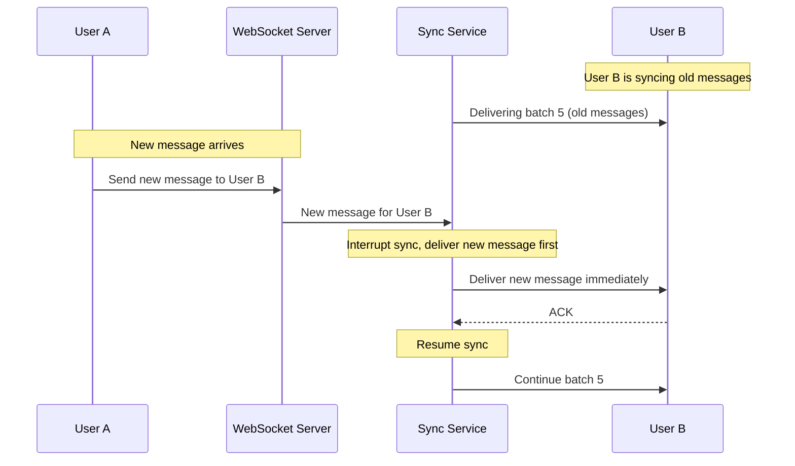
```mermaid
sequenceDiagram
    participant UA as User A
    participant WS as WebSocket Server
    participant Sync as Sync Service
    participant UB as User B
    
    Note over UB: User B is syncing old messages
    
    Sync->>UB: Delivering batch 5 (old messages)
    
    Note over UA,WS: New message arrives
    
    UA->>WS: Send new message to User B
    WS->>Sync: New message for User B
    
    Note over Sync: Interrupt sync, deliver new message first
    
    Sync->>UB: Deliver new message immediately
    UB-->>Sync: ACK
    
    Note over Sync: Resume sync
    
    Sync->>UB: Continue batch 5
```

**Aadvik:** "What about storage tiers? Should we store all messages in the same database?"

**Sara:** "For scale, we need storage tiering:

**Hot Storage (Redis/Cassandra)**:
- Last 30 days of messages
- Fast retrieval, expensive

**Warm Storage (Cassandra/MySQL)**:
- 30 days to 1 year
- Moderate speed, moderate cost

**Cold Storage (S3/HDFS)**:
- Older than 1 year
- Slow retrieval, cheap

When syncing, we first check hot storage, then warm, then cold if needed."

**Aadvik:** "What if User B was offline for 2 months? Do we sync all 2 months of messages?"

**Sara:** "That's a UX question. Options:

1. **Sync all** - User gets everything, but slow initial load
2. **Sync recent only** - Last 7 days, with option to 'Load more'
3. **Lazy sync** - Load visible messages first, fetch more as user scrolls

I'd choose Option 3 - lazy loading. Fetch last 100 messages immediately, then load more as user scrolls up in the chat."

---

## Part 5: Message Delivery Guarantees

**Aadvik:** "Earlier you mentioned a scenario - User B receives the message but connection drops before ACK. How do we ensure no messages are lost?"

**Sara:** "That's the core challenge of reliable messaging. We need to define what 'delivered' means and handle failures."

**Aadvik:** "What are the delivery guarantee options?"

**Sara:** "There are three levels:

1. **At-most-once** - Message delivered zero or one time (may lose messages)
2. **At-least-once** - Message delivered one or more times (may duplicate)
3. **Exactly-once** - Message delivered exactly once (ideal, but complex)

For messaging apps, we typically use **at-least-once** with idempotency to handle duplicates."

**Aadvik:** "Why not exactly-once?"

**Sara:** "Exactly-once delivery is extremely hard in distributed systems. It requires:
- Distributed transactions
- Two-phase commit
- Significant performance overhead
- Complex failure handling

Instead, at-least-once is simpler and we handle duplicates using idempotency."

**Aadvik:** "Explain the idempotency pattern."

**Sara:** "Idempotency means processing the same message multiple times produces the same result. Here's how:

1. Each message has a unique `message_id`
2. Before processing, check if `message_id` was already processed
3. If yes, skip (idempotent)
4. If no, process and mark as processed

This way, if a message is delivered twice, we only process it once."

### Idempotency Flow

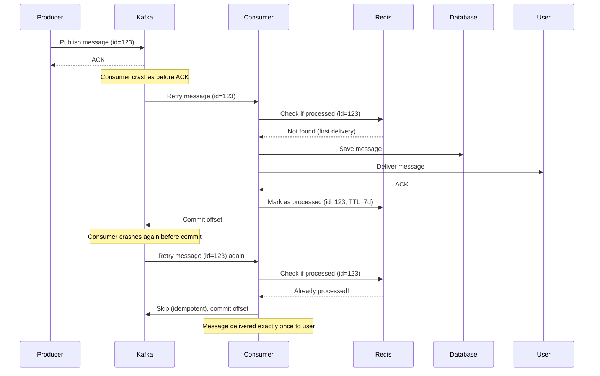
```mermaid
sequenceDiagram
    participant Producer
    participant Kafka
    participant Consumer
    participant Redis
    participant DB as Database
    participant User
    
    Producer->>Kafka: Publish message (id=123)
    Kafka-->>Producer: ACK
    
    Note over Kafka: Consumer crashes before ACK
    
    Kafka->>Consumer: Retry message (id=123)
    Consumer->>Redis: Check if processed (id=123)
    Redis-->>Consumer: Not found (first delivery)
    
    Consumer->>DB: Save message
    Consumer->>User: Deliver message
    User-->>Consumer: ACK
    
    Consumer->>Redis: Mark as processed (id=123, TTL=7d)
    Consumer->>Kafka: Commit offset
    
    Note over Kafka: Consumer crashes again before commit
    
    Kafka->>Consumer: Retry message (id=123) again
    Consumer->>Redis: Check if processed (id=123)
    Redis-->>Consumer: Already processed!
    
    Consumer->>Kafka: Skip (idempotent), commit offset
    Note over Consumer: Message delivered exactly once to user
```

**Aadvik:** "What if the message is delivered to User B, but User B crashes before showing it?"

**Sara:** "We have two levels of delivery:

1. **Delivered to device** - Message reached User B's device
2. **Read by user** - User actually opened/read the message

We track both. When User B's app receives a message:
1. App sends 'delivered' ACK immediately (message received by app)
2. App stores message locally
3. When user opens chat, app sends 'read' ACK"

### Delivery Status Flow

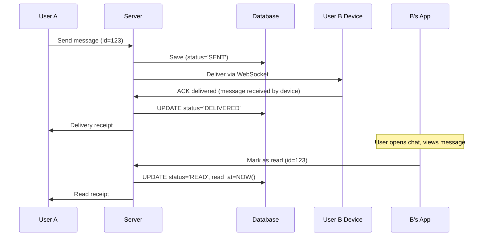
```mermaid
sequenceDiagram
    participant UA as User A
    participant Server
    participant DB as Database
    participant UB as User B Device
    participant App as B's App
    
    UA->>Server: Send message (id=123)
    Server->>DB: Save (status='SENT')
    Server->>UB: Deliver via WebSocket
    
    UB->>Server: ACK delivered (message received by device)
    Server->>DB: UPDATE status='DELIVERED'
    Server->>UA: Delivery receipt
    
    Note over App: User opens chat, views message
    
    App->>Server: Mark as read (id=123)
    Server->>DB: UPDATE status='READ', read_at=NOW()
    Server->>UA: Read receipt
```

**Aadvik:** "What about retries? How do you handle message delivery failures?"

**Sara:** "We need exponential backoff retry mechanism:

1. **First attempt**: Immediate
2. **Retry 1**: After 1 second
3. **Retry 2**: After 2 seconds
4. **Retry 3**: After 4 seconds
5. **Retry 4**: After 8 seconds
6. **Max retries**: Stop after 5 attempts, mark as failed

For persistent failures (user offline for days), we use the sync mechanism when they reconnect."

**Aadvik:** "How do you track which messages need retrying?"

**Sara:** "We maintain a **pending deliveries** queue:

1. When message saved, add to pending queue (if recipient offline)
2. Background job checks pending queue
3. Attempts delivery with retry logic
4. On success, remove from queue
5. On max retries, mark as failed (will sync on reconnect)"

### Retry Mechanism

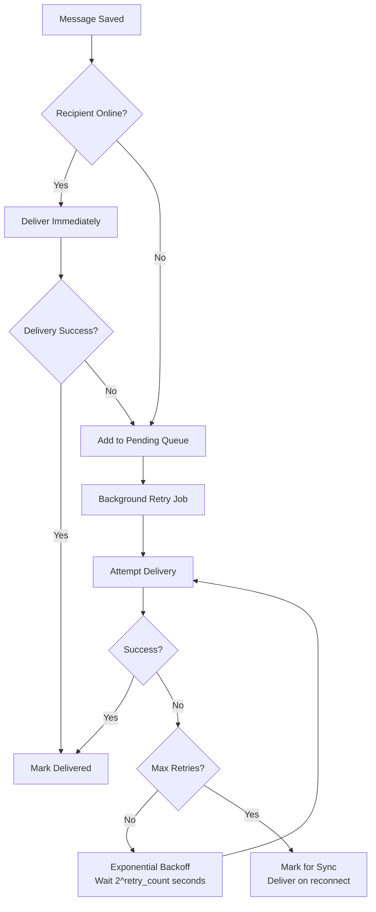
```mermaid
graph TB
    A[Message Saved] --> B{Recipient Online?}
    B -->|Yes| C[Deliver Immediately]
    B -->|No| D[Add to Pending Queue]
    
    C --> E{Delivery Success?}
    E -->|Yes| F[Mark Delivered]
    E -->|No| D
    
    D --> G[Background Retry Job]
    G --> H[Attempt Delivery]
    H --> I{Success?}
    I -->|Yes| F
    I -->|No| J{Max Retries?}
    J -->|No| K[Exponential Backoff<br/>Wait 2^retry_count seconds]
    K --> H
    J -->|Yes| L[Mark for Sync<br/>Deliver on reconnect]
```

**Aadvik:** "What about message ordering? How do you ensure messages arrive in order?"

**Sara:** "Message ordering is tricky in distributed systems. Options:

**Option 1: Sequence Numbers**
- Each message has a `sequence_number` per conversation
- Client buffers messages and orders by sequence
- If sequence 5 arrives before sequence 4, buffer until 4 arrives

**Option 2: Vector Clocks**
- Track causality across servers
- More complex, good for group chats

**Option 3: Single-threaded per conversation**
- Process messages for same conversation on same thread/server
- Ensures ordering but limits parallelism

I'd use Option 1 (sequence numbers) - simpler and effective for most cases."

---

## Part 6: Group Chat Architecture

**Aadvik:** "Now add group chats. 256 users in a group. User A sends a message. How does it reach all 256 members?"

**Sara:** "Group chats fundamentally need **fan-out delivery**. When User A sends a message to the group, we need to deliver it to all 255 other members (excluding sender)."

**Aadvik:** "What's the difference from 1-on-1 messaging?"

**Sara:** "Key differences:
1. **Fan-out factor** - One message → N deliveries (256 members)
2. **Storage strategy** - Do we store one message or 255 copies?
3. **Delivery coordination** - Some members online, some offline
4. **Read receipts** - Track who has read the message"

**Aadvik:** "Let's start with storage. Do you store one message or one per member?"

**Sara:** "That's a critical design decision. Let me think about both options:

### Option 1: Store One Message Per Group

```sql
CREATE TABLE group_messages (
    message_id BIGINT PRIMARY KEY,
    group_id VARCHAR(50) NOT NULL,
    from_user_id VARCHAR(50) NOT NULL,
    content TEXT,
    created_at TIMESTAMP,
    INDEX idx_group (group_id, created_at DESC)
);
```

**Pros:**
- Storage efficient - One message for 256 members
- Easier updates - Update read status in one place
- Lower write load

**Cons:**
- Complex read queries - Need to join with delivery status
- Harder to query "all messages for User B" (they're in many groups)

### Option 2: Store Per-Member (Fan-out on Write)

```sql
-- Same as 1-on-1 messages table
-- Each member gets their own copy
```

**Pros:**
- Simple queries - Same table as 1-on-1 messages
- Independent delivery status per member
- Faster reads - No joins needed

**Cons:**
- 256x storage (one message stored 256 times)
- 256x writes when message sent
- More expensive"

**Aadvik:** "Which would you choose?"

**Sara:** "I'd choose **Option 2 (fan-out on write)** for these reasons:

1. **Read performance** - Most common operation is "fetch my messages", not "fetch group messages"
2. **Consistency** - Each user's view is independent
3. **Scalability** - Writes are cheaper than complex read queries at scale
4. **Delivery tracking** - Easy to track delivered/read per member

The storage cost is acceptable given the scale we're targeting."

**Aadvik:** "Show me how the fan-out works."

**Sara:** "When User A sends a message to Group 123, here's the flow:"

### Group Message Fan-Out Flow

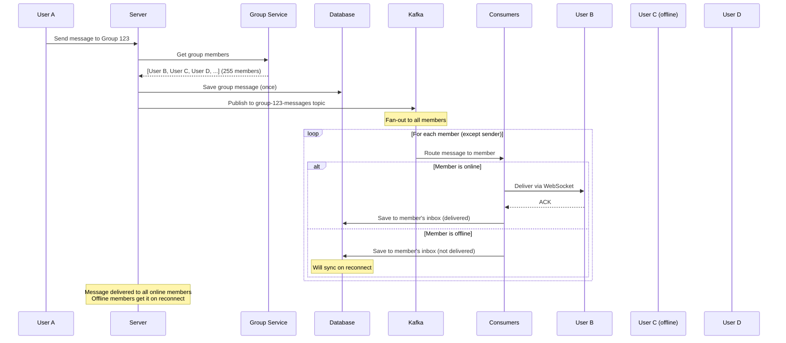
```mermaid
sequenceDiagram
    participant UA as User A
    participant Server
    participant GroupService as Group Service
    participant DB as Database
    participant Kafka
    participant Consumers
    participant UB as User B
    participant UC as User C (offline)
    participant UD as User D
    
    UA->>Server: Send message to Group 123
    Server->>GroupService: Get group members
    GroupService-->>Server: [User B, User C, User D, ...] (255 members)
    
    Server->>DB: Save group message (once)
    Server->>Kafka: Publish to group-123-messages topic
    
    Note over Kafka: Fan-out to all members
    
    loop For each member (except sender)
        Kafka->>Consumers: Route message to member
        alt Member is online
            Consumers->>UB: Deliver via WebSocket
            UB-->>Consumers: ACK
            Consumers->>DB: Save to member's inbox (delivered)
        else Member is offline
            Consumers->>DB: Save to member's inbox (not delivered)
            Note over DB: Will sync on reconnect
        end
    end
    
    Note over Server: Message delivered to all online members<br/>Offline members get it on reconnect
```

**Aadvik:** "What about group membership? How do you manage who's in which group?"

**Sara:** "We need a group membership table:"

```sql
CREATE TABLE group_members (
    group_id VARCHAR(50) NOT NULL,
    user_id VARCHAR(50) NOT NULL,
    role ENUM('ADMIN', 'MEMBER') DEFAULT 'MEMBER',
    joined_at TIMESTAMP,
    PRIMARY KEY (group_id, user_id),
    INDEX idx_user (user_id)
);
```

**Aadvik:** "When User A sends a message, do you query the group_members table every time?"

**Sara:** "No, that would be expensive. We cache group membership in Redis:

1. **Cache group members** - When group created/updated, cache member list
2. **On message send** - Lookup from cache (fast)
3. **Cache invalidation** - When member added/removed, invalidate cache"

### Group Membership Caching

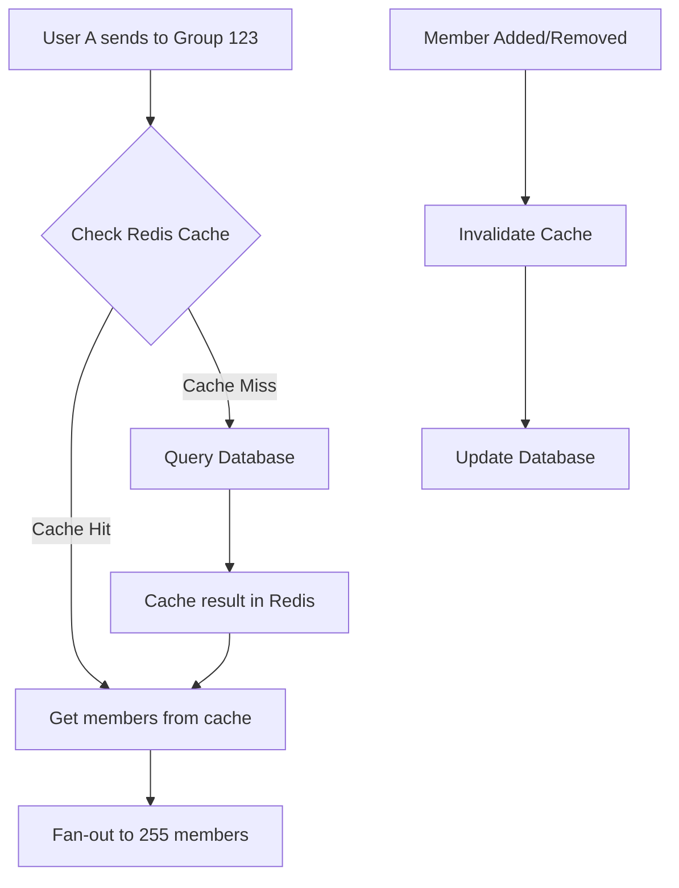
```mermaid
graph TB
    A[User A sends to Group 123] --> B{Check Redis Cache}
    B -->|Cache Hit| C[Get members from cache]
    B -->|Cache Miss| D[Query Database]
    D --> E[Cache result in Redis]
    E --> C
    C --> F[Fan-out to 255 members]
    
    G[Member Added/Removed] --> H[Invalidate Cache]
    H --> I[Update Database]
```

**Aadvik:** "What about read receipts in groups? How do you track who has read?"

**Sara:** "For group messages, we track read receipts per member:

```sql
CREATE TABLE group_message_reads (
    message_id BIGINT NOT NULL,
    user_id VARCHAR(50) NOT NULL,
    read_at TIMESTAMP,
    PRIMARY KEY (message_id, user_id)
);
```

When User B reads a group message:
1. Client sends read receipt
2. Save to `group_message_reads` table
3. Notify sender (User A) about read receipt
4. User A can see "256 members, 180 have read""

### Group Read Receipts

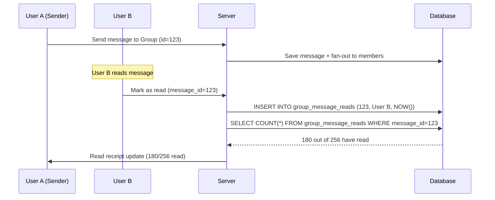
```mermaid
sequenceDiagram
    participant UA as User A (Sender)
    participant UB as User B
    participant Server
    participant DB as Database
    
    UA->>Server: Send message to Group (id=123)
    Server->>DB: Save message + fan-out to members
    
    Note over UB: User B reads message
    
    UB->>Server: Mark as read (message_id=123)
    Server->>DB: INSERT INTO group_message_reads (123, User B, NOW())
    
    Server->>DB: SELECT COUNT(*) FROM group_message_reads WHERE message_id=123
    DB-->>Server: 180 out of 256 have read
    
    Server->>UA: Read receipt update (180/256 read)
```

---

## Part 7: Multi-Device Synchronization

**Aadvik:** "User has WhatsApp on phone and laptop. Both are online. User A sends a message to User B. How does User B receive it on both devices?"

**Sara:** "This requires **multi-device fan-out**. When a message arrives for User B, we need to:
1. Identify all of User B's active devices
2. Deliver the message to each device
3. Sync delivery status across devices"

**Aadvik:** "How do you track which devices a user has?"

**Sara:** "We need a device registry, similar to connection registry but per device:"

```sql
CREATE TABLE user_devices (
    user_id VARCHAR(50) NOT NULL,
    device_id VARCHAR(100) NOT NULL,
    device_type ENUM('PHONE', 'TABLET', 'DESKTOP', 'WEB') NOT NULL,
    device_token VARCHAR(255),  -- For push notifications
    last_active TIMESTAMP,
    registered_at TIMESTAMP,
    PRIMARY KEY (user_id, device_id),
    INDEX idx_user (user_id)
);
```

**Aadvik:** "How do you register devices?"

**Sara:** "When User B logs in on a new device:
1. Device sends registration request with device info
2. Server generates unique `device_id`
3. Store in `user_devices` table
4. Register WebSocket connection for that device in connection registry: `connection:user_id:device_id`"

### Multi-Device Connection Registry

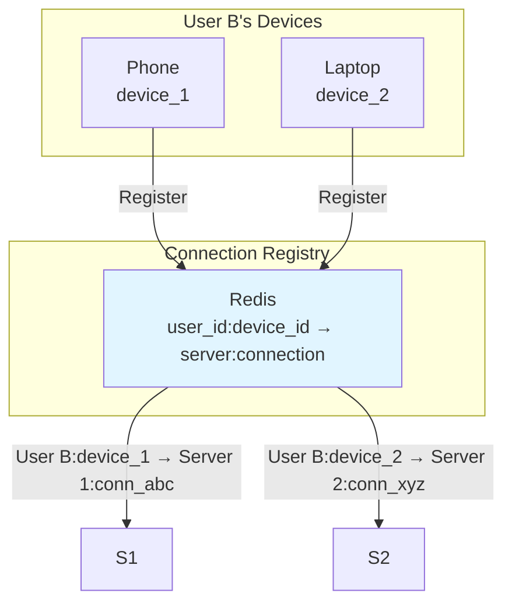
```mermaid
graph TB
    subgraph "User B's Devices"
        D1[Phone<br/>device_1]
        D2[Laptop<br/>device_2]
    end
    
    subgraph "Connection Registry"
        R[Redis<br/>user_id:device_id → server:connection]
    end
    
    D1 -->|Register| R
    D2 -->|Register| R
    
    R -->|User B:device_1 → Server 1:conn_abc| S1
    R -->|User B:device_2 → Server 2:conn_xyz| S2
    
    style R fill:#e1f5ff
```

**Aadvik:** "Now, User A sends a message to User B. How do you deliver to both devices?"

**Sara:** "We need to fan-out to all of User B's active devices:"

### Multi-Device Message Delivery

```mermaid
sequenceDiagram
    participant UA as User A
    participant Server
    participant DeviceService as Device Service
    participant Reg as Connection Registry
    participant D1 as User B's Phone
    participant D2 as User B's Laptop
    
    UA->>Server: Send message to User B
    Server->>DeviceService: Get User B's active devices
    DeviceService-->>Server: [device_1 (phone), device_2 (laptop)]
    
    Server->>DB: Save message
    
    par Deliver to Phone
        Server->>Reg: Lookup(User B, device_1)
        Reg-->>Server: Server 1, conn_abc
        Server->>D1: Deliver message
        D1-->>Server: ACK delivered
    and Deliver to Laptop
        Server->>Reg: Lookup(User B, device_2)
        Reg-->>Server: Server 2, conn_xyz
        Server->>D2: Deliver message
        D2-->>Server: ACK delivered
    end
    
    Server->>DB: Update delivered_at (both devices)
    Server->>UA: Delivery receipt (2/2 devices)
```

**Aadvik:** "What if User B reads the message on phone? Should laptop show it as read too?"

**Sara:** "Yes! Read receipts need to sync across devices. When User B reads on phone:
1. Phone sends read receipt
2. Server marks message as read in database
3. Server notifies laptop (User B's other device) that message is read
4. Both devices show message as read"

### Read Receipt Sync Across Devices

```mermaid
sequenceDiagram
    participant D1 as User B's Phone
    participant Server
    participant DB as Database
    participant D2 as User B's Laptop
    
    Note over D1: User B reads message on phone
    
    D1->>Server: Mark as read (message_id=123)
    Server->>DB: UPDATE messages SET read_at=NOW() WHERE message_id=123
    
    Server->>D2: Push read receipt sync (message_id=123, read)
    D2->>Server: ACK sync received
    
    Note over D1,D2: Both devices now show message as read
```

**Aadvik:** "What about 'last seen'? If User B is active on phone, should laptop show them as online?"

**Sara:** "Good question. We need to aggregate presence across devices:

**Approach:**
- If ANY device is active → User is online
- `last_seen` = most recent activity across all devices
- When any device sends heartbeat, update user's presence"

### Multi-Device Presence

```mermaid
sequenceDiagram
    participant D1 as Phone
    participant D2 as Laptop
    participant PresenceService
    participant Redis
    
    D1->>PresenceService: Heartbeat (active)
    PresenceService->>Redis: Update presence(User B, ONLINE, device_1)
    
    D2->>PresenceService: Heartbeat (active)
    PresenceService->>Redis: Update presence(User B, ONLINE, device_2)
    
    Note over Redis: User B has 2 active devices
    
    PresenceService->>Redis: GET presence(User B)
    Redis-->>PresenceService: ONLINE (last_seen: NOW, devices: [phone, laptop])
```

**Aadvik:** "What if User B receives a message on phone while laptop is syncing old messages?"

**Sara:** "That's a synchronization challenge. We need to handle:

1. **Priority delivery** - New messages delivered immediately to all active devices
2. **Sync coordination** - Each device syncs independently based on its own `last_sync_timestamp`
3. **Conflict resolution** - If same message arrives via sync and push, use idempotency"

### Concurrent New Messages and Sync

```mermaid
sequenceDiagram
    participant UA as User A
    participant Server
    participant D1 as User B's Phone (syncing)
    participant D2 as User B's Laptop (syncing)
    
    Note over D1,D2: Both devices syncing old messages
    
    UA->>Server: Send new message to User B
    Server->>Server: Get User B's devices
    
    par Deliver to Phone
        Server->>D1: Deliver new message (interrupt sync)
        D1-->>Server: ACK
        Note over D1: Resume sync after new message
    and Deliver to Laptop
        Server->>D2: Deliver new message (interrupt sync)
        D2-->>Server: ACK
        Note over D2: Resume sync after new message
    end
```

---

## Part 8: End-to-End Encryption

**Aadvik:** "Privacy is critical. How do we implement end-to-end encryption so the server can't read messages?"

**Sara:** "End-to-end encryption (E2EE) means messages are encrypted on the sender's device and only decrypted on the receiver's device. The server stores encrypted messages but can't decrypt them."

**Aadvik:** "How does the encryption work? Walk me through the key exchange."

**Sara:** "We use **asymmetric encryption** for key exchange, then **symmetric encryption** for messages (faster):

**Key Exchange Flow (Simplified Signal Protocol):**
1. Each user has a **public key** and **private key** pair
2. Users exchange public keys
3. Generate shared secret (Diffie-Hellman)
4. Use shared secret to encrypt/decrypt messages"

**Aadvik:** "Where are the keys stored?"

**Sara:** "Critical security question:
- **Public keys**: Stored on server (users can fetch each other's public keys)
- **Private keys**: Never leave the device, stored only on device's secure storage
- **Shared secrets**: Computed on device, never stored or transmitted"

### Key Exchange Flow

```mermaid
sequenceDiagram
    participant UA as User A Device
    participant Server
    participant UB as User B Device
    
    Note over UA: User A generates key pair<br/>private_key_A (never leaves device)<br/>public_key_A
    
    UA->>Server: Register public_key_A
    Server->>Server: Store public_key_A
    
    Note over UB: User B generates key pair<br/>private_key_B (never leaves device)<br/>public_key_B
    
    UB->>Server: Register public_key_B
    Server->>Server: Store public_key_B
    
    Note over UA,UB: User A wants to send message to User B
    
    UA->>Server: Request User B's public_key_B
    Server-->>UA: Return public_key_B
    
    Note over UA: Compute shared_secret = DH(private_key_A, public_key_B)
    
    UA->>UA: Encrypt message using shared_secret
    
    UA->>Server: Send encrypted message (server can't read)
    Server->>UB: Forward encrypted message
    
    Note over UB: Compute shared_secret = DH(private_key_B, public_key_A)
    
    UB->>UB: Decrypt message using shared_secret
```

**Aadvik:** "What about new devices? If User B adds a new laptop, how do they get the keys?"

**Sara:** "Multi-device key management is complex. Options:

**Option 1: Per-Device Keys**
- Each device has its own key pair
- When sending, encrypt separately for each device
- More secure (one device compromised doesn't affect others)

**Option 2: Key Synchronization**
- Sync private key to new device (encrypted with device-specific key)
- Simpler but less secure

I'd recommend Option 1 for better security."

**Aadvik:** "Show me how a message is encrypted and stored."

**Sara:** "Here's the complete flow:"

### Message Encryption Flow

```mermaid
sequenceDiagram
    participant UA as User A Device
    participant Server
    participant DB as Database
    participant UB as User B Device
    
    Note over UA: User A types "Hello"
    
    UA->>UA: Get User B's public_key_B (from cache or server)
    UA->>UA: Compute shared_secret
    UA->>UA: Encrypt("Hello") → encrypted_message
    
    UA->>Server: Send {to_user: B, encrypted_content: "xyz...", sender_key_id: "key_123"}
    
    Server->>DB: Store encrypted message (can't decrypt)
    
    Note over Server: Server doesn't know message content!
    
    Server->>UB: Forward encrypted message
    
    UB->>UB: Get User A's public_key_A
    UB->>UB: Compute shared_secret (same as A computed)
    UB->>UB: Decrypt("xyz...") → "Hello"
    
    Note over UB: Message decrypted and displayed
```

**Aadvik:** "What about group chat encryption? That's more complex."

**Sara:** "Yes, group encryption is challenging. For a group with 256 members:

**Approach 1: Sender Keys (Simplified)**
- Sender encrypts message once with a **sender key**
- Share sender key with all group members (encrypted with each member's public key)
- Each member decrypts sender key, then decrypts message
- When member leaves, rotate sender key

**Approach 2: Per-Member Encryption**
- Encrypt message separately for each member using their public key
- Server stores 256 encrypted copies
- More storage but simpler key management"

**Aadvik:** "How do you handle key rotation if a device is compromised?"

**Sara:** "Key rotation is critical for security:

1. User generates new key pair
2. Old public key marked as deprecated
3. New messages use new public key
4. Old messages remain encrypted with old key (stored on device)
5. Server broadcasts key rotation to all contacts"

### Key Rotation Flow

```mermaid
sequenceDiagram
    participant UA as User A
    participant Server
    participant UB as User B
    participant UC as User C
    
    Note over UA: Device compromised! Rotate keys
    
    UA->>UA: Generate new key pair
    UA->>Server: Register new public_key_A_v2
    
    Server->>Server: Mark old public_key_A_v1 as deprecated
    
    Server->>UB: Notify key rotation (User A has new key)
    Server->>UC: Notify key rotation (User A has new key)
    
    Note over UB,UC: Update User A's public key in cache
    
    UA->>Server: Send encrypted message with new key
    Server->>UB: Forward (UB uses new key to decrypt)
```

**Aadvik:** "Does encryption affect performance?"

**Sara:** "Yes, but it's manageable:

**Performance Impact:**
- Key exchange: One-time setup (cached)
- Encryption/Decryption: ~1-5ms per message (acceptable)
- Group encryption: 256 encryptions per message (more expensive)

**Optimizations:**
- Cache shared secrets per conversation
- Use symmetric encryption for messages (faster than asymmetric)
- Batch encrypt for groups if possible

The security benefit outweighs the performance cost."

---

## Part 9: Media Transfer and Storage

**Aadvik:** "User A sends a 10MB video to User B. How do we handle this?"

**Sara:** "Media files are large - we can't send them directly through the message queue. We need a separate media handling flow:"

**Aadvik:** "What's the problem with sending large files through the message queue?"

**Sara:** "Problems:
1. **Message queue payload limit** - Kafka/RabbitMQ have size limits (typically 1-10MB)
2. **Memory overhead** - Loading 10MB videos into memory for each consumer
3. **Bandwidth** - Transferring large files multiple times through the system
4. **Latency** - Blocking message delivery waiting for media upload"

**Aadvik:** "How would you design this?"

**Sara:** "We use a **two-phase approach**:
1. **Upload media** to object storage (S3, CDN)
2. **Send message** with media URL/metadata (small payload)"

### Media Upload Flow

```mermaid
sequenceDiagram
    participant UA as User A Device
    participant MediaService as Media Service
    participant Storage as S3/CDN
    participant Server
    participant DB as Database
    participant UB as User B
    
    UA->>MediaService: Upload video (10MB)
    MediaService->>MediaService: Generate unique media_id
    MediaService->>Storage: Upload to S3 (path: media_id)
    Storage-->>MediaService: Upload complete, URL
    
    MediaService->>DB: Store media metadata (id, url, size, type)
    MediaService-->>UA: Media upload success (media_id, url)
    
    UA->>Server: Send message {to_user: B, media_id: "abc123", type: "VIDEO"}
    
    Server->>DB: Save message (small payload, just media_id)
    Server->>UB: Deliver message with media_id
    
    UB->>Storage: Download media using URL from metadata
    Storage-->>UB: Stream video
```

**Aadvik:** "What about metadata? How does User B know the video size, duration, etc.?"

**Sara:** "We store media metadata separately:"

```sql
CREATE TABLE media_files (
    media_id VARCHAR(100) PRIMARY KEY,
    user_id VARCHAR(50) NOT NULL,
    file_url VARCHAR(500) NOT NULL,
    file_type ENUM('IMAGE', 'VIDEO', 'AUDIO', 'FILE'),
    file_size BIGINT,
    width INT,  -- For images/videos
    height INT,
    duration INT,  -- For videos/audio (seconds)
    thumbnail_url VARCHAR(500),  -- For videos
    created_at TIMESTAMP,
    INDEX idx_user (user_id)
);
```

**Aadvik:** "How does the message reference the media?"

**Sara:** "The message table includes media reference:"

```sql
-- In messages table
media_id VARCHAR(100),  -- Foreign key to media_files
media_url VARCHAR(500),  -- Denormalized for fast access
```

**Aadvik:** "What about thumbnails for videos?"

**Sara:** "We generate thumbnails during upload:

1. **Upload video** to S3
2. **Background job** processes video:
   - Extract thumbnail (first frame or custom)
   - Generate multiple resolutions (thumbnail, preview, full)
   - Store all versions in S3
3. **Update metadata** with thumbnail URLs
4. **Message includes** thumbnail URL for fast preview"

### Media Processing Pipeline

```mermaid
graph TB
    A[User uploads video] --> B[Media Service]
    B --> C[S3 Storage]
    B --> D[Processing Queue]
    
    D --> E[Extract Thumbnail]
    D --> F[Generate Resolutions]
    D --> G[Transcode if needed]
    
    E --> H[Store Thumbnail in S3]
    F --> I[Store Resolutions in S3]
    G --> J[Store Trans coded Version]
    
    H --> K[Update Metadata]
    I --> K
    J --> K
    
    K --> L[Message Sent with Media ID]
```

**Aadvik:** "What about progressive loading? If User B has slow internet?"

**Sara:** "We use **adaptive bitrate streaming**:
- Store multiple quality versions (480p, 720p, 1080p)
- Client requests appropriate quality based on connection
- For images: Generate multiple sizes (thumbnail, medium, full)
- Client downloads thumbnail first (fast), then full image on demand"

**Aadvik:** "What about end-to-end encryption for media? How does that work?"

**Sara:** "Media encryption is challenging because files are large. Options:

**Option 1: Encrypt on Device**
- Device encrypts entire file before upload
- Upload encrypted blob to S3
- Server stores encrypted file (can't view)
- Recipient downloads and decrypts
- **Problem**: Large encryption overhead, can't generate thumbnails on server

**Option 2: Encrypted Container**
- Encrypt file, store metadata separately
- Generate thumbnail before encryption
- Store encrypted file + unencrypted thumbnail (compromise for UX)

**Option 3: Streaming Encryption**
- Encrypt chunks as they upload
- Server never sees decrypted content
- More complex but better UX

For practicality, I'd use Option 2 - encrypt media but allow thumbnail generation for better UX."

---

## Part 10: User Registration and Profile Management

**Aadvik:** "Let's talk about user onboarding. How does registration work?"

**Sara:** "For messaging apps like WhatsApp, registration is typically phone-number based. Let me walk through the flow:"

**Aadvik:** "Why phone numbers?"

**Sara:** "Phone numbers are:
- Unique identifiers
- Easy for users (no username/password to remember)
- Enable easy contact discovery (sync phone contacts)
- Universal (everyone has one)"

### User Registration Flow

```mermaid
sequenceDiagram
    participant User
    participant App
    participant AuthService as Auth Service
    participant SMSService as SMS Service
    participant DB as Database
    
    User->>App: Enter phone number
    App->>AuthService: Request OTP
    AuthService->>DB: Check if user exists
    
    alt New User
        AuthService->>DB: Create user record (phone, status='PENDING')
    end
    
    AuthService->>SMSService: Send OTP (6-digit code)
    SMSService->>User: SMS with OTP
    
    User->>App: Enter OTP
    App->>AuthService: Verify OTP
    
    AuthService->>AuthService: Validate OTP (expires in 5 min)
    
    alt Valid OTP
        AuthService->>DB: UPDATE user SET status='VERIFIED'
        AuthService->>AuthService: Generate JWT token
        AuthService-->>App: Registration success + token
        App->>App: Store token, proceed to profile setup
    else Invalid/Expired OTP
        AuthService-->>App: Error, resend OTP
    end
```

**Aadvik:** "What happens after verification?"

**Sara:** "After phone verification:
1. User sets up profile (name, profile picture)
2. Generate encryption keys (for E2EE)
3. Upload contacts for discovery
4. Ready to send/receive messages"

**Aadvik:** "How does contact discovery work?"

**Sara:** "Contact discovery allows users to find friends who are already on the platform:

1. **Client uploads contacts** - User's phone contacts (phone numbers)
2. **Server matches** - Check which phone numbers are registered users
3. **Return matches** - Send back list of registered users (without exposing full contact list)
4. **Client displays** - Show "X contacts on WhatsApp""

### Contact Discovery Flow

```mermaid
sequenceDiagram
    participant User
    participant App
    participant DiscoveryService as Discovery Service
    participant DB as Database
    
    User->>App: Grant contact access
    App->>App: Read phone contacts
    App->>DiscoveryService: Upload contact hashes (privacy: hash phone numbers)
    
    DiscoveryService->>DB: Query registered users WHERE phone IN (hashed_contacts)
    DB-->>DiscoveryService: Matched users
    
    DiscoveryService->>DiscoveryService: Anonymize results
    DiscoveryService-->>App: Return matched users (phone, name, profile_pic_url)
    
    App->>App: Display contacts on platform
```

**Aadvik:** "Privacy concern - aren't you exposing who's on the platform?"

**Sara:** "Yes, that's a privacy issue. Solutions:

**Option 1: Hash Phone Numbers**
- Client hashes phone numbers before sending
- Server stores hashed phone numbers
- Match against hashes (one-way, can't reverse)
- **Still exposes**: If you hash my number, you can check if I'm registered

**Option 2: Private Contact Discovery**
- Use cryptographic protocols (Private Set Intersection)
- Server learns nothing about contacts
- More complex but better privacy

For MVP, we'd use Option 1 with rate limiting to prevent abuse."

**Aadvik:** "What's in the user profile?"

**Sara:** "User profile includes:"

```sql
CREATE TABLE users (
    user_id VARCHAR(50) PRIMARY KEY,
    phone_number VARCHAR(20) UNIQUE NOT NULL,
    name VARCHAR(255),
    profile_picture_url VARCHAR(500),
    status_message VARCHAR(255),  -- "Available", "Busy", etc.
    public_key TEXT,  -- For E2EE
    created_at TIMESTAMP,
    last_seen TIMESTAMP,
    status ENUM('ACTIVE', 'DELETED') DEFAULT 'ACTIVE',
    INDEX idx_phone (phone_number)
);
```

**Aadvik:** "How does profile fetching work in the message flow?"

**Sara:** "When User A sends message to User B, the client needs User B's profile info (name, picture). We can:

1. **Include in message** - Send profile info with each message (redundant)
2. **Cache on client** - Fetch once, cache locally
3. **Lazy load** - Fetch profile when displaying chat

I'd use caching - fetch profile on first message, cache with TTL."

---

## Part 11: High-Level Architecture & System Design

**Aadvik:** "Now let's put it all together. Design the complete system architecture that handles all the requirements we discussed."

**Sara:** "Let me design the full system with all components. We need multiple services working together:"

### Complete System Architecture

```mermaid
graph TB
    subgraph "Client Layer"
        A[User A Device]
        B[User B Device]
    end
    
    subgraph "Edge Layer"
        LB[Load Balancer / API Gateway]
    end
    
    subgraph "Authentication & Discovery"
        AUTH[Auth Service<br/>OTP, JWT, User Management]
        DISCO[Discovery Service<br/>Contact Matching]
    end
    
    subgraph "Core Messaging Services"
        MSG[Message Service<br/>Send, Route, Deliver]
        GROUP[Group Service<br/>Group Management, Fan-out]
        SYNC[Sync Service<br/>Offline Message Sync]
    end
    
    subgraph "Connection Management"
        WS[WebSocket Servers<br/>Connection Pool]
        REG[Connection Registry<br/>Redis]
    end
    
    subgraph "Message Queue"
        KAFKA[Kafka Cluster<br/>Message Routing, Fan-out]
    end
    
    subgraph "Storage Layer"
        MSGDB[(Cassandra<br/>Message Store)]
        USERDB[(MySQL<br/>Users, Profiles, Groups)]
        MEDIA[S3/CDN<br/>Media Files]
        REDIS[(Redis<br/>Cache, Registry)]
    end
    
    subgraph "Media Services"
        MEDIASVC[Media Service<br/>Upload, Process, Thumbnails]
    end
    
    subgraph "Background Jobs"
        RETRY[Retry Service<br/>Failed Delivery Retries]
        PROCESS[Media Processor<br/>Thumbnail Generation]
    end
    
    A --> LB
    B --> LB
    LB --> AUTH
    LB --> MSG
    LB --> WS
    
    AUTH --> USERDB
    DISCO --> USERDB
    
    MSG --> KAFKA
    MSG --> MSGDB
    MSG --> REG
    GROUP --> KAFKA
    GROUP --> USERDB
    
    WS --> REG
    WS --> KAFKA
    
    KAFKA --> SYNC
    KAFKA --> RETRY
    
    MSG --> MEDIASVC
    MEDIASVC --> MEDIA
    MEDIASVC --> KAFKA
    PROCESS --> MEDIA
    
    REG --> REDIS
    SYNC --> REDIS
    AUTH --> REDIS
```

### End-to-End Message Flow (Complete System)

**Aadvik:** "Show me the complete flow from registration to sending/receiving a message."

**Sara:** "Let me walk through the end-to-end flow:"

#### Complete User Journey: Registration → Send Message → Receive Message

```mermaid
sequenceDiagram
    participant UA as User A
    participant LB as Load Balancer
    participant AUTH as Auth Service
    participant MSG as Message Service
    participant REG as Connection Registry
    participant KAFKA as Kafka
    participant SYNC as Sync Service
    participant DB as Cassandra
    participant UB as User B
    
    Note over UA,UB: Phase 1: Registration
    
    UA->>LB: POST /auth/register (phone)
    LB->>AUTH: Forward request
    AUTH->>AUTH: Send OTP via SMS
    UA->>LB: POST /auth/verify (phone, OTP)
    LB->>AUTH: Verify OTP
    AUTH->>AUTH: Generate JWT token
    AUTH-->>UA: Registration success + token
    
    UA->>LB: POST /profile/setup (name, picture)
    LB->>AUTH: Update profile
    AUTH->>DB: Save profile + generate encryption keys
    
    Note over UA,UB: Phase 2: Connect
    
    UA->>LB: WebSocket Connect (JWT token)
    LB->>WS: Establish connection
    WS->>REG: Register(User A, server_1, conn_abc)
    
    UB->>LB: WebSocket Connect
    WS->>REG: Register(User B, server_2, conn_xyz)
    
    Note over UA,UB: Phase 3: Send Message
    
    UA->>LB: Send message("Hello", to: User B)
    LB->>MSG: Process message
    MSG->>DB: Save message (status='SENT')
    MSG->>REG: Lookup(User B)
    REG-->>MSG: Server 2, conn_xyz
    
    MSG->>KAFKA: Publish to user_B_messages
    KAFKA->>SYNC: Consume message
    SYNC->>UB: Deliver via WebSocket
    
    UB-->>SYNC: ACK delivered
    SYNC->>DB: UPDATE status='DELIVERED'
    SYNC->>MSG: Forward ACK
    MSG-->>UA: Delivery receipt
```

### Service Responsibilities

**Aadvik:** "What does each service do?"

**Sara:** "Here's the breakdown:

**1. Auth Service:**
- User registration (phone + OTP)
- Authentication (JWT generation)
- Profile management
- Encryption key management

**2. Message Service:**
- Receive messages from clients
- Route messages to correct recipients
- Coordinate delivery
- Message status tracking

**3. Group Service:**
- Group creation/management
- Group membership
- Group message fan-out coordination

**4. Sync Service:**
- Offline message synchronization
- Message pagination
- Cursor management

**5. Connection Registry (Redis):**
- Track active connections (user → server:connection)
- Device management
- Presence tracking

**6. WebSocket Servers:**
- Maintain persistent connections
- Message delivery to devices
- Heartbeat management

**7. Media Service:**
- Media upload handling
- Thumbnail generation
- Multiple resolution processing

**8. Kafka:**
- Message routing between services
- Fan-out for group messages
- Retry queues
- Event streaming"

---

## Part 12: Scaling to Millions and Billions

**Aadvik:** "How do we scale this to handle 2 billion users, 100 billion messages per day?"

**Sara:** "We need multiple scaling strategies working together:

1. **Connection Scaling** - Handle 100M+ concurrent WebSocket connections
2. **Message Sharding** - Distribute message storage across clusters
3. **Geographic Distribution** - Deploy in multiple regions
4. **Storage Tiering** - Optimize storage costs
5. **Caching** - Reduce database load"

**Aadvik:** "Start with connections. How many servers do we need?"

**Sara:** "Connection capacity planning:

- **Per Server Capacity**: Each WebSocket server can handle ~50K-100K connections (depends on resources)
- **100M Concurrent Users**: Need 1,000-2,000 servers for connections alone
- **Load Balancing**: Distribute connections across servers
- **Connection Pooling**: Reuse connections, minimize overhead"

### Connection Scaling Architecture

```mermaid
graph TB
    subgraph "Global Users"
        U[100M Concurrent Users]
    end
    
    subgraph "Regional Load Balancers"
        LB1[US-East LB]
        LB2[EU-West LB]
        LB3[Asia-Pacific LB]
    end
    
    subgraph "WebSocket Server Pools"
        subgraph "US Region"
            WS1[WS Server 1<br/>50K connections]
            WS2[WS Server 2<br/>50K connections]
            WS3[WS Server N<br/>50K connections]
        end
        
        subgraph "EU Region"
            WS4[WS Server 1<br/>50K connections]
            WS5[WS Server 2<br/>50K connections]
        end
    end
    
    U --> LB1
    U --> LB2
    U --> LB3
    
    LB1 --> WS1
    LB1 --> WS2
    LB1 --> WS3
    
    LB2 --> WS4
    LB2 --> WS5
```

**Aadvik:** "What about message storage sharding?"

**Sara:** "Cassandra naturally shards by partition key. We partition by `to_user_id`:

**Sharding Strategy:**
- Partition key: `to_user_id` (hash of user_id)
- Messages for User B always go to same partition
- Each partition handles ~10M users
- Can add more nodes to increase capacity"

**Aadvik:** "How do you handle cross-region messaging?"

**Sara:** "Geographic distribution is critical:

**Regional Deployment:**
- Deploy complete stack in each region (US, EU, Asia)
- Users connect to nearest region
- Cross-region routing for inter-region messages"

### Geographic Distribution

```mermaid
graph TB
    subgraph "US Region"
        US_WS[WebSocket Servers]
        US_MSG[Message Service]
        US_CASS[(Cassandra<br/>US Partition)]
        US_KAFKA[Kafka Cluster]
    end
    
    subgraph "EU Region"
        EU_WS[WebSocket Servers]
        EU_MSG[Message Service]
        EU_CASS[(Cassandra<br/>EU Partition)]
        EU_KAFKA[Kafka Cluster]
    end
    
    subgraph "Global Services"
        REGISTRY[Global Connection Registry<br/>Redis Cluster]
        ROUTER[Cross-Region Router]
    end
    
    US_MSG --> US_CASS
    EU_MSG --> EU_CASS
    
    US_MSG --> ROUTER
    EU_MSG --> ROUTER
    
    ROUTER --> EU_MSG
    ROUTER --> US_MSG
    
    US_WS --> REGISTRY
    EU_WS --> REGISTRY
```

**Aadvik:** "How does cross-region routing work?"

**Sara:** "When User A (US) sends to User B (EU):
1. Message Service in US receives message
2. Checks User B's region (from global registry)
3. If different region, routes via cross-region router
4. EU Message Service receives and delivers
5. Message stored in EU Cassandra partition"

**Aadvik:** "What about storage costs? 100B messages per day is massive."

**Sara:** "Storage tiering is essential:

**Hot Storage (Last 30 days):**
- Redis/Cassandra
- ~15TB per day × 30 = 450TB
- Fast retrieval, expensive

**Warm Storage (30 days - 1 year):**
- Cassandra/MySQL
- ~450TB × 12 = 5.4PB
- Moderate speed

**Cold Storage (1+ years):**
- S3/HDFS (compressed)
- Archive, rarely accessed
- Cheap but slow

**Total Active Storage**: ~6PB (with hot + warm)"

**Aadvik:** "What about caching strategies?"

**Sara:** "Multi-layer caching:

1. **Client Cache** - Messages stored locally on device
2. **Redis Cache** - Hot messages (last 24 hours) at server
3. **CDN** - Profile pictures, media thumbnails
4. **Connection Registry Cache** - Active connections (Redis)

This reduces database load by 80-90%."

---

## Part 13: Trade-offs and Final Thoughts

**Aadvik:** "Let's summarize the key trade-offs we made. What were the critical decisions?"

**Sara:** "Here are the major trade-offs we discussed and chose:

### Critical Trade-offs

**1. WebSocket vs Long Polling**
- **Chose**: WebSocket
- **Trade-off**: WebSocket has connection overhead but provides real-time bidirectional communication. Long polling is simpler but has higher latency and HTTP overhead.

**2. At-least-once vs Exactly-once Delivery**
- **Chose**: At-least-once with idempotency
- **Trade-off**: Exactly-once is complex and can cause performance issues. At-least-once is simpler, and idempotency handles duplicates on the client side.

**3. RDBMS vs NoSQL for Messages**
- **Chose**: Cassandra (NoSQL)
- **Trade-off**: 
  - RDBMS provides ACID guarantees but doesn't scale well for write-heavy workloads
  - Cassandra provides horizontal scaling and high write throughput, but eventual consistency

**4. Group Message Storage: One vs Per-Member**
- **Chose**: Per-member storage (fan-out on write)
- **Trade-off**: 
  - One message: Storage efficient but complex queries
  - Per-member: 256x storage but simpler reads and better performance

**5. End-to-End Encryption: Full vs Partial**
- **Chose**: Full encryption with thumbnail compromise
- **Trade-off**: Full encryption provides security but prevents server-side features (search, thumbnails). We chose security with minimal UX compromise.

**6. Storage Tiering: All Hot vs Tiered**
- **Chose**: Tiered (hot/warm/cold)
- **Trade-off**: All hot storage is fast but expensive. Tiered storage balances cost and access patterns.

### Key Design Principles We Followed

1. **Write-Heavy Optimization** - Designed for high write throughput (messages are write-heavy)

2. **Idempotency First** - All operations idempotent to handle retries and failures gracefully

3. **Horizontal Scalability** - Every component can scale horizontally (no single bottleneck)

4. **Eventual Consistency** - Accepted eventual consistency for better availability and performance

5. **Security by Design** - E2EE built into core architecture, not an afterthought

### What We Learned

**Aadvik:** "What are the biggest challenges in building a messaging system at scale?"

**Sara:** "The biggest challenges are:

1. **Connection Management** - Maintaining millions of persistent connections efficiently

2. **Message Ordering** - Ensuring messages arrive in correct order despite network delays and retries

3. **Multi-Device Sync** - Coordinating state across devices without conflicts

4. **Offline Handling** - Delivering messages reliably when users reconnect

5. **Group Chat Fan-out** - Efficiently delivering one message to hundreds of recipients

6. **Geographic Distribution** - Routing messages across regions with low latency

### Final Architecture Summary

**Core Components:**
- **WebSocket Servers**: Handle real-time connections
- **Message Service**: Route and coordinate delivery
- **Cassandra**: Store messages (write-optimized)
- **Kafka**: Message queue and fan-out
- **Redis**: Connection registry and caching
- **MySQL**: User profiles and groups (strong consistency needed)

**Scaling Strategy:**
- Horizontal scaling at every layer
- Geographic distribution (multi-region)
- Storage tiering (hot/warm/cold)
- Multi-layer caching

**Key Features:**
- Real-time 1-on-1 messaging
- Group chats (up to 256 members)
- Multi-device synchronization
- End-to-end encryption
- Offline message delivery
- Media handling (images, videos)
- Contact discovery

**Aadvik:** "Excellent work, Sara! This is a production-ready design that can scale to billions of users."

---

## Homework Assignment

**Build a working implementation:**
1. WebSocket server with connection management
2. Message routing system
3. Offline message sync
4. Basic group chat
5. Multi-device message delivery

**Next Day Preview:** Feed System - introducing fan-out patterns, timeline generation, and caching strategies for social media feeds.
